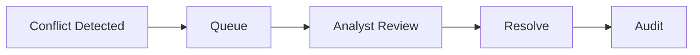

# Dedupe Merge Conflicts

## Scenario
Conflicting duplicate records and merge authority rules.

## Detection Signals
- Error-rate and latency anomalies on affected services.
- Data integrity checks (duplicate keys, missing transitions, imbalance alerts).
- Queue lag or webhook retry saturation above SLO thresholds.

## Immediate Containment
- Pause risky automation path via feature flag/runbook switch.
- Route affected records into review queue with owner assignment.
- Notify operations channel with incident context and blast radius.

## Recovery Steps
- Reconcile canonical state from source-of-truth events and logs.
- Apply deterministic compensating updates with audit annotations.
- Backfill downstream projections and verify invariant checks pass.

## Prevention
- Add contract tests and chaos scenarios for this edge condition.
- Instrument specific leading indicators and alert tuning.

## Domain Glossary
- **Merge Conflict Ticket**: File-specific term used to anchor decisions in **Dedupe Merge Conflicts**.
- **Lead**: Prospect record entering qualification and ownership workflows.
- **Opportunity**: Revenue record tracked through pipeline stages and forecast rollups.
- **Correlation ID**: Trace identifier propagated across APIs, queues, and audits for this workflow.

## Entity Lifecycles
- Lifecycle for this document: `Conflict Detected -> Queue -> Analyst Review -> Resolve -> Audit`.
- Each transition must capture actor, timestamp, source state, target state, and justification note.

## Integration Boundaries
- Integrates dedupe engine, analyst console, and audit/event store.
- Data ownership and write authority must be explicit at each handoff boundary.
- Interface changes require schema/version review and downstream impact acknowledgement.

## Error and Retry Behavior
- Automatic merge retries disabled after version conflict; requires human adjudication.
- Retries must preserve idempotency token and correlation ID context.
- Exhausted retries route to an operational queue with triage metadata.

## Measurable Acceptance Criteria
- Conflict queue p95 age stays under 1 business day.
- Observability must publish latency, success rate, and failure-class metrics for this document's scope.
- Quarterly review confirms definitions and diagrams still match production behavior.
