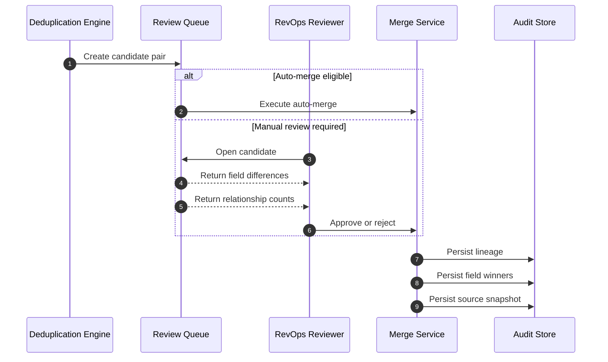

# Dedupe and Merge Conflicts — Customer Relationship Management Platform

## Purpose

Deduplication protects CRM data quality, but merge operations can corrupt lineage, ownership, and compliance state if implemented loosely. This document defines the conflict cases that must be handled before enabling automated or manual merges for leads, contacts, and accounts.

## Merge Control Flow

## Conflict Scenarios

| Scenario | Risk | Required Decision Logic | Audit Requirements | Acceptance Criteria |
|---|---|---|---|---|
| Exact email match but different names | Two employees share mailbox alias or prior typo exists | Never auto-merge if legal name, title, or account differ beyond configured tolerance unless reviewer confirms | Store exact matching rule and rejected or accepted rationale | Auto-merge only happens when policy threshold and restricted-field checks both pass |
| Records linked to same opportunity with different roles | Merge can duplicate contact roles or overwrite influence model | Preserve all non-duplicate relationship roles; collapse exact duplicates only | Before/after relationship graph snapshot | Opportunity participant list stays unique and complete |
| Concurrent merge attempts on same survivor | Lost updates or cyclic lineage | Pair-lock record IDs in sorted order and reject second merge with retriable conflict | Log rejected command and lock owner | At most one successful merge per record pair at a time |
| Merge on record under GDPR erasure or legal hold | Privacy or litigation obligations violated | Block merge until hold or erasure request is resolved; surface status in review UI | Hold reason and blocking workflow ID | Merge endpoint returns explicit policy error, not generic 500 |
| Source record already synced to provider systems | Provider objects may still reference old CRM ID | Store external references on survivor and queue connector repair tasks before tombstoning source | External ref transfer list and repair task IDs | No provider sync creates a “new” duplicate after merge |
| Conflicting consent or unsubscribe state | Communications sent unlawfully after merge | Survivor inherits most restrictive consent state and carries both source evidence trails | Consent comparison and chosen winner fields | Merged record never becomes more permissive than any source |
| Conflicting field-level permissions | Reviewer lacks access to sensitive fields | Hidden fields are excluded from reviewer editing but still resolved by policy or admin-only review | Actor permissions snapshot at decision time | Reviewer cannot unintentionally overwrite hidden fields |
| Account merge with different territory owners | Forecast credit and ownership become ambiguous | Merge does not change territory history automatically; it opens a follow-up ownership resolution task | Territory snapshots before and after merge | Historical forecast attribution remains reproducible |
| Merge followed by unmerge after downstream export | Exported data may contain obsolete IDs | Unmerge creates new lineage event and replay list for downstream systems; exported manifests remain immutable evidence | Merge and unmerge correlation chain | Downstream repair is deterministic and auditable |
| Attachment or note collisions | Duplicate files or note order becomes confusing | Deduplicate by attachment checksum and preserve note timestamps in original order | Attachment mapping and tombstoned duplicates | Timeline remains readable after merge |

## Field-Winner Policy Matrix

| Field Group | Default Winner | Override Rule |
|---|---|---|
| Primary identifiers (email, domain, phone) | Canonical survivor unless empty | reviewer or admin may select source when normalized value is stronger |
| Consent and compliance flags | Most restrictive | admin override prohibited unless explicit legal hold release exists |
| Ownership and territory | Survivor | separate reassignment workflow required for changes |
| Custom fields | Non-null newest value if same semantic type | blocked when values come from hidden fields or incompatible picklists |
| Activities and timeline | Union | duplicate provider IDs collapse to single entry |

## Operational Guardrails

- Store a full source snapshot before merge so unmerge can restore reversible relationships.
- Prevent merge when either record is currently being converted, exported, or erased.
- Search reindex and provider repair tasks are part of the merge completion checklist, not optional follow-up work.
- Review queue SLA must surface stale candidates because business context ages quickly.

## Test Acceptance Criteria

- Merge behavior is deterministic for the same candidate pair and policy version.
- Every accepted merge has a replayable lineage record and every rejected merge has a suppression record.
- Consent, legal hold, and provider reference conflicts are covered by automated tests before auto-merge can be enabled.
