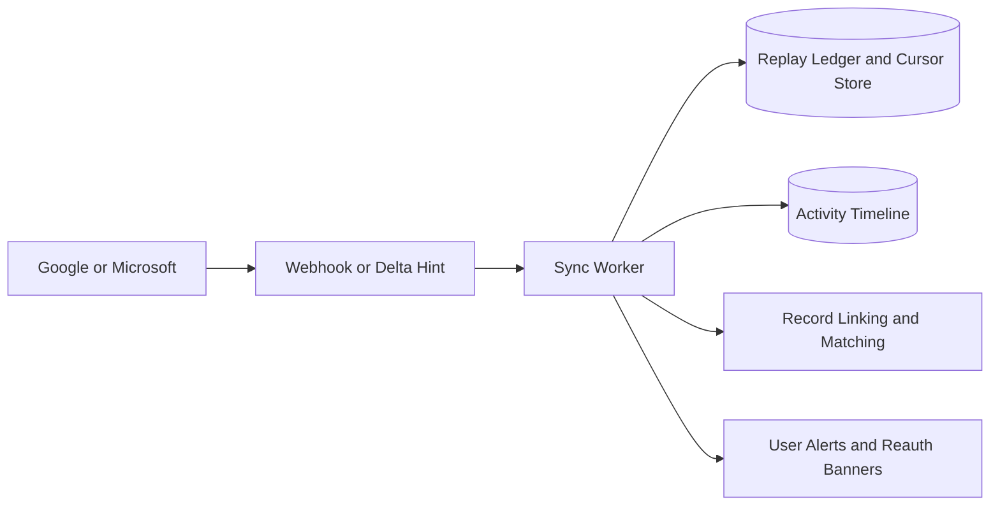

# Email and Calendar Sync Edge Cases — Customer Relationship Management Platform

## Purpose

Email and calendar sync spans OAuth, provider quotas, webhook replay, recurring event semantics, and CRM record-linking heuristics. This document defines the behaviors required to keep timelines accurate without creating duplicate or privacy-violating activity records.

## Sync Control Loop

## Scenario Catalog

| Scenario | Trigger | Risk | Required Handling | Acceptance Criteria |
|---|---|---|---|---|
| Access token expires mid-run | worker starts with valid token but provider rejects next page | Partial sync and duplicate replay on retry | Commit cursor only after each durable page write; refresh token and resume from last committed cursor | No duplicates after retry and no silent cursor skip |
| Refresh token revoked | user changes password or revokes consent | Connector loops failing and hides stale data | Set connection to `REAUTH_REQUIRED`, stop future writes, notify user and admin diagnostics | Connector no longer polls until reauthorized |
| Replayed webhook delivery | provider resends same event or endpoint times out | duplicate email or meeting activity rows | Persist provider event ID or delta token fingerprint before acknowledging completion | Duplicate provider event never produces second timeline entry |
| Recurring meeting exception edited | one instance in a series changes time or attendees | CRM overwrites entire series or loses exception | Store series master and recurrence instance key separately; apply changes only to affected instance | Individual exception remains distinct from master series |
| Meeting deleted externally after CRM edit | provider delete races with CRM reschedule | ghost meetings or user confusion | Compare etag/version vector; if provider delete is newer, mark CRM meeting cancelled and preserve audit note | Users see cancelled state, not resurrected meeting |
| Unknown sender or attendee | inbound email address has no matching contact | activity disappears from timeline | Create unlinked activity in user inbox review queue; allow manual association | No inbound provider message is dropped silently |
| Shared mailbox or alias mismatch | message sent from alias different from user's primary email | wrong owner association | Match against approved sender aliases stored on connection and participant list | Message links to correct user and contact history |
| Provider quota throttling | 429 or backoff headers from Gmail/Graph | aggressive retry worsens outage | Respect provider retry windows, shard queues per tenant, and surface degraded-mode status | Other tenants continue syncing normally |
| Time zone drift on DST boundary | provider event uses zone change near DST transition | meeting appears one hour off in CRM | Store provider timezone and UTC instant; render using viewer locale but preserve original provider zone | Meeting time is stable across DST switch |
| Email thread split by subject changes | reply loses original subject prefix or CRM manual send edits subject | one conversation fragments across multiple timeline threads | Thread primarily by provider thread ID and fallback by normalized references, not subject alone | Related replies still group correctly when provider IDs exist |

## Provider-Specific Rules

| Provider | Special Case | Required Adapter Behavior |
|---|---|---|
| Gmail | history IDs can expire if polling gap is too large | detect expired history ID, schedule full backfill, and mark gap window for audit |
| Microsoft Graph | subscriptions expire and require renewal | renew ahead of expiry and move to degraded mode if renewal fails |
| Both | HTML bodies may contain remote images and tracking pixels | sanitize HTML before storage and render safe preview only |

## Operational Guardrails

- Store encrypted refresh tokens outside the relational database and reference them by secret ID.
- Separate mailbox sync state from activity-linking state so provider outages do not block manual logging.
- Provider deletions cancel or detach CRM activities but never erase immutable audit evidence.
- Sync worker logs must include tenant, provider, cursor, event fingerprint, and retry count.

## Test Acceptance Criteria

- Replayed webhooks, token refresh failure, and recurring-meeting edits are covered in automated integration tests.
- A user can always tell whether the CRM or the provider won the last-write conflict.
- Timeline entries remain unique across webhook, polling, and manual association paths.
