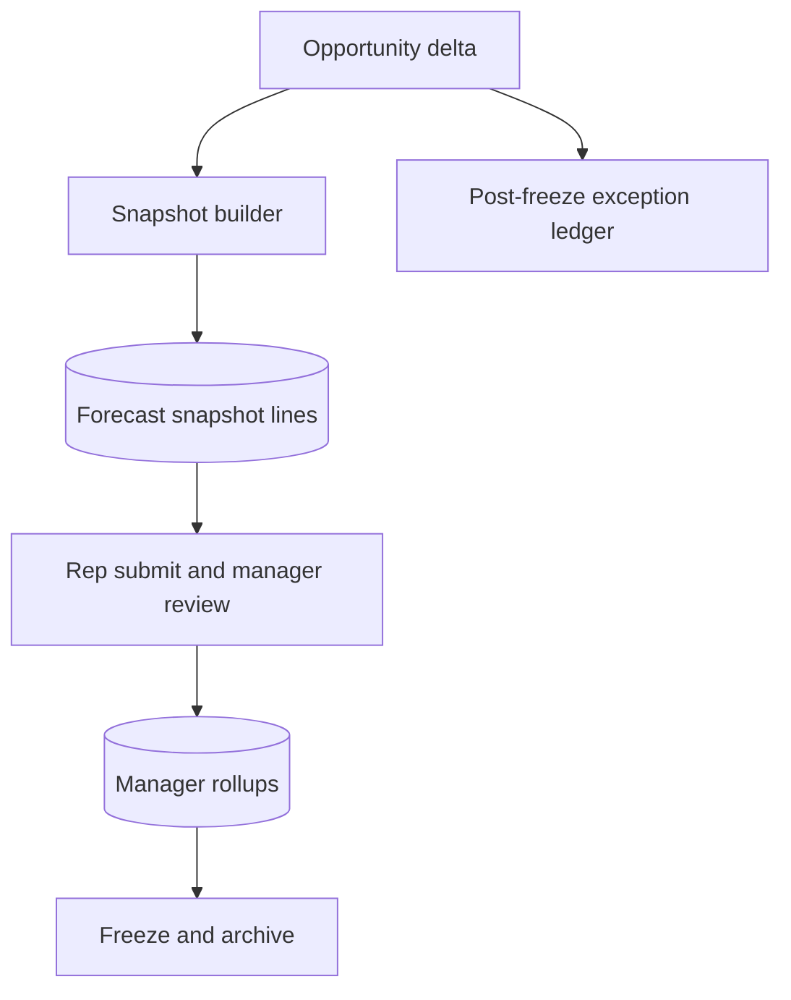

# Forecast Integrity Edge Cases — Customer Relationship Management Platform

## Purpose

Forecasts are highly sensitive to timing, ownership, and snapshot boundaries. This document defines the edge cases that must be handled so rep commits, manager rollups, and finance snapshots remain reproducible even as opportunities continue to change.

## Forecast Integrity Flow

## Scenario Catalog

| Scenario | Risk | Required Handling | Acceptance Criteria |
|---|---|---|---|
| Opportunity changes during submit | Rep submits while another user changes amount or close date | submission references mixed opportunity versions | snapshot builder stamps each included opportunity version and rejects submit if underlying set changes before commit | Submitted snapshot references a single coherent opportunity version set |
| Opportunity reopens after frozen close | historical quarter changes retroactively | finance reports drift from approved period close | frozen snapshot never mutates; reopened opportunity creates an exception record in the next open period or restatement workflow | Frozen total remains unchanged without explicit restatement |
| FX rate changes after submission | multi-currency deals recalc differently on refresh | rollup totals shift silently | snapshot stores both source currency amount and period FX rate used for rollup | Historical totals recalc to the original approved amount |
| Territory reassignment mid-period | open opp owner moves teams | double-count or missing quota credit | tenant policy determines whether open-period snapshot transfers; frozen snapshots stay historical | Rollup math is explainable before and after reassignment |
| Manager approval after rep resubmits | stale manager action approves wrong version | older approval overrides newer submission | approval command must include snapshot version and fail if a newer revision exists | Manager can only approve the latest submitted version |
| Hierarchy missing or cyclic | manager chain broken | rollup job fails or loops forever | detect cycles and missing managers, persist orphan exception, and continue rep-level snapshot | Rep snapshot remains visible while rollup shows explicit exception |
| Closed-lost then closed-won in same period | deal churn inflates commit twice | duplicate amount in rollup history | delta processor subtracts prior category contribution before adding new contribution | Net rollup reflects final state only |
| Manual override without reason | manager changes call arbitrarily | audit gap and trust loss | override requires reason code and actor; raw rep submission remains immutable | Audit shows raw call, override, and final approved number |
| Partial worker failure during rollup | some child snapshots update, others do not | inconsistent team total | rollup writes are transactional per manager node and carry recalculation watermark | Dashboard flags stale node rather than showing mixed totals |
| Import backfill on old opportunities | historical corrections alter open periods unexpectedly | rolling forecasts jump without explanation | backfilled records outside current open periods are logged as historical adjustments, not direct snapshot mutations | Users can trace why forecast changed |

## Guardrails

- Forecast lines must store source opportunity ID, source version, category, raw amount, weighted amount, and reason code.
- Freeze operation archives both the rep snapshot and the manager rollup tree.
- Exception ledger is append-only and visible in manager review screens.
- Recalculation jobs are idempotent for a `(period, owner, watermark)` key.

## Test Acceptance Criteria

- Submit, approve, revise, and freeze paths are covered under concurrent opportunity changes.
- Currency, territory, and reopen scenarios preserve a reproducible audit trail.
- Manager dashboards distinguish frozen totals from post-freeze operational exceptions.
