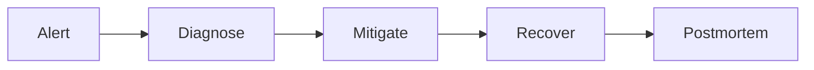

# Operations

## Day-2 Readiness
- SLO dashboard for availability, latency, and data freshness.
- Runbooks for incident triage, rollback, replay, and backfill.
- Capacity planning based on peak traffic and queue depth trends.

## Incident Lifecycle
1. Detect and classify severity with ownership routing.
2. Contain blast radius and communicate stakeholder impact.
3. Recover service and data consistency.
4. Publish postmortem with corrective actions and deadlines.

## Domain Glossary
- **Operational Incident**: File-specific term used to anchor decisions in **Operations**.
- **Lead**: Prospect record entering qualification and ownership workflows.
- **Opportunity**: Revenue record tracked through pipeline stages and forecast rollups.
- **Correlation ID**: Trace identifier propagated across APIs, queues, and audits for this workflow.

## Entity Lifecycles
- Lifecycle for this document: `Alert -> Diagnose -> Mitigate -> Recover -> Postmortem`.
- Each transition must capture actor, timestamp, source state, target state, and justification note.

## Integration Boundaries
- Incident workflow boundaries span monitoring, ticketing, comms, and runbooks.
- Data ownership and write authority must be explicit at each handoff boundary.
- Interface changes require schema/version review and downstream impact acknowledgement.

## Error and Retry Behavior
- Auto-remediation retries once; repeated failures page on-call immediately.
- Retries must preserve idempotency token and correlation ID context.
- Exhausted retries route to an operational queue with triage metadata.

## Measurable Acceptance Criteria
- P1 incidents have postmortem completed within 5 business days.
- Observability must publish latency, success rate, and failure-class metrics for this document's scope.
- Quarterly review confirms definitions and diagrams still match production behavior.

## Runbook: External Integration Outage

### Trigger Conditions
- Connector health check fails for 5 consecutive intervals.
- Provider API error rate exceeds 20% for 10 minutes.
- Webhook delivery lag breaches 15-minute SLO.

### Response Procedure
1. Declare incident and tag impacted connectors/tenants.
2. Enable degraded mode: continue core CRM writes, pause non-critical outbound sync.
3. Freeze destructive sync actions (delete/unlink/merge propagated to provider).
4. Start backlog accumulation metrics and projected recovery ETA updates.
5. Once provider recovers, execute checkpoint-based catch-up and reconciliation sweep.

### Exit Criteria
- Backlog drained below 5 minutes lag.
- Reconciliation mismatch rate below 0.5% for two consecutive runs.
- Incident timeline, impact summary, and replay evidence attached to postmortem.

## Runbook: Duplicate-Contact Merge Conflict

### Trigger Conditions
- Optimistic concurrency/version mismatch on merge attempt.
- Competing merge decisions on same identity cluster.
- Cross-system mapping collision (same provider contact maps to different CRM contacts).

### Response Procedure
1. Auto-lock involved contact cluster (`merge_lock_id`) to prevent additional mutations.
2. Generate canonical candidate using deterministic precedence rules (verified email > recent activity > owner confirmation).
3. Route conflict to analyst queue with side-by-side field provenance.
4. Analyst resolves winner/field-level selection and provides reason code.
5. Apply merge transaction with lineage record + compensating events to downstream systems.

### Exit Criteria
- Cluster unlocked with single canonical contact id.
- All dependent opportunities/activities re-linked successfully.
- Audit package includes before/after snapshots and analyst decision metadata.

## Runbook: Webhook Replay Handling

### Trigger Conditions
- DLQ contains webhook events older than replay threshold.
- Provider outage recovery requires missed-event catch-up.
- Consumer bug fix requires deterministic reprocessing of historical deliveries.

### Replay Procedure
1. Define replay scope by connector, tenant, and time window.
2. Export immutable source payload set and compute replay manifest checksum.
3. Re-inject events through replay endpoint with original `event_id`, `occurred_at`, and `correlation_id`.
4. Enforce idempotency gate; duplicates are logged and skipped, not re-applied.
5. Run post-replay reconciliation and compare key aggregates against pre-replay baseline.

### Safety Controls
- Replay must require dual authorization for production tenants.
- Max replay batch size and per-tenant QPS limit enforced.
- Replay generates explicit `webhook.replayed` audit entries for every accepted item.
