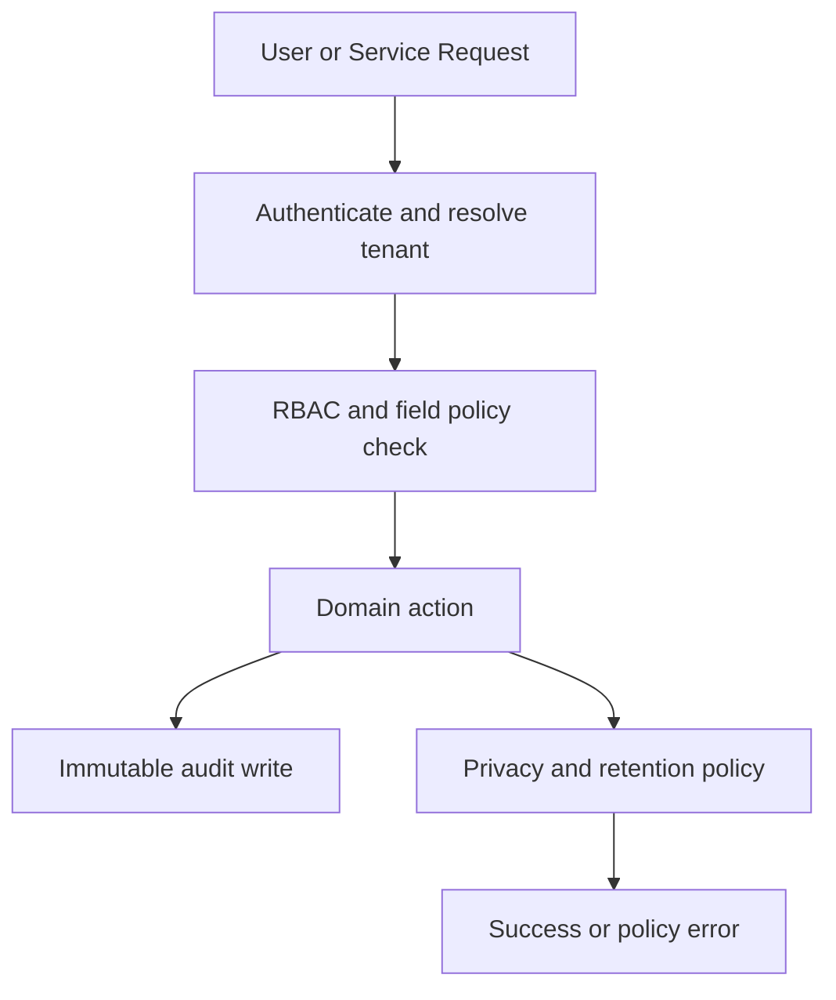

# Security and Compliance Edge Cases — Customer Relationship Management Platform

## Purpose

This document focuses on the security and compliance scenarios most likely to fail in a multi-tenant CRM: tenant isolation leaks, RBAC drift, export and erasure mistakes, audit tampering, and service-account overreach.

## Control Flow

## Scenario Catalog

| Scenario | Risk | Required Handling | Acceptance Criteria |
|---|---|---|---|
| Cross-tenant identifier guess | user guesses UUID from another tenant | data leak across tenants | every query enforces tenant filter before object lookup success; respond with generic not-found or forbidden per policy | Foreign tenant data never appears in API, search, exports, or logs |
| Field-level permission bypass | hidden amount or salary-like custom field requested through API | sensitive field exposure | field policy trims response shape and rejects filter/sort on hidden fields | UI and API return the same protected field set |
| Export includes restricted data | admin builds export after permission changes | oversharing in downloadable files | export manifest is generated from current permission snapshot and revalidated at materialization time | Hidden fields never appear in exports |
| GDPR erasure on merged subject | subject merged into another contact | surviving record still contains personal data | privacy workflow traverses merge lineage and redacts all linked source identifiers | Search, timeline, and campaigns no longer expose erased subject |
| Legal hold conflicts with erasure | court hold exists on related records | unlawful deletion or blocked compliance workflow | erasure transitions to `ON_HOLD` with explicit legal hold reason and approver | No deletion occurs while hold is active |
| Audit log tamper attempt | privileged user or compromised service tries to update audit rows | loss of evidence | app role lacks `UPDATE` and `DELETE`; tamper attempts create security alert | Audit entries are append-only in practice and by policy |
| Break-glass admin session | emergency access used in incident | untracked privileged actions | break-glass login requires elevated MFA, short TTL, mandatory reason, and flagged audit entries | Every emergency action is easy to query and review |
| Webhook secret or token leak | logs or UI expose secrets | third parties can spoof callbacks or access provider data | only secret references are stored; UI never re-renders raw secret; rotation invalidates old secret immediately | Compromised secret can be rotated without downtime to unrelated tenants |
| Service account overreach | background worker reads fields it should not | excessive access blast radius | service accounts get scoped roles by bounded context and separate tenant routing | Worker can act only on its owned aggregates |
| Retention vs purge mismatch | user deletes file but policy requires retention | evidence missing during audit | operational delete tombstones item while retention archive remains immutable until policy expiry | User-facing delete does not violate retention obligations |

## Compliance-Specific Requirements

| Requirement Area | Required System Behavior |
|---|---|
| GDPR Article 17 | erase or anonymize personal data, record approver, and propagate downstream deletion tasks |
| GDPR Article 20 | export only accessible subject data, in a portable file format, with expiry-limited delivery |
| CAN-SPAM | unsubscribe honored immediately, footer present on all campaign sends, suppression ledger authoritative |
| SOC 2 evidence | audit logs, access reviews, change approvals, and key rotation evidence are queryable and retained |

## Operational Guardrails

- Authorization decisions must log policy version and actor type so incidents can be replayed.
- Sensitive export, erasure, and configuration actions require correlation IDs and immutable audit evidence.
- Service-to-service credentials rotate independently from tenant provider credentials.
- Security and privacy alerts route to different queues but share the same correlation model.

## Test Acceptance Criteria

- Cross-tenant, field-level, and export/erasure cases are covered in integration tests and policy tests.
- Secret rotation and break-glass actions are tested without manual production-only steps.
- Audit evidence remains queryable even after GDPR erasure redacts subject PII.
