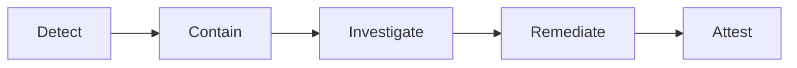

# Security And Compliance

## Sensitive Data Controls
- Classify data by sensitivity and apply masking/tokenization where needed.
- Enforce least privilege for users, services, and break-glass access.

## Compliance Requirements
- Immutable audit logs for admin and policy-changing operations.
- Evidence collection for periodic internal/external audits.
- Regional retention/deletion workflows with legal-hold exceptions.

## Verification
- Quarterly access reviews and key rotation checks.
- Automated policy tests in CI for critical authorization paths.

## Domain Glossary
- **Control Exception**: File-specific term used to anchor decisions in **Security And Compliance**.
- **Lead**: Prospect record entering qualification and ownership workflows.
- **Opportunity**: Revenue record tracked through pipeline stages and forecast rollups.
- **Correlation ID**: Trace identifier propagated across APIs, queues, and audits for this workflow.

## Entity Lifecycles
- Lifecycle for this document: `Detect -> Contain -> Investigate -> Remediate -> Attest`.
- Each transition must capture actor, timestamp, source state, target state, and justification note.

## Integration Boundaries
- Boundaries include IAM, KMS, SIEM, and compliance evidence repositories.
- Data ownership and write authority must be explicit at each handoff boundary.
- Interface changes require schema/version review and downstream impact acknowledgement.

## Error and Retry Behavior
- Failed control checks are non-retryable until remediation evidence is attached.
- Retries must preserve idempotency token and correlation ID context.
- Exhausted retries route to an operational queue with triage metadata.

## Measurable Acceptance Criteria
- 100% privileged actions are auditable with actor, reason, and ticket link.
- Observability must publish latency, success rate, and failure-class metrics for this document's scope.
- Quarterly review confirms definitions and diagrams still match production behavior.
