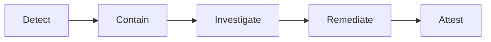

# Security And Compliance

## Sensitive Data Controls
- Classify data by sensitivity and apply masking/tokenization where needed.
- Enforce least privilege for users, services, and break-glass access.

## Compliance Requirements
- Immutable audit logs for admin and policy-changing operations.
- Evidence collection for periodic internal/external audits.
- Regional retention/deletion workflows with legal-hold exceptions.

## Verification
- Quarterly access reviews and key rotation checks.
- Automated policy tests in CI for critical authorization paths.

## Domain Glossary
- **Control Exception**: File-specific term used to anchor decisions in **Security And Compliance**.
- **Lead**: Prospect record entering qualification and ownership workflows.
- **Opportunity**: Revenue record tracked through pipeline stages and forecast rollups.
- **Correlation ID**: Trace identifier propagated across APIs, queues, and audits for this workflow.

## Entity Lifecycles
- Lifecycle for this document: `Detect -> Contain -> Investigate -> Remediate -> Attest`.
- Each transition must capture actor, timestamp, source state, target state, and justification note.

## Integration Boundaries
- Boundaries include IAM, KMS, SIEM, and compliance evidence repositories.
- Data ownership and write authority must be explicit at each handoff boundary.
- Interface changes require schema/version review and downstream impact acknowledgement.

## Error and Retry Behavior
- Failed control checks are non-retryable until remediation evidence is attached.
- Retries must preserve idempotency token and correlation ID context.
- Exhausted retries route to an operational queue with triage metadata.

## Measurable Acceptance Criteria
- 100% privileged actions are auditable with actor, reason, and ticket link.
- Observability must publish latency, success rate, and failure-class metrics for this document's scope.
- Quarterly review confirms definitions and diagrams still match production behavior.

## PII Retention and Data Lifecycle Controls

| Data Class | Examples | Default Retention | Deletion/Anonymization Rule | Legal Hold Behavior |
|---|---|---|---|---|
| Contact Identifiers | name, email, phone | 7 years after last business activity | Hard-delete or irreversible hash on approved erasure request | Hold supersedes deletion until release |
| Communication Content | email body, call transcripts, meeting notes | 3 years | Content redaction with metadata preservation for audit linkage | Preserve encrypted original under hold token |
| Consent Records | opt-in/out, lawful basis, source | Duration of relationship + 5 years | Never mutate prior state; append revocation events | Always retained for evidentiary compliance |
| Audit Logs | auth changes, role updates, exports, merges | 7 years minimum | WORM archive; no direct delete path | Immutable regardless of hold |

## Consent and Preference Enforcement
- Consent is evaluated at send-time and at workflow-enqueue-time.
- Channel-specific preferences (email, SMS/telephony, call window) override campaign defaults.
- Every outbound communication must include consent snapshot reference and purpose-of-processing code.
- Revocation events must propagate to all connectors within 5 minutes and block further sends.

## Auditability and Evidence Model
- All privileged/user-impacting actions capture: actor, tenant, target object, reason code, ticket/link, before/after diff hash.
- Evidence bundles for audits include policy config version, enforcement logs, and reconciliation outcomes.
- Audit events are written to append-only storage with cryptographic integrity checks.

## Tenant Isolation Controls
- Logical data isolation: mandatory `tenant_id` row filtering with policy-enforced query guards.
- Compute isolation: per-tenant rate limits and job partitioning for sync/replay workloads.
- Secret isolation: provider credentials scoped to tenant-specific KMS keys and vault paths.
- Backup/restore isolation: restore operations are tenant-scoped and require explicit target-tenant validation.

## Compliance Validation Cadence
- Monthly automated control tests for retention, consent enforcement, and tenant boundary checks.
- Quarterly access reviews and sampled evidence walkthroughs for SOC 2 and GDPR controls.
- Annual disaster-recovery rehearsal validating secure tenant-scoped restore and audit continuity.
