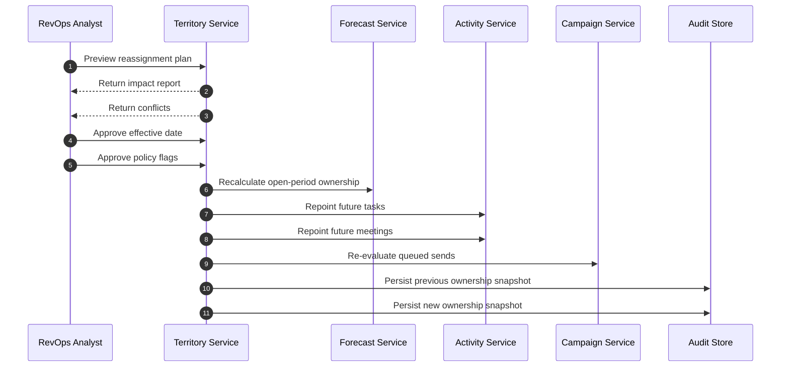

# Territory Reassignment Edge Cases — Customer Relationship Management Platform

## Purpose

Territory changes impact account ownership, open opportunities, forecast credit, future tasks, and campaign execution. This document defines how the CRM must behave when territory rules or owners change mid-cycle.

## Reassignment Flow

## Scenario Catalog

| Scenario | Risk | Required Handling | Acceptance Criteria |
|---|---|---|---|
| Opportunity in approval or signature stage | owner changes while deal is nearly closed | handoff confusion or double-claim | tenant policy decides whether to freeze current owner until close; system records explicit split-credit outcome | Ownership and crediting decision is visible on the opportunity |
| Mid-quarter reassignment with submitted forecast | forecast totals drift unexpectedly | submitted rep call no longer matches rollup | open-period snapshots can transfer only through documented policy; approved or frozen snapshots stay historical | Historical snapshots remain reproducible |
| Reassignment effective date in future | users start working wrong accounts too early | premature owner changes | preview shows future impact only; execution waits for effective timestamp | No record owner changes before schedule |
| Old owner deactivated before execution | target owner becomes null or invalid | orphaned accounts and opps | fallback to manager or territory queue and flag manual review | No record ends with invalid owner reference |
| Shared or partner-owned account | single-owner model breaks partner overlay | incorrect exclusivity | allow primary owner plus overlay metadata; reassignment changes primary only when overlay rules permit | Partner visibility survives territory change |
| Future tasks and meetings | calendar invites and reminders point to wrong rep | meetings missed or reassigned incorrectly | transfer only future open tasks and owned meetings; preserve past activities with original owner | Historical timeline stays truthful while upcoming work moves correctly |
| Queued campaigns for reassigned contacts | contacts receive outreach from old owner after cutover | mixed messaging and compliance confusion | queued unsent messages re-evaluate owner merge fields; already-sent messages remain untouched | No future queued send uses stale owner data |
| Backdated correction after wrong execution | ops needs to fix previous day's reassignment | silent mutation of history | correction creates compensating reassignment entry, not destructive overwrite | Audit shows both mistaken and corrective actions |
| Record lock during execution | user edits account or opportunity while job runs | partial job state | job skips locked records, records them for retry, and final report distinguishes completed vs pending | Reassignment job can resume without duplicating work |
| Territory rule overlap | one account matches two new territories | nondeterministic ownership | preview surfaces overlap and blocks execution until explicit priority or exception is set | Execution is deterministic for every impacted account |

## Policy Decision Matrix

| Decision Area | Default Policy | Configurable Variants |
|---|---|---|
| Open opportunity owner | move with account | keep current owner until close, split credit, manager decision |
| Future tasks | move to new owner | leave with creator, copy task to both owners |
| Meetings | move only if organizer is CRM owner | keep original organizer, notify new owner only |
| Campaign queue | recompute queued only | freeze campaign owner for entire launch |
| Forecast credit | open periods configurable, frozen periods immutable | custom split-credit model |

## Operational Guardrails

- Preview and execution must run against the same normalized account dataset and rule version.
- Every reassignment stores previous owner, previous territory, new owner, new territory, effective date, and policy flags.
- Batch jobs must emit per-record reconciliation details so managers can dispute ownership changes.
- Post-execution search and dashboard refresh are required before the job is marked complete.

## Test Acceptance Criteria

- Reassignment is safe under future-dated execution, locked records, submitted forecasts, and queued campaigns.
- Policy variants for open opportunities and future tasks are covered by automated tests.
- Managers can reconstruct who owned an account or opportunity at any historical moment.
