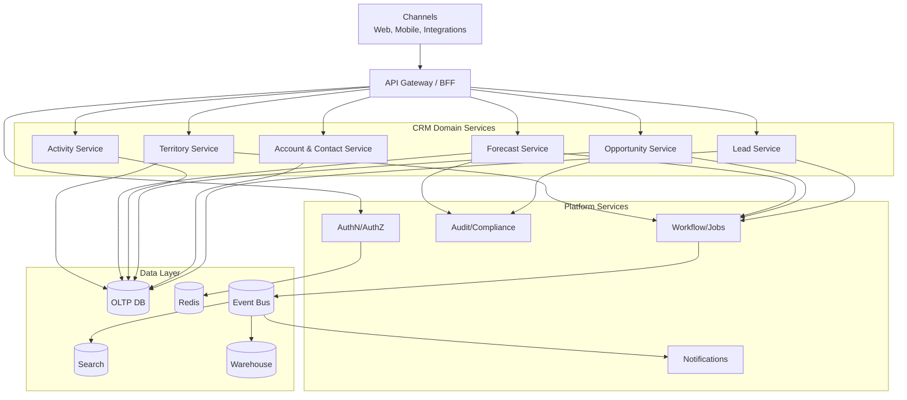

# Architecture Diagram

## High-Level Architecture

```mermaid
flowchart TB
    CH[Channels\nWeb, Mobile, Integrations] --> EDGE[API Gateway / BFF]

    subgraph Domain[CRM Domain Services]
      Lead[Lead Service]
      Account[Account & Contact Service]
      Opp[Opportunity Service]
      Activity[Activity Service]
      Forecast[Forecast Service]
      Territory[Territory Service]
    end

    EDGE --> Lead
    EDGE --> Account
    EDGE --> Opp
    EDGE --> Activity
    EDGE --> Forecast
    EDGE --> Territory

    subgraph Platform[Platform Services]
      Auth[AuthN/AuthZ]
      Audit[Audit/Compliance]
      Notify[Notifications]
      Workflow[Workflow/Jobs]
    end

    Lead --> Workflow
    Opp --> Workflow
    Forecast --> Workflow
    Territory --> Workflow

    EDGE --> Auth
    Opp --> Audit
    Forecast --> Audit

    subgraph Data[Data Layer]
      OLTP[(OLTP DB)]
      Cache[(Redis)]
      Bus[(Event Bus)]
      Search[(Search)]
      WH[(Warehouse)]
    end

    Lead --> OLTP
    Account --> OLTP
    Opp --> OLTP
    Activity --> OLTP
    Forecast --> OLTP
    Territory --> OLTP

    Workflow --> Bus
    Bus --> Notify
    Bus --> Search
    Bus --> WH
    Auth --> Cache
```
