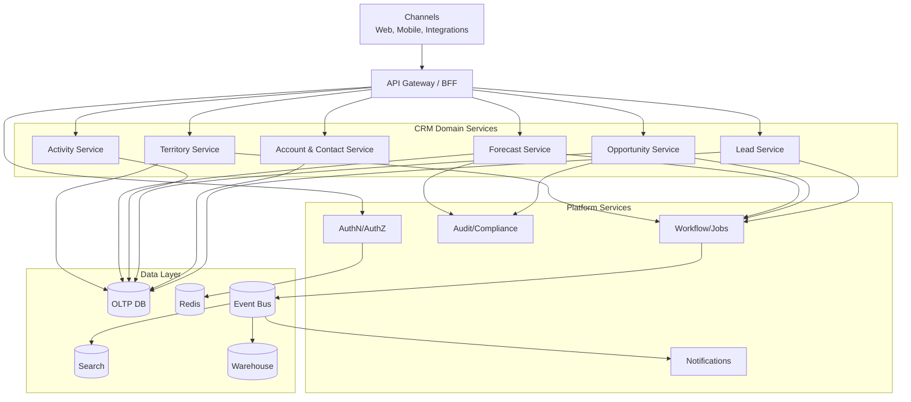
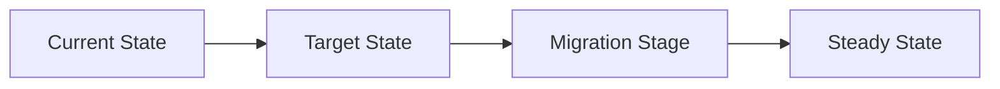
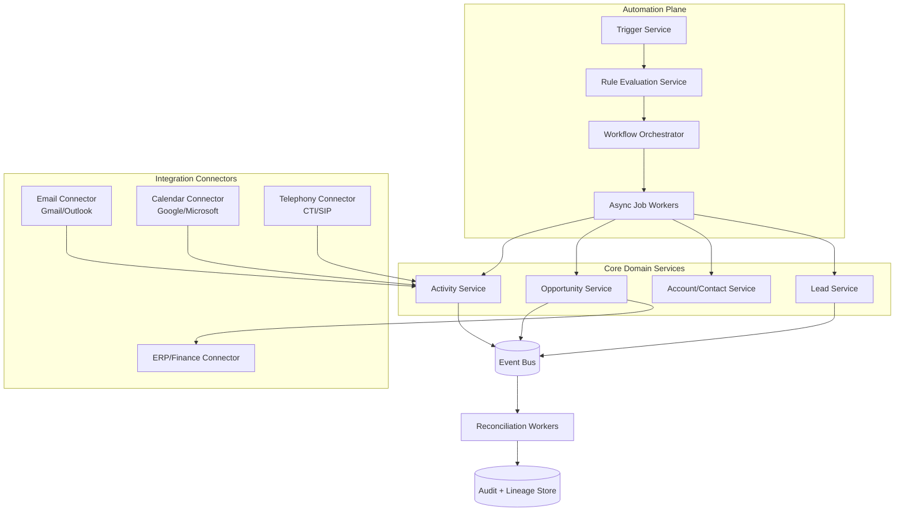

# Architecture Diagram

## High-Level Architecture

## Domain Glossary
- **Architecture View**: File-specific term used to anchor decisions in **Architecture Diagram**.
- **Lead**: Prospect record entering qualification and ownership workflows.
- **Opportunity**: Revenue record tracked through pipeline stages and forecast rollups.
- **Correlation ID**: Trace identifier propagated across APIs, queues, and audits for this workflow.

## Entity Lifecycles
- Lifecycle for this document: `Current State -> Target State -> Migration Stage -> Steady State`.
- Each transition must capture actor, timestamp, source state, target state, and justification note.

## Integration Boundaries
- Boundaries separate ingress, domain microservices, event fabric, and data planes.
- Data ownership and write authority must be explicit at each handoff boundary.
- Interface changes require schema/version review and downstream impact acknowledgement.

## Error and Retry Behavior
- Inter-service calls retry with circuit breakers; cross-domain writes use saga compensation.
- Retries must preserve idempotency token and correlation ID context.
- Exhausted retries route to an operational queue with triage metadata.

## Measurable Acceptance Criteria
- Diagram identifies all tier-1 components with HA strategy and owner.
- Observability must publish latency, success rate, and failure-class metrics for this document's scope.
- Quarterly review confirms definitions and diagrams still match production behavior.

## Workflow Automation and Integration Topology

### Reliability Controls for Integrations
- Connector circuit breakers isolate provider-specific outages without blocking core CRM writes.
- Dead-letter queues are partitioned by connector and tenant for targeted replay.
- Replay manager supports range replay by `occurred_at` and by provider object id.
