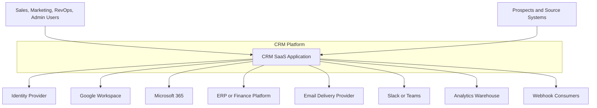

# C4 Diagrams — Customer Relationship Management Platform

## Purpose

These C4-inspired diagrams define the system context (Level 1) and container model (Level 2) for a multi-tenant CRM platform that supports lead capture, account/contact management, opportunities, campaigns, forecast rollups, dedupe, and compliance workflows.

---

## Level 1 — System Context

### Level 1 Notes
- CRM is the system of record for tenant-scoped customer master data, activity lineage, opportunity state, forecast submission state, and campaign consent ledger.
- External providers remain authoritative for identity assertions, mailbox/calendar transport metadata, and downstream financial booking.
- All ingress is authenticated or tenant-resolved before reaching domain logic.

---

## Level 2 — Container Diagram

```mermaid
flowchart TB
    UserUI[Web SPA and Admin Console]
    PublicAPI[Public Forms and REST API]

    subgraph App[CRM Containers]
        Gateway[API Gateway and BFF]
        Authz[Auth and Policy Service]
        LeadSvc[Lead and Dedup Service]
        AccountSvc[Account and Contact Service]
        OppSvc[Opportunity and Pipeline Service]
        ActivitySvc[Activity and Sync Service]
        CampaignSvc[Campaign and Segment Service]
        ForecastSvc[Forecast and Territory Service]
        AdminSvc[Admin, Export, and Privacy Service]
        Integrations[Integration and Webhook Orchestrator]
        Workers[Background Workers and Sagas]
    end

    subgraph Data[Data and Messaging]
        Postgres[(PostgreSQL Primary)]
        Redis[(Redis Cache and Locks)]
        Bus[(Event Bus or Queue)]
        Search[(Search Index)]
        Blob[(Object Storage)]
        Audit[(Immutable Audit Store)]
    end

    UserUI --> Gateway
    PublicAPI --> Gateway
    Gateway --> Authz
    Gateway --> LeadSvc
    Gateway --> AccountSvc
    Gateway --> OppSvc
    Gateway --> ActivitySvc
    Gateway --> CampaignSvc
    Gateway --> ForecastSvc
    Gateway --> AdminSvc
    Gateway --> Integrations

    LeadSvc --> Postgres
    AccountSvc --> Postgres
    OppSvc --> Postgres
    ActivitySvc --> Postgres
    CampaignSvc --> Postgres
    ForecastSvc --> Postgres
    AdminSvc --> Postgres
    Integrations --> Postgres
    Workers --> Postgres

    LeadSvc --> Bus
    OppSvc --> Bus
    ActivitySvc --> Bus
    CampaignSvc --> Bus
    ForecastSvc --> Bus
    AdminSvc --> Bus
    Integrations --> Bus
    Workers --> Bus

    LeadSvc --> Redis
    ForecastSvc --> Redis
    Integrations --> Redis
    Workers --> Redis
    Workers --> Search
    Workers --> Blob
    AdminSvc --> Audit
```

## Container Responsibilities

| Container | Responsibilities | Write Authority | Primary Dependencies |
|---|---|---|---|
| API Gateway and BFF | Authenticate requests, resolve tenant context, apply rate limits, shape UI-specific payloads. | None | Auth service, domain APIs |
| Auth and Policy Service | JWT validation, RBAC, field-level visibility, service-to-service authorization. | Policy cache and audit-only | IdP, Redis |
| Lead and Dedup Service | Intake, scoring orchestration, dedupe candidate generation, conversion initiation. | Lead, intake, dedupe tables | Redis, Postgres, Bus |
| Account and Contact Service | Canonical customer profile, relationship graph, merge application, ownership. | Account/contact tables | Postgres, Bus |
| Opportunity and Pipeline Service | Opportunity CRUD, stage gates, stage history, forecast-driving changes. | Opportunity and pipeline tables | Postgres, Bus |
| Activity and Sync Service | Timeline, tasks, emails, meetings, provider token state, reconciliation. | Activity/email/calendar tables | Postgres, Redis, Bus |
| Campaign and Segment Service | Segment evaluation, campaign sends, suppression ledger, engagement metrics. | Campaign/segment/send tables | Postgres, Bus, ESP |
| Forecast and Territory Service | Forecast snapshots, rollups, quota views, territory rules, reassignment jobs. | Forecast/territory tables | Postgres, Redis, Bus |
| Admin, Export, and Privacy Service | Custom schema config, exports, GDPR workflows, audit queries. | Config/export/privacy tables | Postgres, Blob, Audit |
| Integration and Webhook Orchestrator | Provider adapters, webhook subscriptions, ERP export, replay controls. | Connector and delivery tables | Postgres, Redis, Bus |
| Background Workers and Sagas | Async retries, backfills, projection updates, long-running batch jobs. | Derived state only through owned services | Bus, Redis, Search, Blob |

## Container Design Decisions

- **Multi-tenant isolation:** all stateful containers persist `tenant_id` and enforce row-level filtering; workers execute per-tenant shards.
- **Consistency model:** transactional writes happen in PostgreSQL with outbox publication; search, analytics, and notifications are eventually consistent projections.
- **Dedupe and merge:** candidate generation may be asynchronous, but merge execution is always transactional and locked at the record pair level.
- **Forecast integrity:** forecast snapshots reference immutable opportunity versions rather than live opportunity rows after submission.
- **Compliance:** audit writes are append-only; privacy/export jobs always route through Admin Service to centralize policy checks.

## Availability and Scaling Notes

- Gateway, stateless domain services, and workers scale horizontally by tenant-aware request routing.
- PostgreSQL uses primary/replica topology with point-in-time recovery; Redis is used only for cache, locks, counters, and idempotency windows, never as the sole source of truth.
- External provider quotas are absorbed by the Integration Orchestrator with tenant-scoped backoff queues.

## Acceptance Criteria

- Every container has clear data ownership and no two containers claim write authority over the same aggregate root.
- The container model explains where tenant isolation, auditability, and provider integrations are enforced.
- The diagrams are detailed enough to derive deployment units, API boundaries, and cross-service test contracts.
