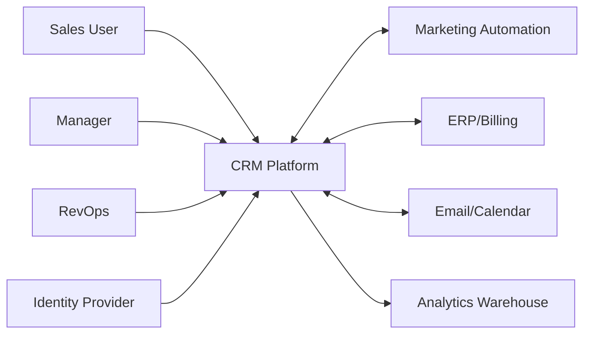
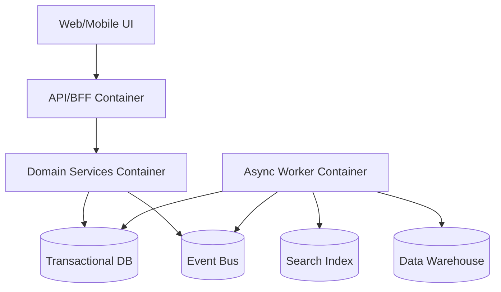

# C4 Diagrams

## C1: System Context

```mermaid
flowchart LR
    User[Sales User] --> CRM[CRM Platform]
    Manager[Manager] --> CRM
    Ops[RevOps] --> CRM
    CRM <--> MAP[Marketing Automation]
    CRM <--> ERP[ERP/Billing]
    CRM <--> Mail[Email/Calendar]
    CRM --> BI[Analytics Warehouse]
    SSO[Identity Provider] --> CRM
```

## C2: Container View

```mermaid
flowchart TB
    UI[Web/Mobile UI]
    API[API/BFF Container]
    Core[Domain Services Container]
    Jobs[Async Worker Container]
    DB[(Transactional DB)]
    Bus[(Event Bus)]
    Search[(Search Index)]
    WH[(Data Warehouse)]

    UI --> API --> Core
    Core --> DB
    Core --> Bus
    Jobs --> DB
    Jobs --> Bus
    Jobs --> Search
    Jobs --> WH
```
