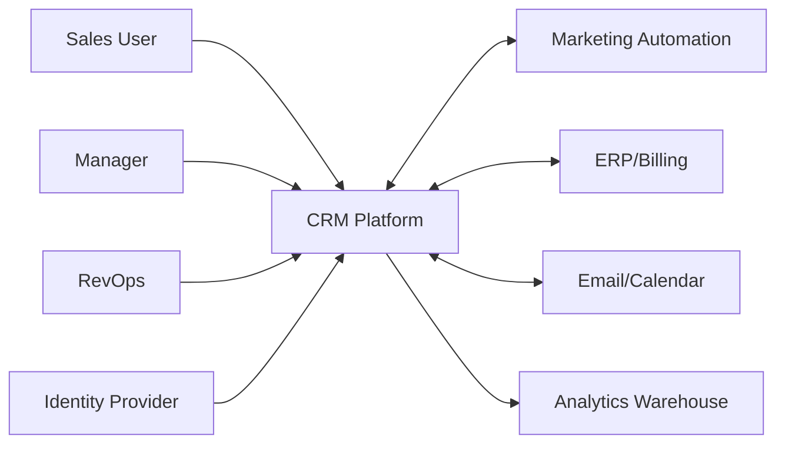
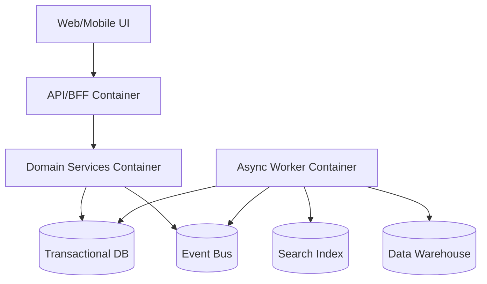
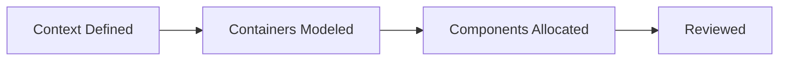

# C4 Diagrams

## C1: System Context

## C2: Container View

## Domain Glossary
- **Container Responsibility**: File-specific term used to anchor decisions in **C4 Diagrams**.
- **Lead**: Prospect record entering qualification and ownership workflows.
- **Opportunity**: Revenue record tracked through pipeline stages and forecast rollups.
- **Correlation ID**: Trace identifier propagated across APIs, queues, and audits for this workflow.

## Entity Lifecycles
- Lifecycle for this document: `Context Defined -> Containers Modeled -> Components Allocated -> Reviewed`.
- Each transition must capture actor, timestamp, source state, target state, and justification note.

## Integration Boundaries
- C4 views connect product, platform, security, and operations stakeholders.
- Data ownership and write authority must be explicit at each handoff boundary.
- Interface changes require schema/version review and downstream impact acknowledgement.

## Error and Retry Behavior
- Contract conflicts between C4 levels block approval until resolved.
- Retries must preserve idempotency token and correlation ID context.
- Exhausted retries route to an operational queue with triage metadata.

## Measurable Acceptance Criteria
- Context, container, and component levels are all present with version date.
- Observability must publish latency, success rate, and failure-class metrics for this document's scope.
- Quarterly review confirms definitions and diagrams still match production behavior.
