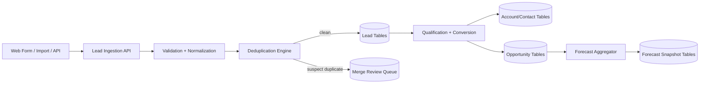
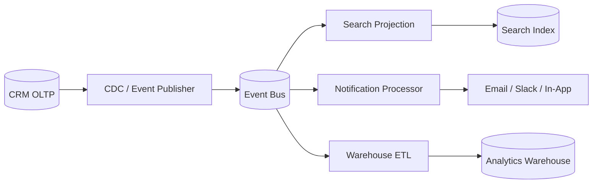
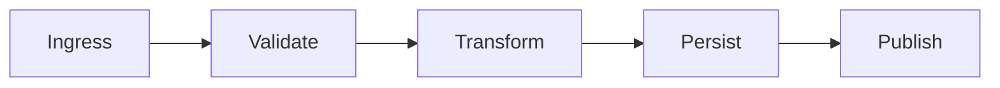

# Data Flow Diagrams

## Lead and Opportunity Data Flow

## Operational and Analytics Data Flow

## Domain Glossary
- **Data Transformation**: File-specific term used to anchor decisions in **Data Flow Diagrams**.
- **Lead**: Prospect record entering qualification and ownership workflows.
- **Opportunity**: Revenue record tracked through pipeline stages and forecast rollups.
- **Correlation ID**: Trace identifier propagated across APIs, queues, and audits for this workflow.

## Entity Lifecycles
- Lifecycle for this document: `Ingress -> Validate -> Transform -> Persist -> Publish`.
- Each transition must capture actor, timestamp, source state, target state, and justification note.

## Integration Boundaries
- Flows cover OLTP writes, CDC streams, analytics loads, and reverse ETL.
- Data ownership and write authority must be explicit at each handoff boundary.
- Interface changes require schema/version review and downstream impact acknowledgement.

## Error and Retry Behavior
- Failed transforms are quarantined and replayed from immutable source events.
- Retries must preserve idempotency token and correlation ID context.
- Exhausted retries route to an operational queue with triage metadata.

## Measurable Acceptance Criteria
- Every flow states source, sink, latency budget, and data quality checks.
- Observability must publish latency, success rate, and failure-class metrics for this document's scope.
- Quarterly review confirms definitions and diagrams still match production behavior.
