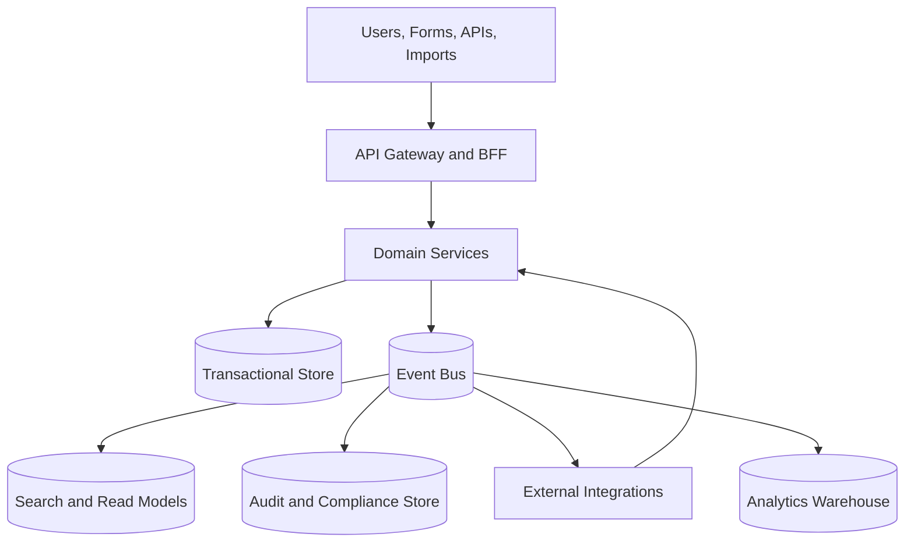
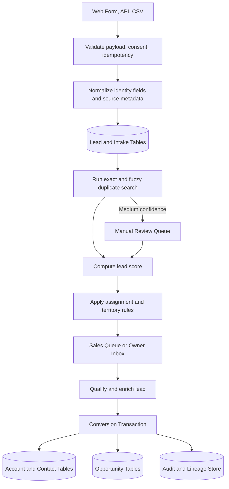
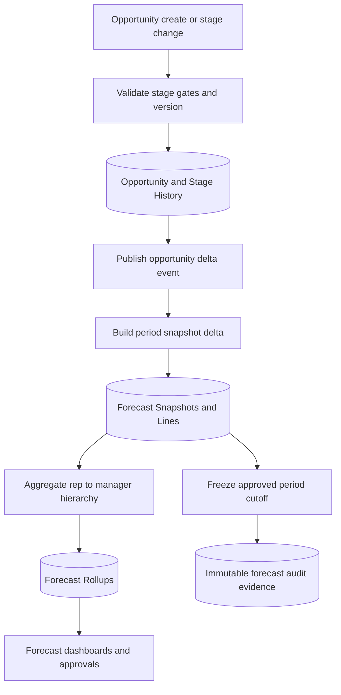
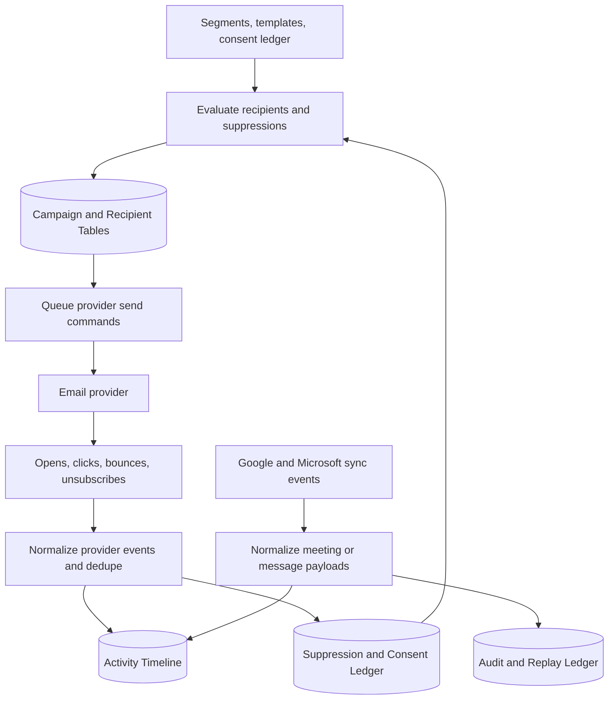

# Data Flow Diagrams — Customer Relationship Management Platform

## Overview

These diagrams model the highest-value data movement paths in the CRM platform: platform-wide context, lead-to-conversion, forecast rollup integrity, and campaign plus sync compliance.

---

## DFD 0 — Platform Context

### DFD 0 Notes
- Gateway performs tenant resolution, authentication, rate limiting, and request normalization.
- Domain services own writes to transactional storage.
- Event bus fans out to read models, audit, and provider adapters without coupling user-facing request latency to downstream systems.

---

## DFD 1 — Lead Intake to Qualified Opportunity

### Processing Detail
- `Validate` rejects malformed or unauthorized traffic synchronously.
- `Normalize` computes canonical email, phone, and company-domain keys used by dedupe and reporting.
- `Review` stores candidate explanations and user decisions for future suppression or auto-merge tuning.
- `Convert` copies mapped fields and writes lineage IDs that connect the original lead to the downstream account, contact, and opportunity.

### Failure Handling
- If scoring fails, the lead remains usable with `score_status = pending`.
- If conversion fails at any point, no account/contact/opportunity rows are committed.

---

## DFD 2 — Opportunity Changes to Forecast Rollup

### Processing Detail
- Opportunity events carry old and new period attribution, allowing forecast recalculation to remove stale amounts before adding new ones.
- Snapshot lines store both raw amount and weighted amount so dashboards can explain totals without recomputing from live rows.
- Freeze state prevents later opportunity edits from mutating historical approved totals; exceptions are displayed separately.

### Failure Handling
- If hierarchy lookup fails, rep snapshot persists but rollup is marked incomplete for manager repair.
- If period is frozen, the delta is recorded as an exception instead of mutating the frozen snapshot.

---

## DFD 3 — Campaign Execution and Activity Sync Compliance

### Processing Detail
- Recipient eligibility is evaluated again immediately before send so unsubscribes or legal holds raised after scheduling are honored.
- Provider events update both campaign metrics and the core communication preference ledger.
- Sync normalization writes replay keys so duplicate webhooks or backfills cannot create duplicate timeline entries.

### Failure Handling
- Failed sends remain isolated to the recipient record; campaign state moves to `PARTIAL_FAILURE` only when tenant thresholds are exceeded.
- Provider outage or token expiry pauses sync cursors without blocking manual activity entry.

## Acceptance Criteria

- Each diagram identifies sources, transformations, persistent stores, and outputs.
- The flows make it clear which data is authoritative, derived, or replayable.
- Error handling covers dedupe review, forecast freeze, and unsubscribe/token replay concerns specific to CRM operations.
