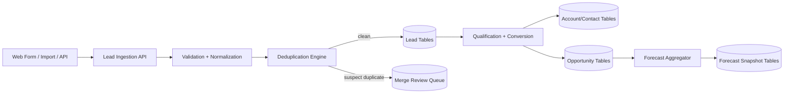
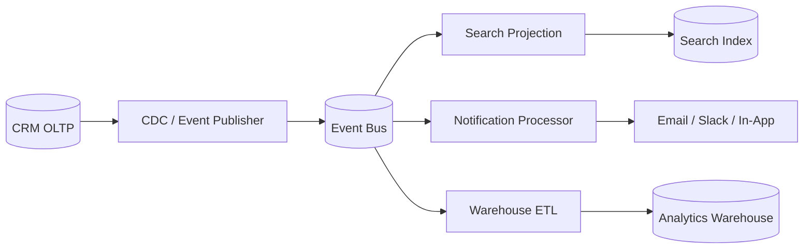

# Data Flow Diagrams

## Lead and Opportunity Data Flow

```mermaid
flowchart LR
    Source[Web Form / Import / API] --> Ingest[Lead Ingestion API]
    Ingest --> Validate[Validation + Normalization]
    Validate --> Dedupe[Deduplication Engine]
    Dedupe -->|clean| LeadStore[(Lead Tables)]
    Dedupe -->|suspect duplicate| MergeQueue[(Merge Review Queue)]

    LeadStore --> Convert[Qualification + Conversion]
    Convert --> AccountStore[(Account/Contact Tables)]
    Convert --> OppStore[(Opportunity Tables)]
    OppStore --> Forecast[Forecast Aggregator]
    Forecast --> Snapshot[(Forecast Snapshot Tables)]
```

## Operational and Analytics Data Flow

```mermaid
flowchart LR
    OLTP[(CRM OLTP)] --> CDC[CDC / Event Publisher]
    CDC --> Bus[(Event Bus)]
    Bus --> SearchProj[Search Projection]
    Bus --> Notify[Notification Processor]
    Bus --> ETL[Warehouse ETL]

    SearchProj --> Search[(Search Index)]
    ETL --> WH[(Analytics Warehouse)]
    Notify --> Channels[Email / Slack / In-App]
```
