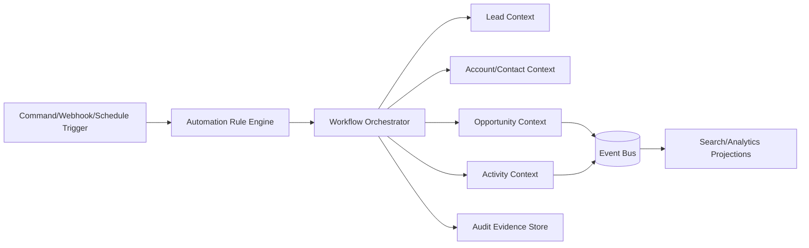

# Domain Model

## Purpose
Define the domain model artifacts for the **Customer Relationship Management Platform** with implementation-ready detail.

## Domain Context
- Domain: CRM
- Core entities: Lead, Contact, Account, Opportunity, Activity, Forecast Snapshot, Territory
- Primary workflows: lead capture and qualification, deduplication and merge review, opportunity stage progression, territory assignment and reassignment, forecast rollup and approval

## Key Design Decisions
- Enforce idempotency and correlation IDs for all mutating operations.
- Persist immutable audit events for critical lifecycle transitions.
- Separate online transaction paths from async reconciliation/repair paths.

## Reliability and Compliance
- Define SLOs and error budgets for user-facing operations.
- Include RBAC, least-privilege service identities, and full audit trails.
- Provide runbooks for degraded mode, replay, and backfill operations.

## Architecture Emphasis
- Bounded contexts with explicit API and event contracts.
- Read/write model separation where throughput and consistency needs diverge.
- Cross-cutting layers for authn/authz, observability, and policy enforcement.

## Domain Glossary
- **Aggregate Invariant**: File-specific term used to anchor decisions in **Domain Model**.
- **Lead**: Prospect record entering qualification and ownership workflows.
- **Opportunity**: Revenue record tracked through pipeline stages and forecast rollups.
- **Correlation ID**: Trace identifier propagated across APIs, queues, and audits for this workflow.

## Entity Lifecycles
- Lifecycle for this document: `Create Aggregate -> Mutate via Commands -> Emit Events -> Archive`.
- Each transition must capture actor, timestamp, source state, target state, and justification note.

## Integration Boundaries
- Model boundaries align with lead, account, opportunity, and forecast contexts.
- Data ownership and write authority must be explicit at each handoff boundary.
- Interface changes require schema/version review and downstream impact acknowledgement.

## Error and Retry Behavior
- Invariant violations return conflict errors; no partial aggregate writes.
- Retries must preserve idempotency token and correlation ID context.
- Exhausted retries route to an operational queue with triage metadata.

## Measurable Acceptance Criteria
- Each aggregate defines invariants and concurrency strategy.
- Observability must publish latency, success rate, and failure-class metrics for this document's scope.
- Quarterly review confirms definitions and diagrams still match production behavior.

## Bounded Contexts and Domain Boundaries

| Bounded Context | Owns | Explicitly Does Not Own | Core Invariants | Primary APIs |
|---|---|---|---|---|
| Lead Management | Lead intake, qualification status, assignment intent, dedupe candidates | Account master profile, opportunity financials | A lead has one tenant-scoped canonical identity key set; lead state transitions are monotonic unless reopened by policy | `POST /leads`, `POST /leads/{id}/qualify`, `POST /leads/{id}/convert` |
| Account & Contact Management | Account, contact, relationship graph, merge decisions, canonical person/org profile | Opportunity pipeline stage policy, forecasting | Contact email uniqueness per tenant after canonicalization; account merge produces immutable lineage record | `POST /contacts`, `POST /accounts`, `POST /contacts/merge` |
| Opportunity Management | Opportunity lifecycle, stage transitions, amount/probability, close semantics | Lead scoring, contact consent ledger | Stage transition must satisfy configured gate criteria; closed state is append-only with reason codes | `POST /opportunities`, `POST /opportunities/{id}/advance`, `POST /opportunities/{id}/close` |
| Activity & Engagement | Email/call/meeting/task activity timeline, external provider sync cursors | Ownership assignment policies, financial forecasting | Activity events are immutable; provider event id + tenant id is unique | `POST /activities`, `POST /activities/sync/reconcile` |
| Forecast & Territory | Territory ownership, rollup calculations, quota views | Contact PII canonicalization, provider token management | Snapshot is period-locked after approval; rollup math is reproducible from source opportunity set | `POST /territories/rebalance`, `POST /forecasts/{period}/submit` |

### Lifecycle Ownership (Lead → Qualified → Opportunity → Closed)
- **Lead context** owns `LeadCreated`, `LeadQualified`, and `LeadConverted` transitions.
- **Account/Contact context** owns canonical profile creation during conversion and duplicate remediation.
- **Opportunity context** owns `OpportunityOpened`, stage progression, and terminal closure (`ClosedWon`/`ClosedLost`).
- **Forecast context** owns post-close attribution and pipeline analytics snapshots.

## Workflow Automation Architecture (High-Level)
- Trigger sources: API commands, UI actions, inbound webhooks, scheduled policies.
- Rule evaluation tier: deterministic rule engine for assignment/qualification/stage gates.
- Orchestration tier: saga-style workflow coordinator with compensation for cross-context steps.
- Execution tier: async job workers with idempotency keys and per-tenant rate limits.
- Governance tier: policy registry, approval workflows, and audit evidence writer.

## Integration Patterns (Email / Calendar / Telephony)

| Integration | Pattern | Direction | Idempotency Key | Conflict Resolution |
|---|---|---|---|---|
| Email (Gmail/Outlook) | Webhook-first + periodic backfill polling | Bi-directional metadata + server-side send | `tenant_id + provider_message_id` | Last provider change wins for transport fields; CRM wins for owner/account linkages |
| Calendar (Google/Microsoft) | Delta token polling + webhook hints | Bi-directional event sync | `tenant_id + provider_event_id + recurrence_instance` | Version vector (`etag` + `updated_at`) and attendee-safe merge policy |
| Telephony (CTI/SIP provider) | Event-stream ingestion + call disposition callback | Inbound call events, outbound dial activity | `tenant_id + call_session_id` | Preserve immutable call facts; allow supervised update of disposition tags only |

### Integration Boundary Rules
- External adapters cannot mutate domain state directly; they emit normalized commands/events only.
- Provider auth tokens and secrets remain in a dedicated integration vault boundary.
- Each provider connector supports replay from a watermark/checkpoint for incident recovery.
