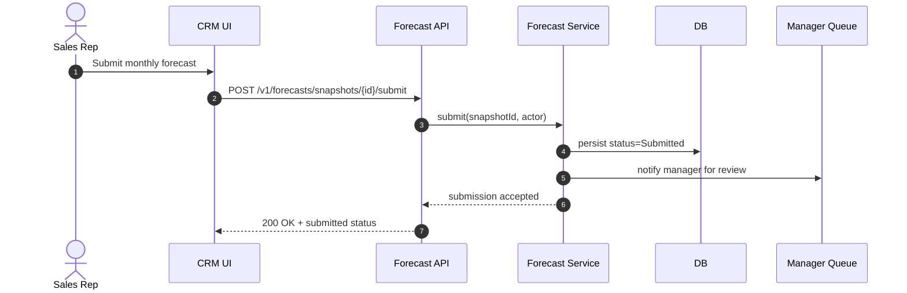
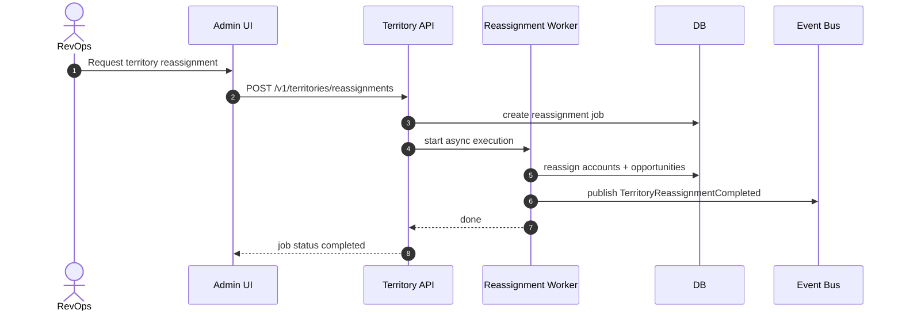
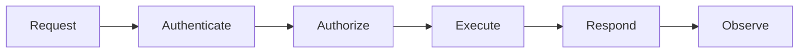

# System Sequence Diagrams

## System Sequence: Submit Forecast

## System Sequence: Territory Reassignment

## Domain Glossary
- **Interaction Step**: File-specific term used to anchor decisions in **System Sequence Diagrams**.
- **Lead**: Prospect record entering qualification and ownership workflows.
- **Opportunity**: Revenue record tracked through pipeline stages and forecast rollups.
- **Correlation ID**: Trace identifier propagated across APIs, queues, and audits for this workflow.

## Entity Lifecycles
- Lifecycle for this document: `Request -> Authenticate -> Authorize -> Execute -> Respond -> Observe`.
- Each transition must capture actor, timestamp, source state, target state, and justification note.

## Integration Boundaries
- Sequences include UI, API gateway, domain service, and async processors.
- Data ownership and write authority must be explicit at each handoff boundary.
- Interface changes require schema/version review and downstream impact acknowledgement.

## Error and Retry Behavior
- Timeout branch and retry branch are drawn for each critical sequence.
- Retries must preserve idempotency token and correlation ID context.
- Exhausted retries route to an operational queue with triage metadata.

## Measurable Acceptance Criteria
- At least one happy path and one failure path per tier-1 sequence.
- Observability must publish latency, success rate, and failure-class metrics for this document's scope.
- Quarterly review confirms definitions and diagrams still match production behavior.
