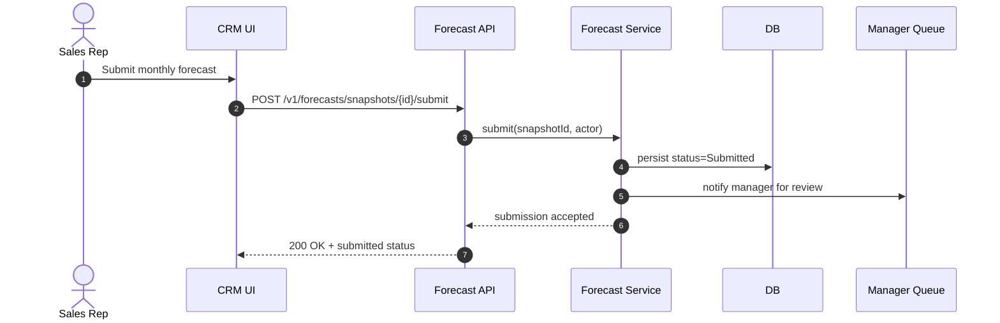
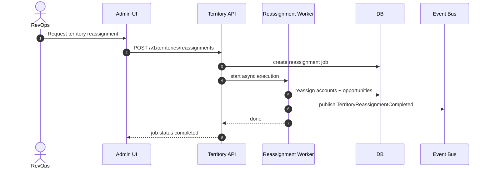

# System Sequence Diagrams

## System Sequence: Submit Forecast

```mermaid
sequenceDiagram
    autonumber
    actor Rep as Sales Rep
    participant UI as CRM UI
    participant API as Forecast API
    participant Svc as Forecast Service
    participant DB as DB
    participant Mgr as Manager Queue

    Rep->>UI: Submit monthly forecast
    UI->>API: POST /v1/forecasts/snapshots/{id}/submit
    API->>Svc: submit(snapshotId, actor)
    Svc->>DB: persist status=Submitted
    Svc->>Mgr: notify manager for review
    Svc-->>API: submission accepted
    API-->>UI: 200 OK + submitted status
```

## System Sequence: Territory Reassignment

```mermaid
sequenceDiagram
    autonumber
    actor Ops as RevOps
    participant UI as Admin UI
    participant API as Territory API
    participant Job as Reassignment Worker
    participant DB as DB
    participant Bus as Event Bus

    Ops->>UI: Request territory reassignment
    UI->>API: POST /v1/territories/reassignments
    API->>DB: create reassignment job
    API->>Job: start async execution
    Job->>DB: reassign accounts + opportunities
    Job->>Bus: publish TerritoryReassignmentCompleted
    Job-->>API: done
    API-->>UI: job status completed
```
