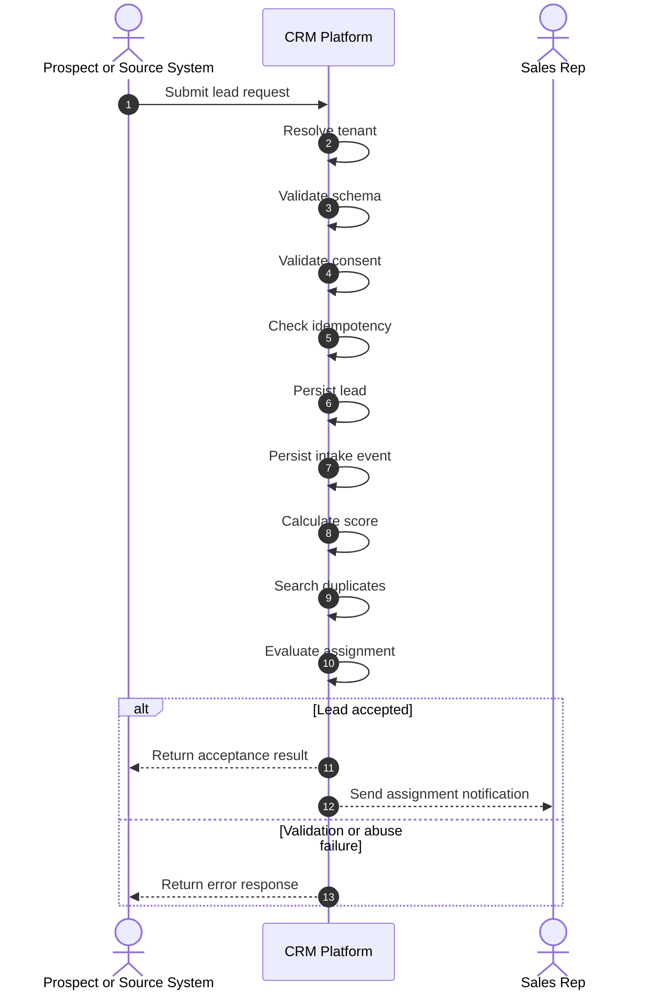
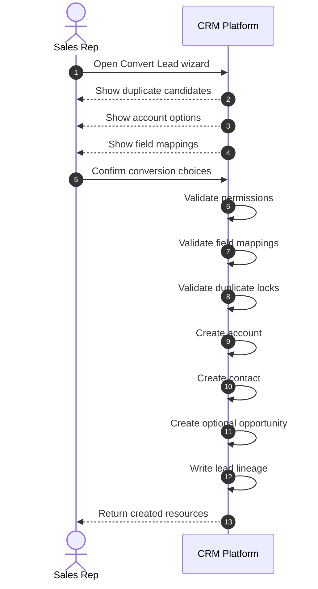
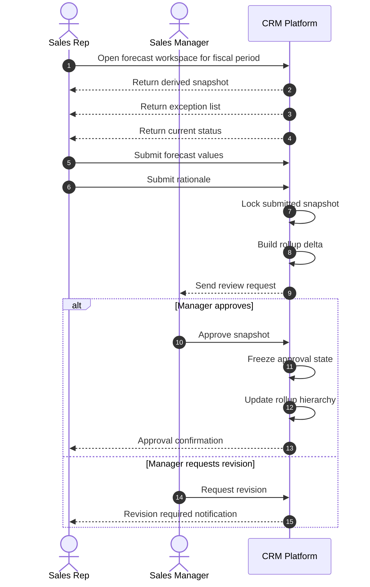
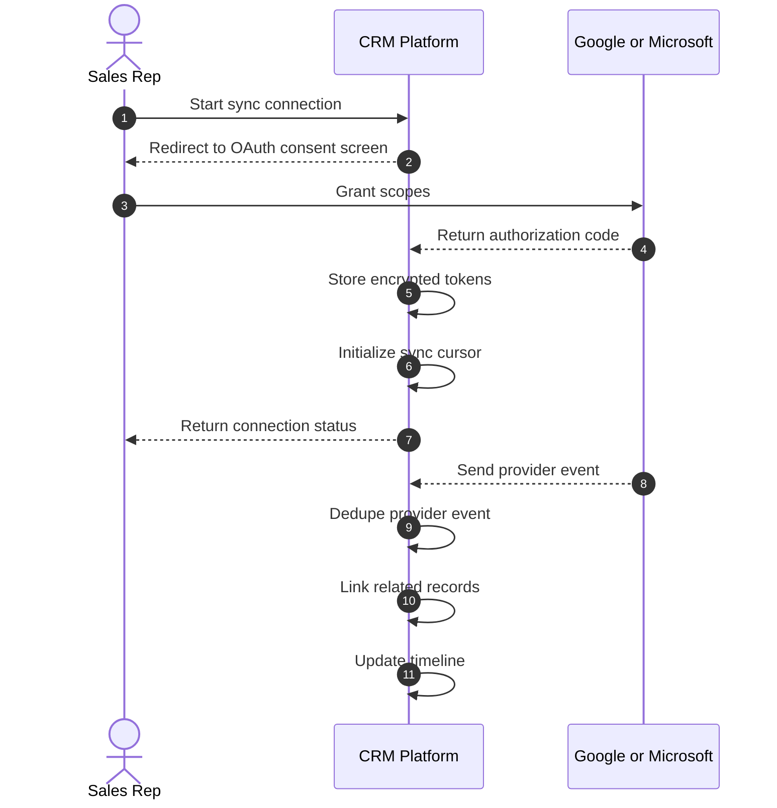
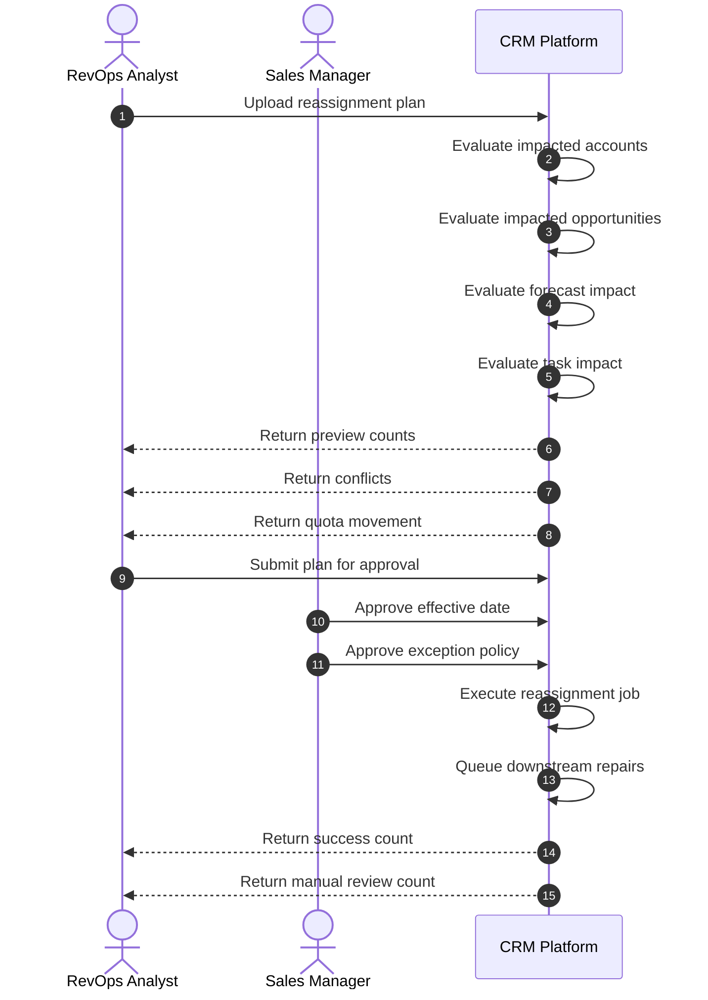

# System Sequence Diagrams — Customer Relationship Management Platform

## Purpose

These sequences describe black-box interactions between users or external systems and the CRM platform for the most important end-user workflows.

---

## SSD-01 — Capture and Route Lead

---

## SSD-02 — Convert Lead to Customer Records

---

## SSD-03 — Submit and Approve Forecast

---

## SSD-04 — Connect Email and Calendar Sync

---

## SSD-05 — Territory Reassignment Preview and Commit

## Acceptance Criteria

- Each sequence includes user intent, system validations, and visible outcomes.
- Alternate paths cover rejection, revision, or degraded external provider behavior where relevant.
- The sequences are detailed enough to derive API contract tests and end-to-end acceptance tests.
