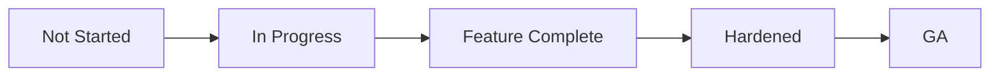

# Backend Status Matrix

## Purpose
Define the backend status matrix artifacts for the **Customer Relationship Management Platform** with implementation-ready detail.

## Domain Context
- Domain: CRM
- Core entities: Lead, Contact, Account, Opportunity, Activity, Forecast Snapshot, Territory
- Primary workflows: lead capture and qualification, deduplication and merge review, opportunity stage progression, territory assignment and reassignment, forecast rollup and approval

## Key Design Decisions
- Enforce idempotency and correlation IDs for all mutating operations.
- Persist immutable audit events for critical lifecycle transitions.
- Separate online transaction paths from async reconciliation/repair paths.

## Reliability and Compliance
- Define SLOs and error budgets for user-facing operations.
- Include RBAC, least-privilege service identities, and full audit trails.
- Provide runbooks for degraded mode, replay, and backfill operations.

## Delivery Emphasis
- Milestones mapped to slices that are testable end-to-end.
- CI quality gates include lint, unit/integration tests, and contract checks.
- Backend status matrix tracks readiness by capability and release wave.

## Domain Glossary
- **Capability Status**: File-specific term used to anchor decisions in **Backend Status Matrix**.
- **Lead**: Prospect record entering qualification and ownership workflows.
- **Opportunity**: Revenue record tracked through pipeline stages and forecast rollups.
- **Correlation ID**: Trace identifier propagated across APIs, queues, and audits for this workflow.

## Entity Lifecycles
- Lifecycle for this document: `Not Started -> In Progress -> Feature Complete -> Hardened -> GA`.
- Each transition must capture actor, timestamp, source state, target state, and justification note.

## Integration Boundaries
- Matrix links engineering status with QA, security, and SRE readiness gates.
- Data ownership and write authority must be explicit at each handoff boundary.
- Interface changes require schema/version review and downstream impact acknowledgement.

## Error and Retry Behavior
- Status updates failing validation are blocked until evidence links are attached.
- Retries must preserve idempotency token and correlation ID context.
- Exhausted retries route to an operational queue with triage metadata.

## Measurable Acceptance Criteria
- All GA rows include runbook link, dashboard link, and on-call rotation.
- Observability must publish latency, success rate, and failure-class metrics for this document's scope.
- Quarterly review confirms definitions and diagrams still match production behavior.
