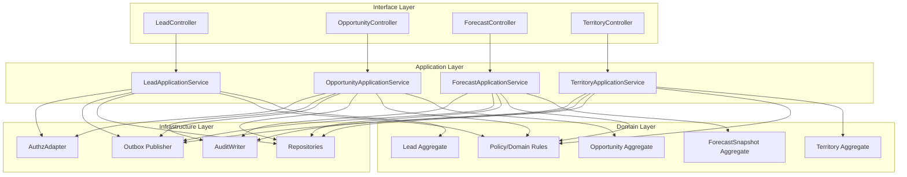

# C4 Code Diagram

This code-level view maps key modules inside the CRM backend service.

```mermaid
flowchart TB
    subgraph Interface[Interface Layer]
      CtrlLead[LeadController]
      CtrlOpp[OpportunityController]
      CtrlForecast[ForecastController]
      CtrlTerritory[TerritoryController]
    end

    subgraph App[Application Layer]
      LeadApp[LeadApplicationService]
      OppApp[OpportunityApplicationService]
      ForecastApp[ForecastApplicationService]
      TerritoryApp[TerritoryApplicationService]
    end

    subgraph Domain[Domain Layer]
      LeadAgg[Lead Aggregate]
      OppAgg[Opportunity Aggregate]
      ForecastAgg[ForecastSnapshot Aggregate]
      TerritoryAgg[Territory Aggregate]
      Rules[Policy/Domain Rules]
    end

    subgraph Infra[Infrastructure Layer]
      Repo[Repositories]
      Outbox[Outbox Publisher]
      Audit[AuditWriter]
      Authz[AuthzAdapter]
    end

    CtrlLead --> LeadApp
    CtrlOpp --> OppApp
    CtrlForecast --> ForecastApp
    CtrlTerritory --> TerritoryApp

    LeadApp --> LeadAgg
    OppApp --> OppAgg
    ForecastApp --> ForecastAgg
    TerritoryApp --> TerritoryAgg

    LeadApp --> Rules
    OppApp --> Rules
    ForecastApp --> Rules
    TerritoryApp --> Rules

    LeadApp --> Repo
    OppApp --> Repo
    ForecastApp --> Repo
    TerritoryApp --> Repo

    LeadApp --> Outbox
    OppApp --> Outbox
    ForecastApp --> Outbox
    TerritoryApp --> Outbox

    OppApp --> Audit
    ForecastApp --> Audit
    TerritoryApp --> Audit
    LeadApp --> Authz
    OppApp --> Authz
```
