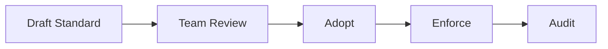

# Implementation Guidelines

## Purpose
Define the implementation guidelines artifacts for the **Customer Relationship Management Platform** with implementation-ready detail.

## Domain Context
- Domain: CRM
- Core entities: Lead, Contact, Account, Opportunity, Activity, Forecast Snapshot, Territory
- Primary workflows: lead capture and qualification, deduplication and merge review, opportunity stage progression, territory assignment and reassignment, forecast rollup and approval

## Key Design Decisions
- Enforce idempotency and correlation IDs for all mutating operations.
- Persist immutable audit events for critical lifecycle transitions.
- Separate online transaction paths from async reconciliation/repair paths.

## Reliability and Compliance
- Define SLOs and error budgets for user-facing operations.
- Include RBAC, least-privilege service identities, and full audit trails.
- Provide runbooks for degraded mode, replay, and backfill operations.

## Delivery Emphasis
- Milestones mapped to slices that are testable end-to-end.
- CI quality gates include lint, unit/integration tests, and contract checks.
- Backend status matrix tracks readiness by capability and release wave.

## Domain Glossary
- **Implementation Rule**: File-specific term used to anchor decisions in **Implementation Guidelines**.
- **Lead**: Prospect record entering qualification and ownership workflows.
- **Opportunity**: Revenue record tracked through pipeline stages and forecast rollups.
- **Correlation ID**: Trace identifier propagated across APIs, queues, and audits for this workflow.

## Entity Lifecycles
- Lifecycle for this document: `Draft Standard -> Team Review -> Adopt -> Enforce -> Audit`.
- Each transition must capture actor, timestamp, source state, target state, and justification note.

## Integration Boundaries
- Guidelines integrate CI linting, security scanning, and release governance.
- Data ownership and write authority must be explicit at each handoff boundary.
- Interface changes require schema/version review and downstream impact acknowledgement.

## Error and Retry Behavior
- Pipeline transient failures auto-retry; policy violations fail fast.
- Retries must preserve idempotency token and correlation ID context.
- Exhausted retries route to an operational queue with triage metadata.

## Measurable Acceptance Criteria
- Guidelines include measurable thresholds for coverage, lint, and vuln severity.
- Observability must publish latency, success rate, and failure-class metrics for this document's scope.
- Quarterly review confirms definitions and diagrams still match production behavior.

## Module-Level Service Contracts

| Module | Responsibilities | Sync API Contract | Async Contract | Ownership Notes |
|---|---|---|---|---|
| Lead Service | Capture, score, qualify, convert leads | `POST /leads`, `PATCH /leads/{id}/status`, `POST /leads/{id}/convert` | Publishes `crm.lead.*` events; consumes dedupe decisions | Owns lead status state machine and qualification policy binding |
| Account/Contact Service | Canonical account/contact profile, dedupe/merge | `POST /contacts`, `PATCH /contacts/{id}`, `POST /contacts/merge` | Publishes `crm.contact.*`, `crm.account.*`; consumes conversion intents | System of record for person/org master data |
| Opportunity Service | Pipeline, stage transitions, close-out semantics | `POST /opportunities`, `POST /opportunities/{id}/advance`, `POST /opportunities/{id}/close` | Publishes `crm.opportunity.*`; consumes lead conversion outputs | Owns deal lifecycle and forecast input fidelity |
| Activity Integration Service | Email/calendar/telephony activity ingestion and projection | `POST /activities`, `POST /activities/replay`, `POST /activities/reconcile` | Publishes `crm.activity.*`; consumes provider webhooks and poll snapshots | Owns provider cursor checkpoints and mapping logic |
| Integration Gateway | Provider auth, connector dispatch, rate control | `POST /integrations/{provider}/connect`, `POST /integrations/{provider}/refresh` | Emits `crm.integration.*` health and delivery events | No direct writes to domain tables; command/event boundary only |

## Event Taxonomy and Versioning Policy

### Event Families
- **Lifecycle events:** `crm.lead.lifecycle.*`, `crm.opportunity.lifecycle.*`.
- **Master data events:** `crm.contact.master.*`, `crm.account.master.*`.
- **Engagement events:** `crm.activity.email.*`, `crm.activity.calendar.*`, `crm.activity.call.*`.
- **Integration health events:** `crm.integration.connector.*`.
- **Compliance events:** `crm.audit.policy.*`, `crm.consent.*`.

### Versioning Rules
- Backward-compatible additions remain within minor schema version (`v1.x`).
- Breaking payload changes require new major topic suffix (`.v2`) and dual-publish window.
- Consumer teams must declare compatibility matrix before producer cutover.

## External Data Sync and Reconciliation Behavior

### Sync Modes
1. **Near-real-time ingestion:** webhook -> normalize -> upsert -> emit lineage event.
2. **Scheduled delta sync:** checkpointed pull for missed updates and sparse providers.
3. **Full reconciliation sweep:** nightly compare between provider snapshot and CRM projections.

### Reconciliation Outcomes
| Outcome | Condition | Action |
|---|---|---|
| Match | Provider and CRM records aligned by checksum/version | Mark cursor checkpoint successful |
| Drift-Resolvable | Field-level mismatch on non-authoritative fields | Apply deterministic patch and emit `crm.sync.corrected.v1` |
| Drift-Manual | Ambiguous conflict (e.g., duplicate contacts across systems) | Create review task, freeze automation branch, emit `crm.sync.manual_review_required.v1` |
| Missing Remote | CRM object has no provider object and should exist | Queue re-export with capped retries |
| Missing Local | Provider object exists without CRM mapping | Route to import candidate queue with dedupe scoring |

### Guardrails
- Reconciliation writes must include `reconciliation_run_id` for audit traceability.
- No destructive merge/update may execute without pre-image snapshot capture.
- Replay/reconcile jobs are tenant-throttled to protect noisy-neighbor isolation.
