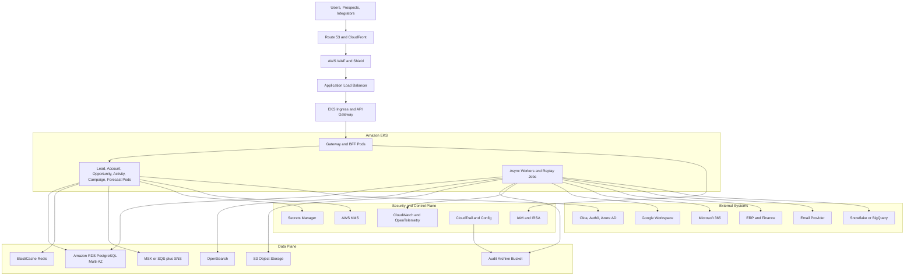
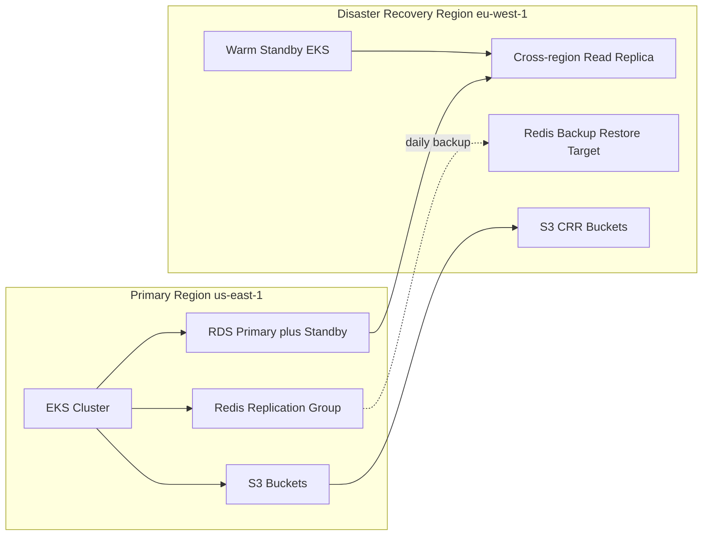

# Cloud Architecture — Customer Relationship Management Platform

## Purpose

This document defines the reference cloud architecture for running the CRM platform as a multi-tenant SaaS on AWS, with explicit mapping notes for teams that must deploy equivalent services on GCP. It complements the Kubernetes deployment and network documents by focusing on managed-service choices, resilience patterns, data protection, and operational guardrails.

---

## 1. Primary AWS Reference Architecture

### Service Selection Rationale

| Capability | AWS Service | Why |
|---|---|---|
| Compute orchestration | EKS | Matches the deployment topology already defined for CRM services and async workers. |
| OLTP database | RDS PostgreSQL Multi-AZ | Strong relational consistency, PITR, and support for row-level security and JSONB. |
| Cache, locks, rate limits | ElastiCache Redis | Fast idempotency windows, distributed locks, and queue counters. |
| Event streaming or queueing | MSK for high-volume eventing, SQS/SNS for simple jobs | Supports outbox fan-out, sync retries, and batch processing. |
| Search and timeline retrieval | OpenSearch | Fast full-text search across accounts, contacts, activities, and emails. |
| Export, audit, and backup storage | S3 with bucket-level KMS encryption | Durable storage for exports, snapshots, replay payloads, and audit archives. |
| Secret handling | Secrets Manager + KMS | Rotates OAuth client secrets, webhook secrets, and DB credentials without redeploys. |
| Observability | CloudWatch, OTEL Collector, X-Ray-compatible traces | Supports tenant-aware dashboards and incident triage. |

---

## 2. High Availability and Disaster Recovery

### Recovery Objectives

| Metric | Target | Implementation |
|---|---|---|
| RPO | <= 1 hour | RDS cross-region replica, S3 cross-region replication, hourly outbox/audit export checkpoints |
| RTO | <= 4 hours | Warm standby infrastructure, GitOps rehydrate, pre-provisioned DNS failover, tested runbooks |
| Token replay loss | 0 durable event loss after commit | Outbox table plus provider replay ledger stored in primary DB and replicated |

---

## 3. Tenant Isolation and Security Controls

| Control Area | Implementation |
|---|---|
| Tenant data isolation | `tenant_id` on all business tables, PostgreSQL row-level security, tenant-aware cache keys, per-tenant object storage prefixes |
| Authentication and SSO | OIDC/SAML federation to external IdP; SCIM provisioning optional; service accounts via short-lived IAM/OIDC tokens |
| RBAC and field security | Central policy service cached in Redis; evaluated at API and UI composition layers |
| Encryption at rest | RDS, Redis snapshots, OpenSearch, S3, and EBS volumes encrypted with KMS-managed keys |
| Encryption in transit | TLS 1.3 for ingress and mTLS or SigV4/IAM for internal control-plane access where supported |
| Secret management | Provider refresh tokens and webhook secrets stored in Secrets Manager, referenced by ARN in app tables |
| Auditability | CloudTrail for infrastructure, append-only audit tables for business events, immutable archive buckets with retention locks |
| Compliance workflows | Dedicated privacy/export service, per-request audit correlation, legal-hold gating before erasure |

---

## 4. CRM-Specific Operational Constraints

- **Lead ingestion:** public form endpoints run behind WAF rate limits and abuse scoring; successful writes continue even if downstream scoring is temporarily delayed.
- **Email/calendar sync:** provider quotas and webhook subscription expiries are absorbed by integration workers; connections can degrade per tenant without affecting unrelated tenants.
- **Forecast freeze:** forecast snapshots and period-close exports are written to S3 and audit storage before finance freeze is acknowledged.
- **Territory reassignment:** heavy preview and execution jobs run on worker node pools with quota isolation from transactional APIs.
- **Campaign sends:** queue-based dispatch isolates provider throughput from user-facing scheduling UI.

---

## 5. GCP Equivalence Map

| AWS Reference | GCP Equivalent | Notes |
|---|---|---|
| Route 53 + CloudFront + WAF | Cloud DNS + Cloud CDN + Cloud Armor | Same edge posture and caching model |
| EKS | GKE | Use Workload Identity instead of IRSA |
| RDS PostgreSQL | Cloud SQL for PostgreSQL or AlloyDB | Maintain row-level security compatibility |
| ElastiCache Redis | Memorystore for Redis | Keep same cache key and lock semantics |
| MSK or SQS/SNS | Pub/Sub + Cloud Tasks | Choose Pub/Sub for event fan-out and Cloud Tasks for directed retries |
| OpenSearch | OpenSearch on GCP or Elastic Cloud | Search service remains auxiliary, not source of truth |
| S3 | Cloud Storage | Preserve per-tenant encrypted prefixes and signed URL expiry |
| Secrets Manager + KMS | Secret Manager + Cloud KMS | Same secret reference pattern |
| CloudWatch/OTEL | Cloud Monitoring, Logging, Trace | Preserve tenant_id and correlation_id labels |

---

## 6. Deployment Guardrails

- Separate node pools for latency-sensitive APIs, integration workers, and replay/batch jobs.
- Provider callbacks enter through dedicated ingress paths so replay filtering and signature verification can scale independently.
- PITR and schema-migration rollback procedures must be rehearsed quarterly using sanitized tenant snapshots.
- Cross-region failover drills must include forecast freeze, export download URLs, and webhook signing key continuity.

## Acceptance Criteria

- The architecture specifies concrete managed services for all core CRM capabilities and their HA/DR posture.
- Security, tenant isolation, privacy, and audit requirements are explicitly represented, not implied.
- A team could provision equivalent AWS or GCP infrastructure without inventing missing operational constraints.
