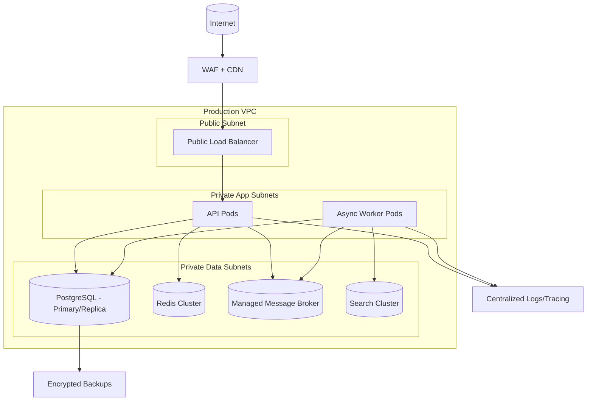
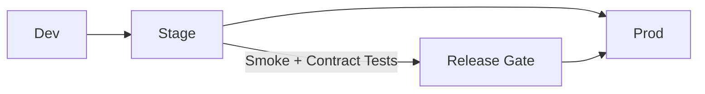
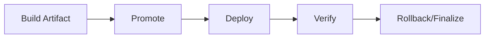

# Deployment Diagram

## Production Deployment Topology

## Environment Promotion

## Domain Glossary
- **Deployment Topology**: File-specific term used to anchor decisions in **Deployment Diagram**.
- **Lead**: Prospect record entering qualification and ownership workflows.
- **Opportunity**: Revenue record tracked through pipeline stages and forecast rollups.
- **Correlation ID**: Trace identifier propagated across APIs, queues, and audits for this workflow.

## Entity Lifecycles
- Lifecycle for this document: `Build Artifact -> Promote -> Deploy -> Verify -> Rollback/Finalize`.
- Each transition must capture actor, timestamp, source state, target state, and justification note.

## Integration Boundaries
- Boundaries include CI/CD, registry, cluster scheduler, and ingress.
- Data ownership and write authority must be explicit at each handoff boundary.
- Interface changes require schema/version review and downstream impact acknowledgement.

## Error and Retry Behavior
- Canary failure triggers automatic rollback and retry in next window only.
- Retries must preserve idempotency token and correlation ID context.
- Exhausted retries route to an operational queue with triage metadata.

## Measurable Acceptance Criteria
- Deployment doc includes rollback objective <=15 min and blast-radius notes.
- Observability must publish latency, success rate, and failure-class metrics for this document's scope.
- Quarterly review confirms definitions and diagrams still match production behavior.
