# Kubernetes Deployment Diagram

**Version:** 1.0 | **Status:** Approved | **Last Updated:** 2025-07-15

## Overview

This document describes the Kubernetes deployment topology for the CRM Platform production environment. It covers all namespaces, workload specifications, StatefulSets, ingress configuration, autoscaling policies, and resource allocations.

---

## 1. Cluster Topology

The CRM Platform runs on a managed Kubernetes cluster (EKS 1.29) across three availability zones in `us-east-1`. The cluster uses dedicated node groups per workload class to ensure resource isolation and independent scaling.

**Node Groups:**

| Node Group | Instance Type | Min Nodes | Max Nodes | Purpose |
|------------|--------------|-----------|-----------|---------|
| `ng-app` | m6i.xlarge (4 vCPU / 16 GB) | 6 | 30 | Microservice pods |
| `ng-data` | r6i.2xlarge (8 vCPU / 64 GB) | 3 | 6 | StatefulSet workloads |
| `ng-batch` | c6i.2xlarge (8 vCPU / 16 GB) | 0 | 10 | Spot — batch/async workers |
| `ng-infra` | t3.large (2 vCPU / 8 GB) | 2 | 4 | Monitoring, ingress controllers |

---

## 2. Namespace Layout

```mermaid
graph TD
    CLUSTER[EKS Cluster — us-east-1]

    CLUSTER --> NS_PROD[Namespace: crm-prod]
    CLUSTER --> NS_STAGING[Namespace: crm-staging]
    CLUSTER --> NS_MONITORING[Namespace: crm-monitoring]
    CLUSTER --> NS_INFRA[Namespace: crm-infra]

    NS_PROD --> SVC_LEAD[LeadService Deployment]
    NS_PROD --> SVC_CONTACT[ContactService Deployment]
    NS_PROD --> SVC_DEAL[DealService Deployment]
    NS_PROD --> SVC_ACTIVITY[ActivityService Deployment]
    NS_PROD --> SVC_FORECAST[ForecastService Deployment]
    NS_PROD --> SVC_TERRITORY[TerritoryService Deployment]
    NS_PROD --> SVC_CAMPAIGN[CampaignService Deployment]
    NS_PROD --> SVC_INTEGRATION[IntegrationService Deployment]
    NS_PROD --> SVC_NOTIFICATION[NotificationService Deployment]
    NS_PROD --> SVC_SEARCH[SearchService Deployment]
    NS_PROD --> SVC_AUDIT[AuditService Deployment]

    NS_PROD --> SS_PG[StatefulSet: PostgreSQL Cluster]
    NS_PROD --> SS_REDIS[StatefulSet: Redis Cluster]
    NS_PROD --> SS_KAFKA[StatefulSet: Kafka 3-Broker]
    NS_PROD --> SS_ES[StatefulSet: Elasticsearch 3-Node]

    NS_INFRA --> INGRESS[NGINX Ingress Controller]
    NS_INFRA --> KONG[Kong API Gateway]
    NS_INFRA --> SEALED[Sealed Secrets Controller]
    NS_INFRA --> CERTMGR[cert-manager]

    NS_MONITORING --> PROM[Prometheus + Thanos]
    NS_MONITORING --> GRAFANA[Grafana]
    NS_MONITORING --> ALERTMGR[Alertmanager]
    NS_MONITORING --> JAEGER[Jaeger Tracing]

    INGRESS --> KONG
    KONG --> SVC_LEAD
    KONG --> SVC_CONTACT
    KONG --> SVC_DEAL
    KONG --> SVC_ACTIVITY
    KONG --> SVC_FORECAST
    KONG --> SVC_TERRITORY
    KONG --> SVC_CAMPAIGN
    KONG --> SVC_SEARCH
```



---

## 3. Service Deployment Specifications

### 3.1 Deployment Table

| Service | Image | Replicas (Default) | CPU Request | CPU Limit | Mem Request | Mem Limit | HPA Min | HPA Max |
|---------|-------|--------------------|-------------|-----------|-------------|-----------|---------|---------|
| LeadService | `crm/lead-service:1.x` | 3 | 250m | 1000m | 256Mi | 1Gi | 2 | 8 |
| ContactService | `crm/contact-service:1.x` | 3 | 250m | 1000m | 256Mi | 1Gi | 2 | 8 |
| DealService | `crm/deal-service:1.x` | 3 | 250m | 1000m | 256Mi | 1Gi | 2 | 8 |
| ActivityService | `crm/activity-service:1.x` | 2 | 200m | 800m | 256Mi | 768Mi | 2 | 6 |
| ForecastService | `crm/forecast-service:1.x` | 2 | 500m | 2000m | 512Mi | 2Gi | 2 | 5 |
| TerritoryService | `crm/territory-service:1.x` | 2 | 200m | 500m | 256Mi | 512Mi | 2 | 4 |
| CampaignService | `crm/campaign-service:1.x` | 2 | 250m | 1000m | 256Mi | 1Gi | 2 | 6 |
| IntegrationService | `crm/integration-service:1.x` | 3 | 300m | 1200m | 512Mi | 1.5Gi | 2 | 8 |
| NotificationService | `crm/notification-service:1.x` | 2 | 150m | 500m | 128Mi | 512Mi | 2 | 6 |
| SearchService | `crm/search-service:1.x` | 2 | 250m | 1000m | 256Mi | 1Gi | 2 | 6 |
| AuditService | `crm/audit-service:1.x` | 2 | 150m | 500m | 256Mi | 512Mi | 2 | 4 |

### 3.2 HPA Configuration

All HPA objects target CPU utilization of **70%** and memory utilization of **80%** for scaling decisions. Scale-down stabilization window is set to **300 seconds** to prevent thrashing.

Example HPA manifest (LeadService):

```yaml
apiVersion: autoscaling/v2
kind: HorizontalPodAutoscaler
metadata:
  name: lead-service-hpa
  namespace: crm-prod
spec:
  scaleTargetRef:
    apiVersion: apps/v1
    kind: Deployment
    name: lead-service
  minReplicas: 2
  maxReplicas: 8
  metrics:
    - type: Resource
      resource:
        name: cpu
        target:
          type: Utilization
          averageUtilization: 70
    - type: Resource
      resource:
        name: memory
        target:
          type: Utilization
          averageUtilization: 80
  behavior:
    scaleDown:
      stabilizationWindowSeconds: 300
```

---

## 4. StatefulSet Specifications

### 4.1 PostgreSQL Cluster

The CRM Platform uses a shared PostgreSQL 15 cluster with logical database isolation per service. The cluster runs in patroni-managed high-availability mode with one primary and two replicas.

| Parameter | Value |
|-----------|-------|
| StatefulSet name | `postgres-cluster` |
| Replicas | 3 (1 primary, 2 replicas) |
| Image | `postgres:15.4` with Patroni sidecar |
| CPU Request | 1000m |
| CPU Limit | 4000m |
| Memory Request | 4Gi |
| Memory Limit | 16Gi |
| Storage | 500Gi per node (gp3, encrypted) |
| PVC StorageClass | `ebs-gp3-encrypted` |
| Backup | pg_basebackup daily → S3 `crm-db-backups` |

### 4.2 Redis Cluster

| Parameter | Value |
|-----------|-------|
| StatefulSet name | `redis-cluster` |
| Mode | Cluster mode (3 masters, 3 replicas) |
| Image | `redis:7.2-alpine` |
| CPU Request | 500m per node |
| CPU Limit | 2000m per node |
| Memory Request | 2Gi per node |
| Memory Limit | 4Gi per node |
| Storage | 20Gi per node (gp3) |
| Eviction Policy | `allkeys-lru` |
| Max Memory | 3.5Gi per master node |

### 4.3 Kafka Cluster

| Parameter | Value |
|-----------|-------|
| StatefulSet name | `kafka-cluster` |
| Brokers | 3 |
| Image | `confluentinc/cp-kafka:7.5.0` |
| CPU Request | 1000m per broker |
| CPU Limit | 4000m per broker |
| Memory Request | 4Gi per broker |
| Memory Limit | 8Gi per broker |
| Storage | 200Gi per broker (gp3, encrypted) |
| Replication Factor | 3 |
| Min In-Sync Replicas | 2 |
| Zookeeper | 3-node ZooKeeper StatefulSet |

### 4.4 Elasticsearch Cluster

| Parameter | Value |
|-----------|-------|
| StatefulSet name | `elasticsearch-cluster` |
| Nodes | 3 |
| Image | `elasticsearch:8.10.0` |
| CPU Request | 1000m per node |
| CPU Limit | 4000m per node |
| Memory Request | 4Gi per node |
| Memory Limit | 8Gi per node |
| Storage | 200Gi per node (gp3, encrypted) |
| JVM Heap | 4Gi |
| Replicas per shard | 1 |

---

## 5. Ingress and API Gateway

### 5.1 NGINX Ingress Controller

Deployed in `crm-infra` namespace as a DaemonSet on `ng-infra` node group. Terminates TLS using certificates managed by cert-manager (Let's Encrypt for staging, ACM-issued for production).

- Annotates requests with `X-Request-ID` header for distributed tracing.
- Enforces `client-max-body-size: 10m` for file upload endpoints.
- Proxies `/api/v*` traffic to Kong API Gateway Service.

### 5.2 Kong API Gateway

Kong runs as a Deployment (3 replicas) in `crm-infra` namespace. It exposes a `LoadBalancer` Service type to receive traffic from NGINX Ingress.

**Kong Plugins active in production:**

| Plugin | Scope | Purpose |
|--------|-------|---------|
| `jwt` | All routes | JWT validation against JWKS endpoint |
| `rate-limiting` | All routes | 1,000 req/min per consumer |
| `request-termination` | Deprecated endpoints | Returns `410 Gone` |
| `correlation-id` | All routes | Injects `X-Correlation-ID` |
| `prometheus` | All routes | Exposes Kong metrics to Prometheus |
| `request-size-limiting` | Upload routes | Max 10 MB |
| `response-transformer` | All routes | Strips internal headers |

### 5.3 Service Types

| Service | Type | Port |
|---------|------|------|
| Kong API Gateway | LoadBalancer | 443 |
| NGINX Ingress Controller | NodePort | 80, 443 |
| All microservices | ClusterIP | 8080 |
| Prometheus | ClusterIP | 9090 |
| Grafana | ClusterIP | 3000 |

---

## 6. ConfigMaps and Secrets

### 6.1 ConfigMaps

Each service has a dedicated ConfigMap for non-sensitive runtime configuration:

```
crm-prod/
  lead-service-config       → LOG_LEVEL, DB_POOL_SIZE, KAFKA_TOPICS
  contact-service-config    → LOG_LEVEL, DB_POOL_SIZE, REDIS_DB_INDEX
  deal-service-config       → LOG_LEVEL, DB_POOL_SIZE, STAGE_LOCK_TIMEOUT_MS
  forecast-service-config   → LOG_LEVEL, SNAPSHOT_SCHEDULE_CRON
  ...
  shared-config             → REGION, ENV, CLUSTER_NAME, TRACING_ENDPOINT
```

### 6.2 Secrets (Sealed Secrets)

All sensitive configuration is managed via [Sealed Secrets](https://github.com/bitnami-labs/sealed-secrets). Plaintext Secrets are never stored in Git. SealedSecret CRDs are committed to the GitOps repository and decrypted at runtime by the Sealed Secrets controller.

Secret categories:

| Secret Name | Contents |
|-------------|----------|
| `postgres-credentials` | DB username, password per service |
| `redis-auth` | Redis AUTH token |
| `kafka-sasl` | SASL username/password |
| `jwt-signing-keys` | RSA private key for token signing |
| `integration-credentials` | OAuth tokens for Slack, Gmail, Outlook |
| `smtp-credentials` | SMTP relay credentials |

---

## 7. PersistentVolumeClaims

All StatefulSet pods bind individual PVCs from the `ebs-gp3-encrypted` StorageClass, which provisions encrypted AWS EBS gp3 volumes.

| PVC Pattern | StorageClass | Size | Access Mode |
|-------------|-------------|------|------------|
| `postgres-data-postgres-cluster-{0,1,2}` | ebs-gp3-encrypted | 500Gi | ReadWriteOnce |
| `redis-data-redis-cluster-{0..5}` | ebs-gp3-encrypted | 20Gi | ReadWriteOnce |
| `kafka-data-kafka-cluster-{0,1,2}` | ebs-gp3-encrypted | 200Gi | ReadWriteOnce |
| `zookeeper-data-zookeeper-{0,1,2}` | ebs-gp3-encrypted | 10Gi | ReadWriteOnce |
| `es-data-elasticsearch-cluster-{0,1,2}` | ebs-gp3-encrypted | 200Gi | ReadWriteOnce |

---

## 8. Rollout and Rollback Strategy

All microservice Deployments use a `RollingUpdate` strategy with:

```yaml
strategy:
  type: RollingUpdate
  rollingUpdate:
    maxSurge: 1
    maxUnavailable: 0
```

Rollbacks are executed via `kubectl rollout undo deployment/<name> -n crm-prod` and are expected to complete within **2 minutes**. Argo CD drift detection alerts within 5 minutes if any manifest diverges from the desired state in the GitOps repository.

---

## 9. Namespace Resource Quotas

| Namespace | CPU Requests Limit | CPU Limits Cap | Memory Requests Limit | Memory Limits Cap |
|-----------|--------------------|----------------|-----------------------|-------------------|
| `crm-prod` | 40 cores | 120 cores | 80Gi | 200Gi |
| `crm-staging` | 10 cores | 30 cores | 20Gi | 50Gi |
| `crm-monitoring` | 4 cores | 16 cores | 16Gi | 32Gi |
| `crm-infra` | 4 cores | 12 cores | 8Gi | 16Gi |
