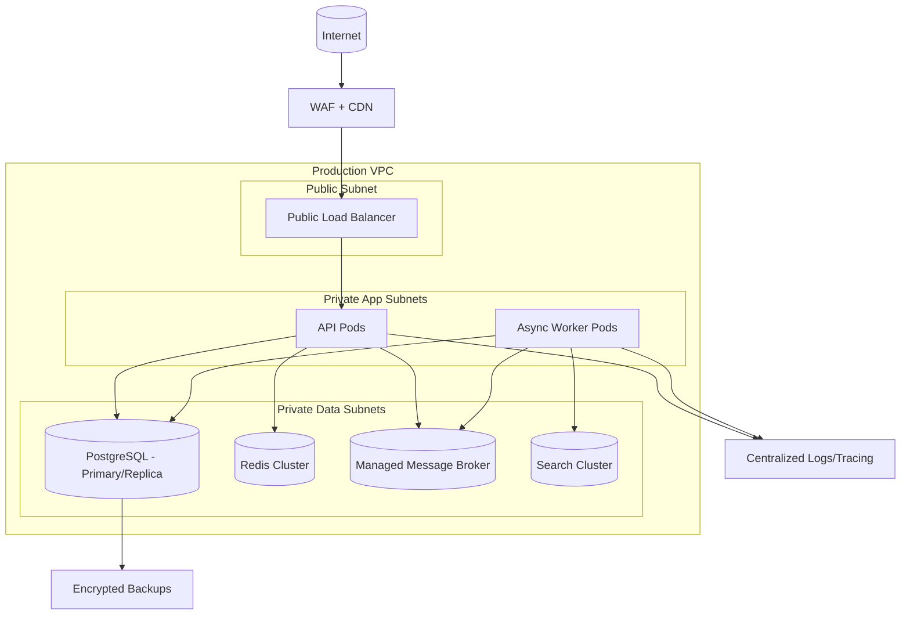
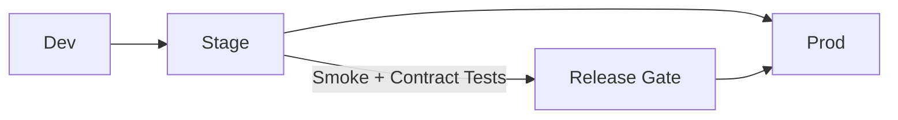

# Deployment Diagram

## Production Deployment Topology

```mermaid
flowchart TB
    Internet[(Internet)] --> WAF[WAF + CDN]
    WAF --> ALB[Public Load Balancer]

    subgraph VPC[Production VPC]
      subgraph Public[Public Subnet]
        ALB
      end

      subgraph PrivateApp[Private App Subnets]
        API[API Pods]
        Worker[Async Worker Pods]
      end

      subgraph PrivateData[Private Data Subnets]
        RDS[(PostgreSQL - Primary/Replica)]
        Redis[(Redis Cluster)]
        MQ[(Managed Message Broker)]
        Search[(Search Cluster)]
      end
    end

    ALB --> API
    API --> RDS
    API --> Redis
    API --> MQ

    Worker --> RDS
    Worker --> MQ
    Worker --> Search

    API --> Logs[Centralized Logs/Tracing]
    Worker --> Logs
    RDS --> Backup[Encrypted Backups]
```

## Environment Promotion

```mermaid
flowchart LR
    Dev[Dev] --> Stage[Stage]
    Stage --> Prod[Prod]
    Stage -->|Smoke + Contract Tests| Gate1[Release Gate]
    Gate1 --> Prod
```
