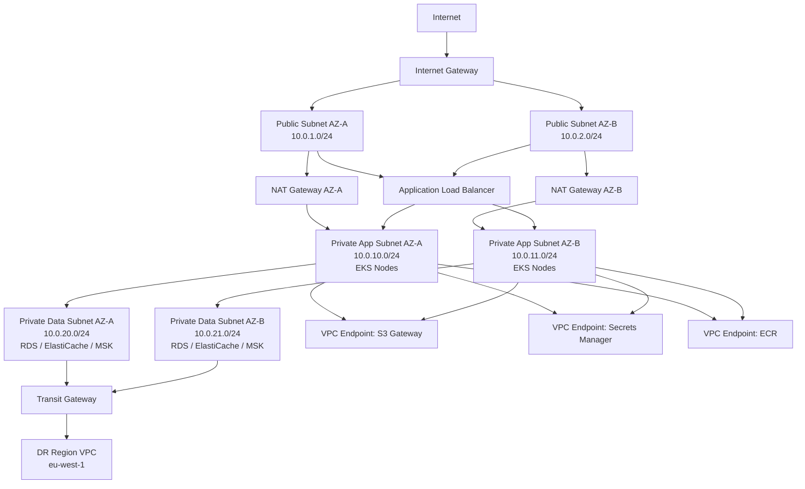

# Network Infrastructure

**Version:** 1.0 | **Status:** Approved | **Last Updated:** 2025-07-15

## Overview

This document defines the network architecture for the CRM Platform hosted on AWS. It covers VPC design, subnet segmentation, security group rules, WAF configuration, DNS strategy, VPC endpoints, NACLs, and multi-region connectivity via Transit Gateway.

---

## 1. VPC Layout

---

## 2. VPC and Subnet Configuration

| Resource | CIDR | AZ | Purpose |
|----------|------|----|---------|
| VPC | 10.0.0.0/16 | — | CRM Platform primary VPC |
| Public Subnet A | 10.0.1.0/24 | us-east-1a | ALB, NAT Gateway |
| Public Subnet B | 10.0.2.0/24 | us-east-1b | ALB, NAT Gateway |
| Private App Subnet A | 10.0.10.0/24 | us-east-1a | EKS worker nodes |
| Private App Subnet B | 10.0.11.0/24 | us-east-1b | EKS worker nodes |
| Private Data Subnet A | 10.0.20.0/24 | us-east-1a | RDS, ElastiCache, MSK |
| Private Data Subnet B | 10.0.21.0/24 | us-east-1b | RDS, ElastiCache, MSK |

**IPv6:** Disabled. All workloads communicate over IPv4. IPv6 egress-only gateway is not provisioned.

**DNS:** VPC DNS resolution and DNS hostnames are both enabled (`enableDnsSupport: true`, `enableDnsHostnames: true`).

---

## 3. Security Groups

### 3.1 `alb-sg` — Application Load Balancer

| Direction | Protocol | Port | Source | Justification |
|-----------|----------|------|--------|---------------|
| Inbound | TCP | 443 | 0.0.0.0/0 | HTTPS traffic from internet |
| Inbound | TCP | 80 | 0.0.0.0/0 | HTTP → redirect to HTTPS |
| Outbound | TCP | 8080 | eks-node-sg | Forward to EKS node HTTP |
| Outbound | TCP | 443 | eks-node-sg | Forward to EKS node HTTPS |

### 3.2 `eks-node-sg` — EKS Worker Nodes

| Direction | Protocol | Port | Source | Justification |
|-----------|----------|------|--------|---------------|
| Inbound | TCP | 8080 | alb-sg | ALB to application pods |
| Inbound | TCP | 443 | alb-sg | ALB HTTPS pass-through |
| Inbound | TCP | 1025–65535 | eks-node-sg | Inter-node pod communication |
| Inbound | TCP | 443 | eks-control-plane-sg | API server to kubelet |
| Outbound | All | All | 0.0.0.0/0 | Internet via NAT (ECR pull, enrichment APIs) |

### 3.3 `rds-sg` — PostgreSQL (RDS)

| Direction | Protocol | Port | Source | Justification |
|-----------|----------|------|--------|---------------|
| Inbound | TCP | 5432 | eks-node-sg | Application layer DB connections |
| Inbound | TCP | 5432 | bastion-sg | DBA administrative access |
| Outbound | None | — | — | No egress required |

### 3.4 `redis-sg` — ElastiCache Redis

| Direction | Protocol | Port | Source | Justification |
|-----------|----------|------|--------|---------------|
| Inbound | TCP | 6379 | eks-node-sg | Application cache reads/writes |
| Outbound | None | — | — | No egress required |

### 3.5 `kafka-sg` — MSK (Kafka)

| Direction | Protocol | Port | Source | Justification |
|-----------|----------|------|--------|---------------|
| Inbound | TCP | 9092 | eks-node-sg | Kafka plaintext (internal only) |
| Inbound | TCP | 9094 | eks-node-sg | Kafka TLS |
| Inbound | TCP | 2181 | eks-node-sg | ZooKeeper (if applicable) |
| Outbound | None | — | — | No egress required |

### 3.6 `bastion-sg` — Bastion Host

| Direction | Protocol | Port | Source | Justification |
|-----------|----------|------|--------|---------------|
| Inbound | TCP | 22 | Corporate IP range only | SSH for DBA/SRE |
| Outbound | TCP | 5432 | rds-sg | PostgreSQL admin |
| Outbound | TCP | 6379 | redis-sg | Redis admin |

---

## 4. Network ACLs (NACLs)

NACLs provide a stateless, subnet-level defense-in-depth layer. All subnets use custom NACLs.

### 4.1 Public Subnet NACL

| Rule # | Direction | Protocol | Port Range | CIDR | Action |
|--------|-----------|----------|-----------|------|--------|
| 100 | Inbound | TCP | 443 | 0.0.0.0/0 | Allow |
| 110 | Inbound | TCP | 80 | 0.0.0.0/0 | Allow |
| 120 | Inbound | TCP | 1024–65535 | 0.0.0.0/0 | Allow (return traffic) |
| 200 | Outbound | TCP | 443 | 0.0.0.0/0 | Allow |
| 210 | Outbound | TCP | 80 | 0.0.0.0/0 | Allow |
| 220 | Outbound | TCP | 8080 | 10.0.10.0/23 | Allow (to app subnets) |
| * | Both | All | All | 0.0.0.0/0 | Deny |

### 4.2 Private App Subnet NACL

| Rule # | Direction | Protocol | Port Range | CIDR | Action |
|--------|-----------|----------|-----------|------|--------|
| 100 | Inbound | TCP | 8080 | 10.0.1.0/23 | Allow (from ALB/public) |
| 110 | Inbound | TCP | 1024–65535 | 10.0.0.0/16 | Allow (return traffic) |
| 120 | Inbound | TCP | All | 10.0.10.0/23 | Allow (inter-node) |
| 200 | Outbound | TCP | 5432 | 10.0.20.0/23 | Allow (to data subnets) |
| 210 | Outbound | TCP | 6379 | 10.0.20.0/23 | Allow |
| 220 | Outbound | TCP | 9092–9094 | 10.0.20.0/23 | Allow |
| 230 | Outbound | TCP | 443 | 0.0.0.0/0 | Allow (NAT → internet) |
| * | Both | All | All | 0.0.0.0/0 | Deny |

### 4.3 Private Data Subnet NACL

| Rule # | Direction | Protocol | Port Range | CIDR | Action |
|--------|-----------|----------|-----------|------|--------|
| 100 | Inbound | TCP | 5432 | 10.0.10.0/23 | Allow (from app nodes) |
| 110 | Inbound | TCP | 6379 | 10.0.10.0/23 | Allow |
| 120 | Inbound | TCP | 9092–9094 | 10.0.10.0/23 | Allow |
| 200 | Outbound | TCP | 1024–65535 | 10.0.10.0/23 | Allow (return traffic) |
| * | Both | All | All | 0.0.0.0/0 | Deny |

---

## 5. WAF Configuration

AWS WAF v2 is attached to the Application Load Balancer. The following rule groups are active:

### 5.1 Managed Rule Groups

| Rule Group | Provider | Priority | Action |
|-----------|---------|---------|--------|
| `AWSManagedRulesCommonRuleSet` | AWS | 1 | Block |
| `AWSManagedRulesSQLiRuleSet` | AWS | 2 | Block |
| `AWSManagedRulesKnownBadInputsRuleSet` | AWS | 3 | Block |
| `AWSManagedRulesAmazonIpReputationList` | AWS | 4 | Block |

### 5.2 Custom Rules

| Rule Name | Type | Condition | Action |
|-----------|------|-----------|--------|
| `RateLimitPerIP` | Rate-based | > 2,000 req/5 min per IP | Block for 5 min |
| `RateLimitLoginEndpoint` | Rate-based | > 20 req/min on `/auth/token` per IP | Block for 15 min |
| `GeoBlockHighRiskCountries` | Geo-match | Country codes in block list (configurable) | Block |
| `BlockMaliciousUserAgents` | String match | `sqlmap`, `nikto`, `masscan` in User-Agent | Block |
| `AllowOnlyHTTPS` | Header match | `X-Forwarded-Proto != https` | Block |

### 5.3 WAF Logging

WAF logs are written to CloudWatch Logs (`aws-waf-logs-crm-prod`) and forwarded to the SIEM (Datadog) via a Kinesis Firehose subscription. Full request sampling is enabled for `BLOCK` actions.

---

## 6. DNS — Route 53

### 6.1 Hosted Zones

| Zone | Type | Purpose |
|------|------|---------|
| `crm.example.com` | Public | External API and portal |
| `internal.crm.example.com` | Private (VPC-linked) | Service-to-service DNS |

### 6.2 External DNS Records

| Record | Type | Value | Routing Policy | Health Check |
|--------|------|-------|----------------|--------------|
| `api.crm.example.com` | A (Alias) | ALB DNS name | Failover (Primary) | `/health` on port 443 |
| `api.crm.example.com` | A (Alias) | DR ALB DNS name | Failover (Secondary) | `/health` on port 443 |
| `portal.crm.example.com` | A (Alias) | CloudFront distribution | Simple | — |

### 6.3 Health Check Configuration

| Parameter | Value |
|-----------|-------|
| Protocol | HTTPS |
| Path | `/api/v1/health` |
| Port | 443 |
| Evaluation interval | 10 seconds |
| Failure threshold | 3 consecutive failures |
| Failover trigger | DNS TTL 60 seconds |

---

## 7. VPC Endpoints

Private connectivity to AWS services to eliminate internet-bound traffic from application subnets:

| Service | Endpoint Type | Subnet Association |
|---------|-------------|-------------------|
| S3 | Gateway | Private App, Private Data |
| Secrets Manager | Interface | Private App |
| ECR API | Interface | Private App |
| ECR Docker | Interface | Private App |
| CloudWatch Logs | Interface | Private App |
| STS | Interface | Private App |
| KMS | Interface | Private App, Private Data |

All Interface endpoints attach to the `vpc-endpoint-sg` security group, which allows inbound TCP 443 from `eks-node-sg` only.

---

## 8. Transit Gateway — Multi-Region Connectivity

A Transit Gateway is attached to the CRM Platform VPC to enable private connectivity to the DR region and any future VPC peering.

| Attachment | Type | Target CIDR | Purpose |
|------------|------|-------------|---------|
| `tgw-crm-primary` | VPC Attachment | 10.0.0.0/16 | Primary region |
| `tgw-crm-dr` | VPC Peer Attachment | 10.1.0.0/16 | DR region (eu-west-1) |

Route propagation: The Transit Gateway route table propagates `10.1.0.0/16` to the Private Data subnets in the primary region, enabling database replication traffic to flow over the private backbone (not internet).

---

## 9. Network Observability

| Signal | Tool | Retention |
|--------|------|-----------|
| VPC Flow Logs | CloudWatch Logs → S3 | 90 days |
| WAF Logs | CloudWatch Logs → Datadog | 30 days |
| DNS Query Logs | Route 53 Resolver Logs → CloudWatch | 30 days |
| ALB Access Logs | S3 `crm-alb-logs` | 90 days |
| NACl/SG change alerts | AWS Config Rules | Indefinite |

VPC Flow Log analysis uses Athena queries for forensic investigation. Anomalous egress patterns trigger a CloudWatch Alarm → PagerDuty alert within 5 minutes.
