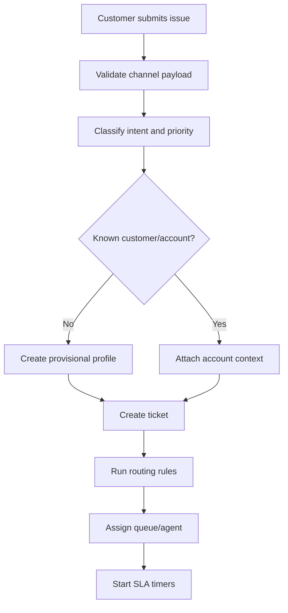
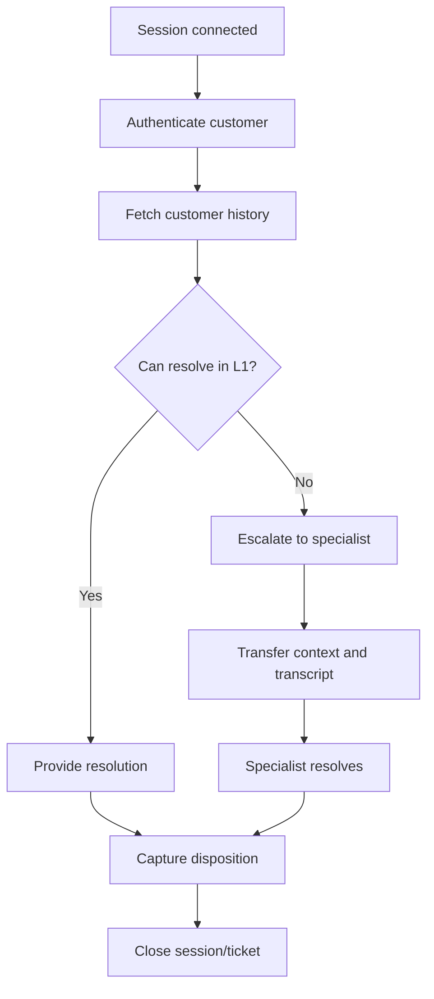
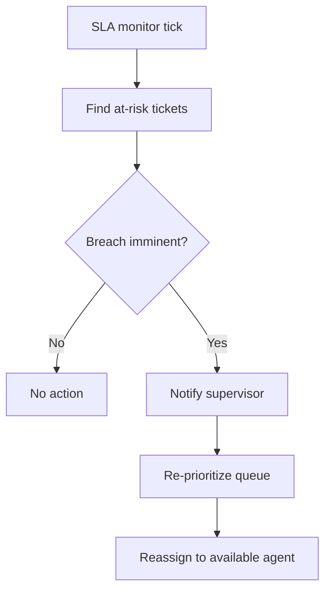
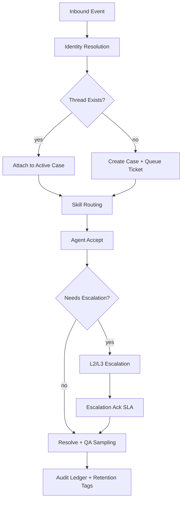

# Activity Diagrams

## Ticket Intake and Routing

## Live Interaction Handling

## SLA Breach Management

## Operational Activity Deep Dive
This activity view expands the intake-to-resolution path with explicit queue transitions, SLA clocks, and incident controls so timing and ownership are observable at every step.

- **Workflow modeling:** `queued -> assigned -> in_progress -> pending_external -> resolved -> closed` with allowed re-open via policy rule.
- **SLA rules:** first response timer starts at queue entry; resolution timer pauses only in `pending_external` with reason code.
- **Omnichannel handling:** voice/chat/email events normalized into `interaction_event` to keep activity diagrams channel-agnostic.
- **Auditability:** each action step emits `activity_transitioned` with actor, queue, and prior state hash.
- **Incident response:** if routing latency p95 breaches threshold for 5 minutes, fail over to deterministic fallback queue map.
