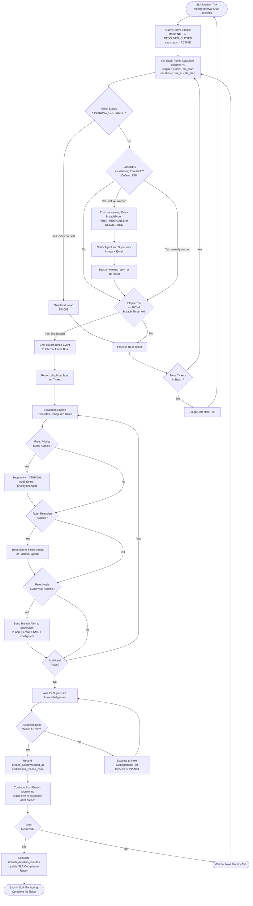

# Activity Diagrams — Customer Support and Contact Center Platform

**Version:** 1.1  
**Last Updated:** 2025-07  
**Status:** Approved

---

## Overview

This document contains detailed Mermaid activity/flowchart diagrams covering the four most complex end-to-end process flows in the platform. Each diagram is accompanied by a textual description of the flow, key decision points, exception handling, and the business rules governing each branch. Together these diagrams drive acceptance-test design, runbook creation, and capacity-planning discussions.

---

## 1. Ticket Lifecycle Activity Diagram

### Description

This diagram traces the complete journey of a support ticket from the moment a raw inbound message is received on any channel through its final archival. It covers channel ingestion and normalization, deduplication, contact resolution, ticket creation, SLA assignment, queue placement, routing, agent first response, the customer-reply cycle, resolution, CSAT dispatch, and auto-closure.

**Key Decision Points:**
- **Deduplication check:** Determines whether the inbound message opens a new ticket or appends to an existing thread.
- **Contact lookup:** Creates a provisional contact profile when no matching record exists.
- **SLA policy selection:** Based on the tier × channel × issue-category matrix; falls back to default if no exact match.
- **Routing decision:** Evaluates skill availability; overflows to backup queue or supervisor triage if no agent qualifies.
- **Customer reply cycle:** Re-opens the SLA clock (paused in PENDING_CUSTOMER) whenever the customer responds.
- **Auto-close timer:** Kicks in 48 hours after resolution if no customer reply; configurable per tenant.

**Exception Handling:**
- Parse failure → dead-letter queue → ops alert.
- No routing match after 3 re-evaluations → supervisor queue with `ROUTING_STALLED` flag.
- CSAT dispatch failure → retry queue (3 attempts / 1 hour) → `csat_survey_failed` event.

```mermaid
flowchart TD
    START([Inbound Message Received]) --> PARSE[Parse Channel Payload
Extract: sender, body, attachments, channel]
    PARSE --> PARSE_OK{Parse
Successful?}
    PARSE_OK -- No --> DLQ[Place in Dead-Letter Queue
Raise Ops Alert]
    DLQ --> END_FAIL([End — Manual Review Required])

    PARSE_OK -- Yes --> NORM[Normalize to ChannelEvent
Strip PII for NLP; assign correlation_id]
    NORM --> DEDUP{Thread
Match Found?}

    DEDUP -- Yes: existing ticket --> APPEND[Append Message to Existing Ticket
Update ticket.updated_at]
    APPEND --> SLA_RESUME{Ticket was
PENDING_CUSTOMER?}
    SLA_RESUME -- Yes --> RESUME_CLOCK[Resume SLA Clock
BR-009]
    SLA_RESUME -- No --> AGENT_NOTIFY_REPLY[Notify Assigned Agent
of New Reply]
    RESUME_CLOCK --> AGENT_NOTIFY_REPLY
    AGENT_NOTIFY_REPLY --> IN_PROGRESS[Set Status = IN_PROGRESS]
    IN_PROGRESS --> AGENT_WORK

    DEDUP -- No: new ticket --> CONTACT_LOOKUP{Contact
Record Exists?}
    CONTACT_LOOKUP -- Yes --> GET_CONTACT[Fetch contact_id and Tier]
    CONTACT_LOOKUP -- No --> CREATE_CONTACT[Create Provisional Contact
source=channel, verified=false]
    CREATE_CONTACT --> GET_CONTACT

    GET_CONTACT --> CREATE_TICKET[Create Ticket
channel, subject, body, contact_id, status=OPEN]
    CREATE_TICKET --> ATTACH_FILES[Store Attachments in Object Storage
Record S3/GCS references on Ticket]
    ATTACH_FILES --> SLA_SELECT{SLA Policy
Match Found?}
    SLA_SELECT -- Yes --> APPLY_SLA[Apply Matched SLA Policy
Set first_response_due_at and resolution_due_at]
    SLA_SELECT -- No --> DEFAULT_SLA[Apply Default SLA Policy
Raise Admin Alert: policy gap]
    DEFAULT_SLA --> APPLY_SLA

    APPLY_SLA --> CLASSIFY[NLP Classification
Issue Category + Required Skills + Priority]
    CLASSIFY --> QUEUE_PLACE[Place Ticket in Routing Queue
BR-004: one queue at a time]
    QUEUE_PLACE --> SLA_START[Start SLA First-Response Timer
BR-003]
    SLA_START --> ACK[Send Auto-Acknowledgement to Customer
Includes ticket_id and response_window]

    ACK --> ROUTE{Routing
Decision}
    ROUTE -- Skill match found --> ASSIGN[Assign to Agent
Set status=ASSIGNED, assigned_agent_id]
    ROUTE -- No match, retry 1-2 --> REEVAL[Re-evaluate in 30 seconds]
    REEVAL --> ROUTE
    ROUTE -- No match after 3 tries --> SUP_QUEUE[Move to Supervisor Triage Queue
Flag: ROUTING_STALLED]
    SUP_QUEUE --> ASSIGN

    ASSIGN --> AGENT_NOTIF[Notify Agent via Push
ticket.assigned event]
    AGENT_NOTIF --> AGENT_WORK[Agent Works Ticket
Reads history, drafts response]

    AGENT_WORK --> FIRST_RESP{First Response
Sent?}
    FIRST_RESP -- Yes --> STOP_FR_TIMER[Stop First-Response SLA Timer
Record first_response_at]
    STOP_FR_TIMER --> AWAIT_CUSTOMER[Set Status = PENDING_CUSTOMER
Pause SLA Clock BR-009]
    AWAIT_CUSTOMER --> CUST_REPLY{Customer
Replied?}

    CUST_REPLY -- Yes within SLA --> IN_PROGRESS
    CUST_REPLY -- No, SLA warning --> WARN[Emit sla.warning Event
Notify Agent and Supervisor]
    WARN --> CUST_REPLY
    CUST_REPLY -- No, SLA breached --> BREACH[Emit sla.breached Event
Escalation Engine fires]
    BREACH --> ESCALATE[Bump Priority to CRITICAL
Reassign to Senior Agent
Notify Supervisor]
    ESCALATE --> AGENT_WORK

    FIRST_RESP -- No, continuing work --> AGENT_WORK

    IN_PROGRESS --> RESOLVE{Agent Marks
Resolved?}
    RESOLVE -- Yes --> SET_RESOLVED[Set status=RESOLVED
Record resolved_at
Stop Resolution SLA Timer]
    SET_RESOLVED --> CSAT_SEND[Dispatch CSAT Survey
BR-006: once per resolved ticket]
    CSAT_SEND --> CSAT_OK{Dispatch
Successful?}
    CSAT_OK -- Yes --> AUTO_CLOSE_WAIT[Wait 48-hour Auto-Close Window]
    CSAT_OK -- No --> CSAT_RETRY[Add to Retry Queue
3 attempts / 60 min]
    CSAT_RETRY --> CSAT_OK2{Retry
Successful?}
    CSAT_OK2 -- Yes --> AUTO_CLOSE_WAIT
    CSAT_OK2 -- No --> LOG_FAIL[Log csat_survey_failed
Flag for Manual Follow-up]
    LOG_FAIL --> AUTO_CLOSE_WAIT

    AUTO_CLOSE_WAIT --> REOPEN{Customer Replies
Within 48 hours?}
    REOPEN -- Yes --> IN_PROGRESS
    REOPEN -- No --> CLOSE[Set status=CLOSED
Record closed_at]
    CLOSE --> ARCHIVE[Archive Ticket
Apply Retention Tags
Emit ticket.closed Audit Event]
    ARCHIVE --> END([End — Ticket Archived])
```

---

## 2. Bot Conversation Flow with Human Handoff

### Description

This diagram models the bot's processing pipeline for a single customer session. It covers session initialization, intent recognition, the confidence-threshold gate, knowledge-base lookup, response generation, escalation signal detection, the handoff decision, context packaging, agent notification, agent acceptance, and the final handoff confirmation. The bot session moves into observer mode once the agent takes over, enabling QA analysis.

**Key Decision Points:**
- **Confidence threshold (≥ 0.75):** Primary gate between automated resolution and human escalation (BR-007).
- **Clarification loop limit:** Maximum 2 clarification rounds before forced escalation prevents infinite loops.
- **Explicit escalation signals:** Customer phrases like "agent", "human", "supervisor" trigger immediate handoff regardless of confidence.
- **Agent availability check:** If no agent is free at handoff time, bot queues the customer and provides wait-time updates.

**Exception Handling:**
- NLP service timeout → fallback to keyword matching → escalate if no keyword match.
- Bot session disconnect → buffer up to 2 minutes → create async follow-up ticket on timeout.
- Agent does not accept handoff within 60 seconds → re-route to next available agent.

```mermaid
flowchart TD
    START([Customer Opens Chat Widget]) --> AUTH{Customer
Authenticated?}
    AUTH -- Yes: SSO token --> FETCH_CTX[Fetch Customer History
and CRM Context]
    AUTH -- No: anonymous --> COLLECT[Collect Name and Email
or Skip for Guest Session]
    COLLECT --> FETCH_CTX

    FETCH_CTX --> BOT_GREET[Bot Sends Welcome Message
Prompts for Issue Description]
    BOT_GREET --> CUST_INPUT[Customer Enters Message]

    CUST_INPUT --> EXPLICIT{Explicit Escalation
Signal Detected?
e.g. agent, human, cancel}
    EXPLICIT -- Yes --> HANDOFF_INIT
    EXPLICIT -- No --> NLP_CALL[Send to NLP Service
for Intent Classification]

    NLP_CALL --> NLP_OK{NLP Service
Responded OK?}
    NLP_OK -- No: timeout --> KEYWORD[Fallback Keyword Matching]
    KEYWORD --> KW_MATCH{Keyword
Match Found?}
    KW_MATCH -- Yes --> CONFIDENCE_CHECK
    KW_MATCH -- No --> HANDOFF_INIT

    NLP_OK -- Yes --> CONFIDENCE_CHECK{Confidence
>= 0.75? BR-007}

    CONFIDENCE_CHECK -- Yes --> KB_LOOKUP[Query Knowledge Base
with Detected Intent + Entities]
    KB_LOOKUP --> KB_FOUND{Article
Found?}
    KB_FOUND -- Yes --> RENDER_RESP[Render Article Summary
with Deep Link; Send to Customer]
    KB_FOUND -- No --> CANNED[Use Canned Response
for Intent if Available]
    CANNED --> RENDER_RESP

    RENDER_RESP --> CUST_CONFIRM{Customer
Confirms Resolution?}
    CUST_CONFIRM -- Yes --> RESOLVED[Mark Session RESOLVED_BY_BOT
Increment Deflection Counter]
    RESOLVED --> CSAT_BOT[Send Inline CSAT Prompt]
    CSAT_BOT --> END_BOT([End — Bot Session Closed])

    CUST_CONFIRM -- No: still has issue --> CLARIFY_COUNT{Clarification
Attempts < 2?}
    CLARIFY_COUNT -- Yes --> CLARIFY[Ask Clarifying Question
Refine Intent Entities]
    CLARIFY --> CUST_INPUT

    CLARIFY_COUNT -- No: max reached --> HANDOFF_INIT

    CONFIDENCE_CHECK -- No: 0.50 - 0.74 --> CLARIFY_COUNT

    HANDOFF_INIT[Initiate Human Handoff
Notify Customer of Wait Time]
    HANDOFF_INIT --> PACKAGE[Package Handoff Payload
transcript, intent, confidence_history, contact_id]
    PACKAGE --> AGENT_AVAIL{Agent
Available? BR-008}

    AGENT_AVAIL -- Yes --> ROUTE_AGENT[Route to Agent
based on Intent-Derived Skills]
    AGENT_AVAIL -- No --> QUEUE_WAIT[Place Customer in Queue
Bot provides wait-time updates every 60s]
    QUEUE_WAIT --> WAIT_LIMIT{Wait > 10 min?}
    WAIT_LIMIT -- No --> AGENT_AVAIL
    WAIT_LIMIT -- Yes --> ASYNC_OFFER[Offer Async Email Callback
Create Ticket with Bot Context]
    ASYNC_OFFER --> END_BOT

    ROUTE_AGENT --> AGENT_NOTIF[Push chat.handoff to Agent
with Embedded Transcript Panel]
    AGENT_NOTIF --> AGENT_ACCEPT{Agent Accepts
Within 60 seconds?}
    AGENT_ACCEPT -- No --> REROUTE[Re-route to Next Available Agent]
    REROUTE --> ROUTE_AGENT
    AGENT_ACCEPT -- Yes --> AGENT_GREET[Agent Sends Greeting to Customer
Handoff Confirmed]
    AGENT_GREET --> UPDATE_TICKET[Update Ticket: handoff_at, handoff_agent_id
Source = BOT_HANDOFF]
    UPDATE_TICKET --> OBSERVER[Bot Enters Observer Mode
Session stored for QA]
    OBSERVER --> END_BOT
```

---

## 3. SLA Breach Detection and Escalation Flow

### Description

This diagram models the continuous SLA monitoring loop from the moment a ticket enters a queue to breach acknowledgement and post-breach monitoring. It shows how the SLA monitor calculates elapsed time, fires progressive warning and breach events, and how the Escalation Engine executes the configured response actions (priority adjustment, reassignment, supervisor notification). The loop continues post-breach to ensure the ticket is eventually resolved despite missing the original SLA.

**Key Decision Points:**
- **Paused status check:** Tickets in `PENDING_CUSTOMER` skip SLA evaluation entirely (BR-009).
- **Warning threshold:** Configurable percentage (default: 75%); triggers agent and supervisor awareness.
- **Breach threshold:** 100% of SLA elapsed; triggers automated escalation actions.
- **Escalation rule match:** Multiple rules may fire in priority order (e.g., first reassign, then notify director).
- **Post-breach monitoring:** Even after breach, monitoring continues to detect further SLA tier violations.

**Exception Handling:**
- SLA monitor lag > 5 minutes → secondary monitor instance; ops alert.
- Escalation Engine unreachable → breach event retained in event bus for replay.
- Supervisor does not acknowledge breach within 15 minutes → escalate to next management tier.

---

## 4. Workforce Scheduling and Shift Management Flow

### Description

This diagram covers the full workforce management cycle from schedule creation through shift execution and post-shift recording. It includes the forecast review phase, schedule building, agent notification, shift start with status updates, concurrent ticket limit enforcement, break management, shift end, and the wrap-up code recording that provides disposition data for analytics.

**Key Decision Points:**
- **Forecast vs. actual:** WFM reviews forecast accuracy before approving the schedule.
- **Coverage adequacy:** Heatmap check ensures minimum staffing levels are met before publication.
- **Concurrent ticket limit enforcement:** Agent workspace enforces `max_concurrent_tickets` at assignment time.
- **Break compliance:** System tracks break duration and sends reminders to ensure labor-rule adherence.
- **Wrap-up code required:** Agents cannot accept new tickets until a disposition code is entered after each resolved ticket.

**Exception Handling:**
- Agent no-show at shift start → supervisor notified; on-call agent may be activated.
- Agent exceeds max break duration → supervisor alert; ticket queue paused for that agent.
- Wrap-up timeout (> 5 minutes) → auto-assign default disposition code; flag for QA review.

```mermaid
flowchart TD
    CREATE_START([WFM Opens Scheduling Workbench]) --> SELECT_PERIOD[Select Target Period
Week or Month]
    SELECT_PERIOD --> LOAD_FORECAST[Load Contact Volume Forecast
Erlang-C Staffing Calculator runs]
    LOAD_FORECAST --> REVIEW_FORECAST{Forecast
Accurate Enough?}
    REVIEW_FORECAST -- No --> ADJUST_FORECAST[Adjust Historical Weights
Re-run Forecast]
    ADJUST_FORECAST --> REVIEW_FORECAST
    REVIEW_FORECAST -- Yes --> BUILD_SCHEDULE[Build Agent Schedule
Drag agents into shift slots]

    BUILD_SCHEDULE --> COVERAGE_CHECK{Coverage Heatmap
All Periods Adequate?}
    COVERAGE_CHECK -- No: understaffed slots --> ADD_AGENTS[Add On-Call Agents
or Extend Existing Shifts]
    ADD_AGENTS --> COVERAGE_CHECK
    COVERAGE_CHECK -- Yes --> LABOR_CHECK{Labor Rule
Compliance Check
Max consecutive hours, breaks}
    LABOR_CHECK -- Violation found --> FIX_VIOLATION[Adjust Shift to Meet Labor Rules]
    FIX_VIOLATION --> LABOR_CHECK
    LABOR_CHECK -- Pass --> PUBLISH[Publish Schedule
Lock for Period]

    PUBLISH --> NOTIFY_AGENTS[Send Shift Confirmations
Email + In-app Push to Agents]
    NOTIFY_AGENTS --> SHIFT_START_WAIT([Wait for Shift Start Time])

    SHIFT_START_WAIT --> SHIFT_START[Shift Begins
Adherence Monitor Activates]
    SHIFT_START --> AGENT_CLOCKIN{Agent Clocks In
Within Grace Period?}
    AGENT_CLOCKIN -- No: no-show --> NO_SHOW[Flag No-Show
Notify Supervisor
Activate On-Call if Needed]
    NO_SHOW --> SHIFT_END
    AGENT_CLOCKIN -- Yes --> SET_AVAILABLE[Set Agent Status = AVAILABLE
Update agent.current_shift_id]

    SET_AVAILABLE --> ACCEPT_LOOP[Accept Ticket Assignments
Routing Engine routes per skill + availability]

    ACCEPT_LOOP --> TICKET_ASSIGN{Ticket
Assigned?}
    TICKET_ASSIGN -- No --> IDLE_CHECK{Idle > Threshold?
Default: 5 min}
    IDLE_CHECK -- Yes --> IDLE_ALERT[Alert Supervisor
Agent idle unusually long]
    IDLE_ALERT --> TICKET_ASSIGN
    IDLE_CHECK -- No --> TICKET_ASSIGN

    TICKET_ASSIGN -- Yes --> CONCURRENCY_CHECK{Concurrent Tickets
< max_concurrent? BR-005}
    CONCURRENCY_CHECK -- No --> HOLD[Hold Assignment
Re-route to Next Agent]
    HOLD --> ACCEPT_LOOP
    CONCURRENCY_CHECK -- Yes --> WORK_TICKET[Agent Works Ticket
Sends responses, resolves issue]

    WORK_TICKET --> TICKET_DONE{Ticket
Resolved?}
    TICKET_DONE -- No --> WORK_TICKET
    TICKET_DONE -- Yes --> WRAPUP[Enter Wrap-Up Mode
Disposition Code Required]

    WRAPUP --> WRAPUP_TIMER{Wrap-Up Code
Entered Within 5 min?}
    WRAPUP_TIMER -- Yes --> RECORD_CODE[Record Disposition Code
Update Analytics]
    WRAPUP_TIMER -- No --> AUTO_CODE[Apply Default Code
Flag for QA Review]
    AUTO_CODE --> RECORD_CODE

    RECORD_CODE --> BREAK_CHECK{Break
Time?}
    BREAK_CHECK -- No --> SET_AVAILABLE
    BREAK_CHECK -- Yes --> BREAK[Set Status = ON_BREAK
Record break_start_at]
    BREAK --> BREAK_LIMIT{Break Duration
<= Allowed Limit?}
    BREAK_LIMIT -- Yes, still on break --> BREAK_LIMIT
    BREAK_LIMIT -- Over limit --> BREAK_ALERT[Alert Supervisor
Break Overrun]
    BREAK_LIMIT -- Break ended --> RETURN_AVAIL[Set Status = AVAILABLE
Record break_end_at]
    RETURN_AVAIL --> SET_AVAILABLE

    SET_AVAILABLE --> SHIFT_END{Shift End
Time Reached?}
    SHIFT_END -- No --> ACCEPT_LOOP
    SHIFT_END -- Yes --> CLOCKOUT[Agent Clocks Out
Record shift_end_at]
    CLOCKOUT --> PENDING_TICKETS{Any Open Tickets
Assigned to Agent?}
    PENDING_TICKETS -- Yes --> REASSIGN_OPEN[Reassign Open Tickets
to Next Available Agent]
    REASSIGN_OPEN --> ADHERENCE
    PENDING_TICKETS -- No --> ADHERENCE[Calculate Adherence Score
Actual vs Scheduled]
    ADHERENCE --> ADHERENCE_REPORT[Update Adherence Report
Publish to WFM Dashboard]
    ADHERENCE_REPORT --> END_SHIFT([End — Shift Closed])
```

