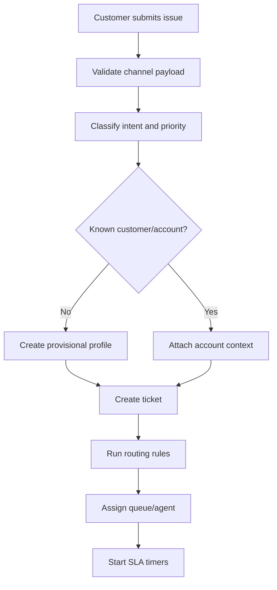
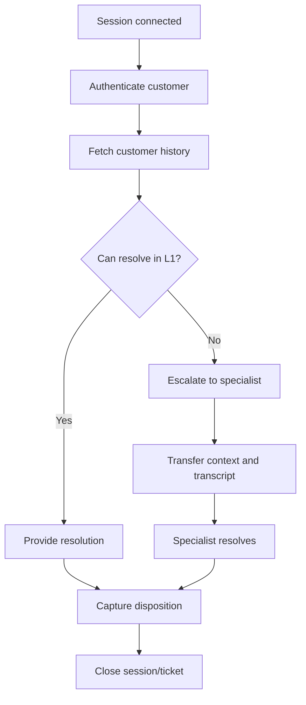
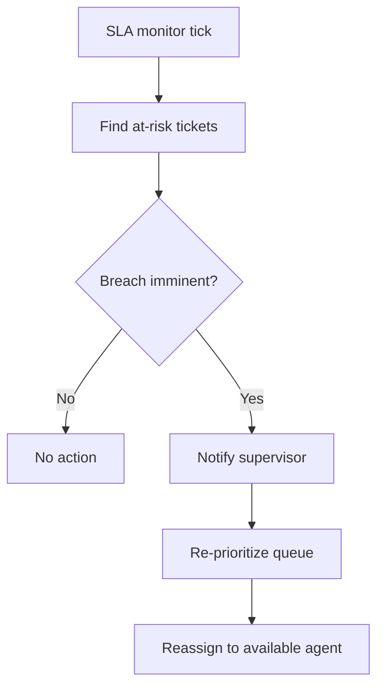

# Activity Diagrams

## Ticket Intake and Routing

```mermaid
flowchart TD
    A[Customer submits issue] --> B[Validate channel payload]
    B --> C[Classify intent and priority]
    C --> D{Known customer/account?}
    D -- No --> E[Create provisional profile]
    D -- Yes --> F[Attach account context]
    E --> G[Create ticket]
    F --> G
    G --> H[Run routing rules]
    H --> I[Assign queue/agent]
    I --> J[Start SLA timers]
```

## Live Interaction Handling

```mermaid
flowchart TD
    A[Session connected] --> B[Authenticate customer]
    B --> C[Fetch customer history]
    C --> D{Can resolve in L1?}
    D -- Yes --> E[Provide resolution]
    D -- No --> F[Escalate to specialist]
    F --> G[Transfer context and transcript]
    G --> H[Specialist resolves]
    E --> I[Capture disposition]
    H --> I
    I --> J[Close session/ticket]
```

## SLA Breach Management

```mermaid
flowchart TD
    A[SLA monitor tick] --> B[Find at-risk tickets]
    B --> C{Breach imminent?}
    C -- No --> D[No action]
    C -- Yes --> E[Notify supervisor]
    E --> F[Re-prioritize queue]
    F --> G[Reassign to available agent]
```
