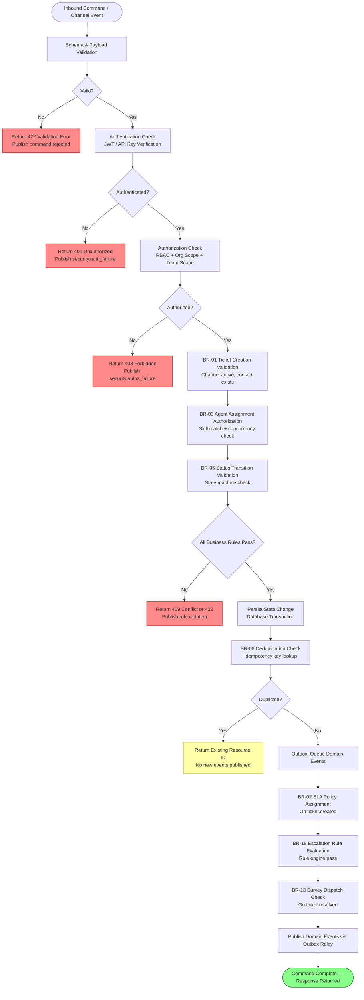

# Business Rules

This document defines all enforceable policy rules for the Customer Support and Contact Center Platform. Rules govern command processing, asynchronous jobs, state machine transitions, authorization decisions, and compliance obligations. Every rule specifies its enforcement point, rule logic, and permitted exceptions.

**Version:** 1.0  
**Status:** Authoritative  
**Last Reviewed:** See git history  

---

## Table of Contents

1. [Enforceable Rules](#enforceable-rules)
2. [Rule Evaluation Pipeline](#rule-evaluation-pipeline)
3. [Exception and Override Handling](#exception-and-override-handling)

---

## Enforceable Rules

### BR-01 — Ticket Creation Validation

**Category:** Data Integrity  
**Enforcer:** `ticket-service` (API layer, pre-persistence hook)

Before a ticket is persisted, the ticket service verifies that (a) the source channel exists and has `status = active`, (b) the contact either exists or is auto-created from the inbound message's sender metadata, and (c) a non-empty subject is present (generated from email subject, first message snippet, or channel default if not supplied by the caller).

If any condition fails, the service returns HTTP 422 with a structured error body identifying the failed validation and the rule ID. No partial ticket records are written.

Auto-contact creation is permitted only if `org.settings_json.auto_create_contacts = true`. When disabled, tickets arriving from unknown contacts are quarantined in a `new` status with `queue_id = NULL` until an agent manually associates a contact.

```pseudocode
FUNCTION validateTicketCreation(cmd):
  channel = channels.findById(cmd.channel_id)
  ASSERT channel != null AND channel.status == "active"
    ELSE RAISE ValidationError("BR-01: channel inactive or not found")

  contact = contacts.findByChannelAddress(cmd.org_id, cmd.sender_address)
  IF contact == null:
    IF org.settings.auto_create_contacts:
      contact = contacts.autoCreate(cmd.org_id, cmd.sender_address, cmd.channel_type)
    ELSE:
      RAISE ValidationError("BR-01: unknown contact and auto-create disabled")

  subject = cmd.subject OR deriveSubject(cmd.first_message, cmd.channel_type)
  ASSERT subject.length >= 1 AND subject.length <= 500
    ELSE RAISE ValidationError("BR-01: subject required")

  RETURN { contact_id: contact.contact_id, subject: subject }
```

**Exceptions:** Programmatic API integrations may supply `contact_id` directly and skip auto-creation. Subject derivation is always attempted before rejecting.

---

### BR-02 — SLA Policy Assignment

**Category:** SLA Governance  
**Enforcer:** `sla-service` (ticket.created event consumer)

Every ticket must be associated with exactly one active SLA policy. On ticket creation, the SLA service subscribes to the `ticket.created` event and selects the best-matching policy using the following priority order: (1) explicit `sla_policy_id` on the ticket, (2) channel-specific policy override configured in `channels.config_json`, (3) priority-level default policy configured at the org level.

If no matching active policy is found, the ticket is flagged with a `sla_unassigned` system tag and a `sla.assignment_failed` event is published. The SLA service retries assignment on the next ticket update event.

```pseudocode
FUNCTION assignSLAPolicy(ticket):
  IF ticket.sla_policy_id IS NOT NULL:
    policy = sla_policies.findActive(ticket.sla_policy_id)
    ASSERT policy != null ELSE log_warning("BR-02: explicit policy not active")

  IF policy == null:
    policy = sla_policies.findByChannel(ticket.org_id, ticket.channel_id, ticket.priority)

  IF policy == null:
    policy = sla_policies.findOrgDefault(ticket.org_id, ticket.priority)

  IF policy == null:
    tickets.addTag(ticket.ticket_id, "sla_unassigned")
    publish("sla.assignment_failed", { ticket_id })
    RETURN

  tickets.setSLAPolicy(ticket.ticket_id, policy.policy_id)
  sla_clocks.start(ticket.ticket_id, policy)
  publish("sla.clock_started", { ticket_id, policy_id, due_at })
```

**Exceptions:** Tickets created with `status = closed` directly (e.g., historical import) skip SLA assignment.

---

### BR-03 — Agent Assignment Authorization

**Category:** Authorization / Routing  
**Enforcer:** `routing-service` (assignment validator)

An agent may only be auto-assigned to a ticket if all of the following conditions are met: (a) the agent is a member of the team associated with the ticket's queue, (b) the agent's `status` is `online`, (c) the agent's current active ticket count is below `concurrent_limit`, and (d) for `skill_based` routing queues, the agent holds at least one matching skill with `proficiency_level >= queue.required_proficiency`.

Manual assignments by supervisors bypass the skill-match check (d) but still enforce conditions (a)–(c). Assignments to `offline` or `busy` agents require an explicit supervisor override token in the request header.

```pseudocode
FUNCTION canAutoAssign(agent, ticket, queue):
  ASSERT agent.team_id == queue.team_id
    ELSE RETURN REJECT("BR-03: agent not in queue team")
  ASSERT agent.status == "online"
    ELSE RETURN REJECT("BR-03: agent not online")
  activeCount = tickets.countActive(agent.agent_id)
  ASSERT activeCount < agent.concurrent_limit
    ELSE RETURN REJECT("BR-03: concurrency limit reached")
  IF queue.routing_strategy == "skill_based":
    matchingSkill = agent_skills.findMatch(agent.agent_id, ticket.required_skills)
    ASSERT matchingSkill != null
      ELSE RETURN REJECT("BR-03: skill mismatch")
  RETURN ALLOW
```

**Exceptions:** Supervisor override token (`X-Override-Token: <token>`) bypasses skill check only. Concurrency limits cannot be overridden.

---

### BR-04 — SLA Clock Management

**Category:** SLA Governance  
**Enforcer:** `sla-service` (ticket event consumer)

The SLA clock operates in three states: **running**, **paused**, and **frozen**. The clock transitions between these states based on ticket status changes and message events.

Clock is **paused** when ticket status transitions to `pending` (awaiting customer response) or `on_hold` (waiting on third party). Elapsed time accumulates but does not advance during pause. Clock **resumes** when an inbound customer message is received on a paused ticket (status reverts to `open`). Clock is **frozen** (permanently stopped) when ticket status transitions to `resolved` or `closed`. Frozen clocks are never unpaused.

Business-hours-only policies exclude non-working periods from elapsed time calculation. The SLA service consults the `WorkforceSchedule` for the org's business hours and computes `adjusted_elapsed_seconds` accordingly.

```pseudocode
FUNCTION handleTicketStatusChange(ticket, old_status, new_status):
  clock = sla_clocks.find(ticket.ticket_id)
  IF new_status IN ["pending", "on_hold"]:
    clock.pause(at=now(), reason=new_status)
    publish("sla.clock_paused", { ticket_id, paused_at: now() })
  ELIF old_status IN ["pending", "on_hold"] AND new_status == "open":
    clock.resume(at=now())
    publish("sla.clock_resumed", { ticket_id, resumed_at: now() })
  ELIF new_status IN ["resolved", "closed"]:
    clock.freeze(at=now())
    publish("sla.clock_stopped", { ticket_id, stopped_at: now() })

FUNCTION handleInboundMessage(message, ticket):
  IF ticket.status IN ["pending", "on_hold"]:
    tickets.setStatus(ticket.ticket_id, "open")
    handleTicketStatusChange(ticket, ticket.status, "open")
```

**Exceptions:** SLA clock for tickets imported with a historical `created_at` is initialized with elapsed time pre-computed from the import timestamp.

---

### BR-05 — Ticket Status Transitions

**Category:** Lifecycle / State Machine  
**Enforcer:** `ticket-service` (status change command handler)

Ticket status follows a defined directed acyclic graph. Invalid transitions are rejected. Valid transitions:

- `new` → `open` (agent views or responds to ticket)
- `open` → `pending` (agent awaits customer reply)
- `open` → `on_hold` (awaiting third-party action)
- `open` → `resolved` (agent marks resolved)
- `pending` → `open` (customer replies)
- `pending` → `resolved` (auto-resolve after inactivity timeout)
- `on_hold` → `open` (hold condition cleared)
- `resolved` → `closed` (auto-close after 72h or manual close)
- `closed` → `open` (reopen — customer sends new message to closed ticket)
- `resolved` → `open` (reopen — within 24h grace period)

Reopening a `closed` ticket creates a new `TicketThread` with `thread_type = system` recording the reopen event and timestamps.

```pseudocode
VALID_TRANSITIONS = {
  "new":      ["open"],
  "open":     ["pending", "on_hold", "resolved"],
  "pending":  ["open", "resolved"],
  "on_hold":  ["open"],
  "resolved": ["closed", "open"],
  "closed":   ["open"]
}

FUNCTION changeStatus(ticket, new_status, actor):
  ASSERT new_status IN VALID_TRANSITIONS[ticket.status]
    ELSE RAISE ConflictError("BR-05: invalid transition " + ticket.status + "→" + new_status)
  old_status = ticket.status
  tickets.setStatus(ticket.ticket_id, new_status)
  publish("ticket.status_changed", { ticket_id, old_status, new_status, actor_id, occurred_at })
  IF new_status IN ["resolved", "closed"]:
    requireDisposition(ticket, actor)
```

**Exceptions:** Admin bulk-close operations may transition directly from any non-closed state to `closed` with an audit reason code.

---

### BR-06 — First Response SLA Clock Start

**Category:** SLA Governance  
**Enforcer:** `sla-service` (message.sent event consumer)

The first-response SLA clock starts at `ticket.created_at` and stops at the timestamp of the first outbound message sent by a human agent (`author_type = agent`, `direction = outbound`). Bot-sent messages (`author_type = bot`) do not stop the first-response SLA clock.

When the first qualifying agent message is sent, the SLA service records `ticket.first_response_at` and publishes `sla.first_response_met`. If this timestamp exceeds `sla_policy.first_response_seconds` from ticket creation (adjusted for business hours), an `sla_breach` record is created.

```pseudocode
FUNCTION handleMessageSent(message, thread, ticket):
  IF thread.direction == "outbound" AND thread.author_type == "agent":
    IF ticket.first_response_at IS NULL:
      tickets.setFirstResponseAt(ticket.ticket_id, message.sent_at)
      elapsed = sla_clocks.computeElapsed(ticket.ticket_id, since=ticket.created_at, until=message.sent_at)
      IF elapsed > policy.first_response_seconds:
        sla_breaches.create(ticket_id, policy_id, breach_type="first_response", breached_at=message.sent_at)
        publish("sla.breached", { ticket_id, breach_type: "first_response" })
      ELSE:
        publish("sla.first_response_met", { ticket_id, response_time_seconds: elapsed })
```

**Exceptions:** If `ticket.created_at` was backdated during import, the SLA service uses `max(ticket.created_at, channel.config_json.import_sla_start_at)`.

---

### BR-07 — Bot-to-Human Handoff

**Category:** Routing / Handoff  
**Enforcer:** `bot-service`, `routing-service`

When a bot determines it cannot resolve a customer's issue (intent confidence below threshold, customer requests human, or max bot turns exceeded), it initiates a handoff. The handoff process: (1) creates a new `TicketThread` of `thread_type = system` documenting the handoff reason and bot session summary, (2) sets `ticket.status = open`, (3) routes the ticket to `bot.handoff_queue_id`, and (4) publishes `bot.handoff_initiated`. The routing service then applies normal queue routing logic to assign a human agent.

Context preservation is mandatory: the bot service writes a structured context summary to the system thread, including recognized intents, collected entities, and attempted resolutions. Human agents can read this context before their first reply.

```pseudocode
FUNCTION initiateHandoff(bot_session, ticket, reason):
  contextSummary = bot_sessions.buildContextSummary(bot_session)
  ticket_threads.create({
    ticket_id: ticket.ticket_id,
    thread_type: "system",
    author_type: "bot",
    content: formatHandoffNote(reason, contextSummary)
  })
  tickets.setStatus(ticket.ticket_id, "open")
  tickets.setQueue(ticket.ticket_id, bot.handoff_queue_id)
  publish("bot.handoff_initiated", { ticket_id, bot_id, reason, context: contextSummary })
  publish("ticket.queued", { ticket_id, queue_id: bot.handoff_queue_id })
```

**Exceptions:** If `handoff_queue_id` is null or the queue is paused, the ticket is assigned to `bot.fallback_agent_id` directly. If both are null, the ticket enters the org's default queue.

---

### BR-08 — Message Deduplication

**Category:** Data Integrity / Idempotency  
**Enforcer:** `ingestion-service` (inbound message processor)

Every inbound message from an external channel carries an `external_message_id` assigned by the channel provider. The ingestion service uses the composite key `(channel_id, external_message_id)` as an idempotency key. Before persisting a new message, the service checks for an existing record with the same composite key.

If a duplicate is detected, the service returns the existing `message_id` to the caller and publishes no new domain events. The duplicate attempt is logged to the idempotency audit log for monitoring and debugging.

Outbound messages sent by the platform do not use this check; instead they use an internal `idempotency_key` header on the API command to prevent duplicate sends on retry.

```pseudocode
FUNCTION processInboundMessage(channelEvent):
  idempotencyKey = (channelEvent.channel_id, channelEvent.external_message_id)
  existing = messages.findByIdempotencyKey(idempotencyKey)
  IF existing != null:
    log("BR-08: duplicate inbound message discarded", { idempotencyKey, existing_message_id: existing.message_id })
    RETURN { message_id: existing.message_id, duplicate: true }

  message = messages.create(channelEvent)
  publish("message.received", { message_id: message.message_id, ticket_id })
  RETURN { message_id: message.message_id, duplicate: false }
```

**Exceptions:** Channel connectors that do not provide stable `external_message_id` values (certain social media APIs) fall back to content hash deduplication within a 60-second window.

---

### BR-09 — Priority Escalation

**Category:** SLA Governance / Escalation  
**Enforcer:** `sla-service`, `escalation-engine`

A ticket's priority is automatically upgraded one level (e.g., `normal` → `high`) under two conditions: (a) the SLA clock shows fewer than 15 minutes remaining before a resolution breach (T-15 warning), or (b) an explicit escalation rule with `action_type = escalate_priority` fires. Priority can only increase automatically; automatic downgrades are not permitted.

When priority is upgraded, `ticket.priority` is updated, a new SLA policy assignment check runs (the new priority may have a different policy), and `ticket.priority_changed` is published. The SLA clock recalculates `due_at` based on the new policy.

```pseudocode
FUNCTION checkSLAWarning(ticket, clock):
  remaining = clock.breach_at - now()
  IF remaining <= 900 AND NOT clock.warning_fired:
    clock.markWarningFired()
    publish("sla.warning_triggered", { ticket_id, remaining_seconds: remaining })
    IF ticket.priority != "urgent":
      newPriority = escalatePriority(ticket.priority)
      tickets.setPriority(ticket.ticket_id, newPriority)
      publish("ticket.priority_changed", { ticket_id, old_priority: ticket.priority, new_priority: newPriority, reason: "sla_warning" })
      sla_service.reassignPolicy(ticket)
```

**Exceptions:** Tickets with `priority = urgent` do not undergo automatic priority escalation (already at maximum). Supervisors may manually downgrade priority with an audit note.

---

### BR-10 — Agent Concurrency Limits

**Category:** Authorization / Load Management  
**Enforcer:** `routing-service` (assignment handler), `ticket-service` (manual assignment handler)

Agents have a configured `concurrent_limit` representing the maximum number of simultaneously active tickets they may hold. "Active" is defined as tickets where `status IN ('new', 'open', 'pending', 'on_hold')` and `assignee_agent_id = agent.agent_id`.

Both the automated routing service and the manual assignment UI enforce this limit. When a ticket is resolved or closed, the active count decrements and the routing service may immediately assign the next queued ticket to the newly available slot.

The limit is checked atomically within a database transaction using `SELECT ... FOR UPDATE` on the agent row to prevent race conditions during concurrent assignment attempts.

```pseudocode
FUNCTION assignTicketToAgent(ticket, agent):
  BEGIN TRANSACTION
    agent_row = agents.lockForUpdate(agent.agent_id)
    activeCount = tickets.countActive(agent.agent_id)
    IF activeCount >= agent_row.concurrent_limit:
      ROLLBACK
      RAISE ConflictError("BR-10: agent at concurrency limit (" + activeCount + "/" + agent_row.concurrent_limit + ")")
    tickets.setAssignee(ticket.ticket_id, agent.agent_id)
    publish("agent.assigned", { ticket_id, agent_id, active_count: activeCount + 1 })
  COMMIT
```

**Exceptions:** Admin-initiated "emergency assign" commands may exceed the concurrent limit by exactly 1 ticket and require an audit reason. The agent's capacity display in the console shows an over-capacity indicator.

---

### BR-11 — Canned Response Scope

**Category:** Authorization  
**Enforcer:** `canned-response-service` (list and use endpoints)

Canned responses carry a `team_id` scope. When `team_id IS NULL`, the response is org-wide and available to all agents. When `team_id IS NOT NULL`, the response is team-scoped and may only be used by agents whose `team_id` matches the canned response's `team_id`.

The canned response list API filters responses based on the requesting agent's team membership. The use (insert-into-reply) API enforces the scope check at execution time to prevent circumvention via cached response IDs.

```pseudocode
FUNCTION getCannedResponsesForAgent(agent):
  RETURN canned_responses.where(
    org_id = agent.org_id
    AND (team_id IS NULL OR team_id = agent.team_id)
    AND NOT deleted
  ).orderBy(usage_count DESC)

FUNCTION useCannedResponse(agent, response_id):
  response = canned_responses.findById(response_id)
  ASSERT response.org_id == agent.org_id
  IF response.team_id IS NOT NULL:
    ASSERT response.team_id == agent.team_id
      ELSE RAISE AuthorizationError("BR-11: canned response scoped to different team")
  canned_responses.incrementUsageCount(response_id)
  RETURN response.content_text
```

**Exceptions:** Supervisors with `manage_team_content` permission may use any team-scoped canned response within their org.

---

### BR-12 — Knowledge Base Article Publishing

**Category:** Content Governance  
**Enforcer:** `kb-service` (status change handler)

Public KB articles (`knowledge_bases.visibility = public`) must pass a review step before being published. An article in `draft` status may only be moved to `review` by its author. From `review`, the article may be moved to `published` only by an agent holding the `kb_reviewer` role, and the reviewer must not be the same agent as the author (four-eyes principle).

Internal KB articles (`visibility = internal`) may be published directly by any agent with `kb_author` permission, bypassing the review requirement.

```pseudocode
FUNCTION changeArticleStatus(article, new_status, actor):
  kb = knowledge_bases.find(article.kb_id)
  IF kb.visibility == "public":
    IF new_status == "review":
      ASSERT actor.agent_id == article.author_agent_id
        ELSE RAISE AuthorizationError("BR-12: only author can submit for review")
    IF new_status == "published":
      ASSERT actor.hasRole("kb_reviewer")
        ELSE RAISE AuthorizationError("BR-12: kb_reviewer role required")
      ASSERT actor.agent_id != article.author_agent_id
        ELSE RAISE AuthorizationError("BR-12: author cannot self-approve")
      article.published_at = now()
  ELIF kb.visibility == "internal":
    ASSERT actor.hasPermission("kb_author")
      ELSE RAISE AuthorizationError("BR-12: kb_author permission required")
  articles.setStatus(article.article_id, new_status)
  publish("article.status_changed", { article_id, new_status, actor_id })
```

**Exceptions:** Org admins may force-publish any article with an audit reason in exceptional circumstances (e.g., urgent security bulletin).

---

### BR-13 — Survey Dispatch

**Category:** Customer Experience / Data Integrity  
**Enforcer:** `survey-service` (ticket.resolved / ticket.closed event consumer)

Exactly one CSAT survey may be dispatched per ticket per resolution event. The survey service checks for an existing `survey_responses` record with the same `(survey_id, ticket_id)` before sending. If one exists, the dispatch is skipped and a warning is logged.

The survey is sent to `ticket.contact_id` via the same channel the ticket originated on, if that channel supports outbound survey delivery. If the channel does not support surveys (e.g., voice), the survey falls back to email using `contact.email`.

```pseudocode
FUNCTION handleTicketResolved(ticket):
  activeTemplate = survey_templates.findActive(ticket.org_id, trigger_event="ticket_resolved")
  IF activeTemplate == null: RETURN

  existing = survey_responses.find(activeTemplate.survey_id, ticket.ticket_id)
  IF existing != null:
    log("BR-13: survey already dispatched for ticket", { ticket_id })
    RETURN

  deliveryChannel = resolveDeliveryChannel(ticket.channel_id, ticket.contact_id)
  survey_dispatch.send(activeTemplate, ticket, deliveryChannel)
  publish("survey.dispatched", { survey_id: activeTemplate.survey_id, ticket_id, contact_id })
```

**Exceptions:** Survey dispatch is suppressed for tickets tagged `internal_test` or for contacts with `unsubscribed_survey = true` in their profile preferences.

---

### BR-14 — Attachment Security Scanning

**Category:** Security  
**Enforcer:** `attachment-service` (upload handler), `scan-service` (async processor)

Attachments are placed in a quarantine state (`scan_status = pending`) immediately upon upload. The attachment service publishes an `attachment.uploaded` event to trigger the async scan pipeline. During the `pending` state, the attachment's pre-signed URL endpoint returns HTTP 403.

Upon scan completion, `scan_status` is updated to `clean` or `infected`. Clean attachments become accessible. Infected attachments remain blocked, the file is deleted from object storage within 1 hour, and an `attachment.infected_detected` event is published for security alerting.

```pseudocode
FUNCTION onAttachmentUploaded(attachment):
  attachments.setScanStatus(attachment.attachment_id, "pending")
  publish("attachment.uploaded", { attachment_id, storage_key, ticket_id })

FUNCTION onScanComplete(attachment_id, scan_result):
  IF scan_result.status == "clean":
    attachments.setScanStatus(attachment_id, "clean")
    publish("attachment.scan_clean", { attachment_id })
  ELIF scan_result.status == "infected":
    attachments.setScanStatus(attachment_id, "infected")
    storage.scheduleDelete(attachment.storage_key, delay_hours=1)
    publish("attachment.infected_detected", { attachment_id, threat: scan_result.threat_name })
    notifications.alertSecurityTeam(attachment_id, scan_result)

FUNCTION getAttachmentUrl(attachment_id, requestor):
  attachment = attachments.find(attachment_id)
  IF attachment.scan_status != "clean":
    RAISE ForbiddenError("BR-14: attachment not available (scan_status=" + attachment.scan_status + ")")
  RETURN storage.generatePresignedUrl(attachment.storage_key, ttl=300)
```

**Exceptions:** No exceptions. Attachment access gates are enforced unconditionally.

---

### BR-15 — Ticket Merge Rules

**Category:** Lifecycle / Data Integrity  
**Enforcer:** `ticket-service` (merge command handler)

Two or more tickets may be merged into a single master ticket. Merge is permitted only when all source tickets have `status IN ('new', 'open', 'pending')`. Resolved or closed tickets may not be merged. The agent initiating the merge must be assigned to or have view access to all involved tickets.

On merge, all `TicketThread` and `Message` records from source tickets are re-parented to the master ticket. `Contact` associations from source tickets that differ from the master's contact are recorded as linked contacts. Source tickets are set to `status = closed` with a system thread noting the merge and the master ticket's ID.

```pseudocode
FUNCTION mergeTickets(master_ticket_id, source_ticket_ids, actor):
  master = tickets.find(master_ticket_id)
  FOR source_id IN source_ticket_ids:
    source = tickets.find(source_id)
    ASSERT source.status IN ["new", "open", "pending"]
      ELSE RAISE ConflictError("BR-15: cannot merge ticket in status " + source.status)
    ASSERT actor.canAccess(source)
      ELSE RAISE AuthorizationError("BR-15: insufficient access to source ticket")

    ticket_threads.reparent(source.ticket_id, master.ticket_id)
    attachments.reparent(source.ticket_id, master.ticket_id)
    ticket_threads.createSystemNote(source.ticket_id, "Merged into ticket #" + master.ticket_id)
    tickets.setStatus(source.ticket_id, "closed", reason="merged")

  publish("ticket.merged", { master_ticket_id, source_ticket_ids, actor_id })
```

**Exceptions:** Admins may merge resolved tickets in bulk migration scenarios with an explicit `force_merge` flag and audit justification.

---

### BR-16 — GDPR Redaction

**Category:** Compliance / Privacy  
**Enforcer:** `privacy-service` (data subject request handler)

Upon receipt of a validated GDPR right-to-erasure request, the privacy service locates all PII fields belonging to the requesting data subject across `contacts`, `messages`, `tickets`, and `survey_responses`. PII fields are replaced with a structured redaction marker `[REDACTED:<timestamp>:<request_id>]`. The contact record itself is anonymized (name, email, phone replaced with redaction markers; `external_id` nulled). The contact's `org_id` association is preserved for aggregate reporting integrity.

The redaction is applied in a single database transaction and recorded in an immutable `privacy_requests` audit table. SLA breach records referencing the contact are not deleted but have PII-adjacent fields redacted.

```pseudocode
FUNCTION processErasureRequest(contact_id, request_id):
  contact = contacts.findById(contact_id)
  ASSERT contact != null ELSE RAISE NotFoundError("BR-16: contact not found")

  redactionMarker = "[REDACTED:" + now().iso() + ":" + request_id + "]"
  BEGIN TRANSACTION
    contacts.redactPII(contact_id, redactionMarker)
    messages.redactByContact(contact_id, redactionMarker)
    survey_responses.redactByContact(contact_id, redactionMarker)
    privacy_requests.record(contact_id, request_id, completed_at=now())
  COMMIT
  publish("contact.pii_redacted", { contact_id, request_id, completed_at: now() })
```

**Exceptions:** Redaction of messages involved in active legal holds is blocked pending legal team clearance. Legal hold status is checked before executing redaction.

---

### BR-17 — Workforce Schedule Enforcement

**Category:** Operational / Load Management  
**Enforcer:** `shift-service` (agent status change consumer), `routing-service`

An agent on a scheduled break (shift `status = active` AND current time falls within a break window defined in `working_hours_json.breaks`) may not accept new ticket assignments. The routing service excludes agents in break status from assignment candidates.

If an agent manually sets `status = break` outside of a scheduled break window, the shift service logs a schedule deviation. The routing service still honors the `break` status for routing purposes regardless of schedule compliance.

```pseudocode
FUNCTION isAgentAvailableForRouting(agent):
  IF agent.status != "online": RETURN false
  shift = shifts.findActive(agent.agent_id)
  IF shift == null: RETURN false
  IF isWithinBreakWindow(shift, now()): RETURN false
  RETURN true

FUNCTION handleAgentStatusChange(agent, new_status):
  IF new_status == "break":
    shift = shifts.findActive(agent.agent_id)
    IF shift != null AND NOT isScheduledBreakTime(shift, now()):
      shifts.logDeviation(shift.shift_id, "unscheduled_break", occurred_at=now())
  RETURN ALLOW
```

**Exceptions:** Agents may manually go on break at any time for welfare reasons; the system logs deviations but does not block the status change.

---

### BR-18 — Escalation Rule Execution Order

**Category:** Automation / Escalation  
**Enforcer:** `escalation-engine` (rule evaluator)

Escalation rules are evaluated in ascending `execution_order`. When a rule matches, its action is executed and rule processing for the current event stops (first-match-wins semantics), unless the rule's `action_config_json` includes `"continue": true`, which allows subsequent rules to also evaluate.

Rules sharing the same `execution_order` value are evaluated in `created_at` ascending order as a tiebreaker. The escalation engine processes at most 20 rules per event to prevent infinite rule chains.

```pseudocode
FUNCTION evaluateEscalationRules(ticket, trigger_event):
  rules = escalation_rules.findActive(ticket.org_id, trigger_type=trigger_event)
               .orderBy(execution_order ASC, created_at ASC)
  evaluated = 0
  FOR rule IN rules:
    IF evaluated >= 20: BREAK
    IF matchesConditions(rule.trigger_config_json, ticket):
      executeAction(rule, ticket)
      evaluated++
      IF NOT rule.action_config_json.get("continue", false):
        BREAK
```

**Exceptions:** Rules with `trigger_type = sla_breach` always execute regardless of other rules' `continue` flag, to ensure breach notifications are never suppressed.

---

### BR-19 — Queue Overflow

**Category:** Routing / Resilience  
**Enforcer:** `routing-service` (queue monitor)

If a ticket has waited in a queue for longer than `queue.max_wait_seconds` and `max_wait_seconds IS NOT NULL`, the queue overflow procedure fires: (a) if `overflow_queue_id IS NOT NULL`, the ticket is moved to the overflow queue; (b) if no overflow queue is configured, the ticket's priority is bumped one level and a manager notification is sent.

The queue monitor runs every 30 seconds and checks all tickets in `status = new` with a non-null `queue_id`. Overflow events generate an `queue.overflow_triggered` domain event for reporting.

```pseudocode
FUNCTION checkQueueOverflow():
  overflowCandidates = tickets.findQueuedExceedingWait()
  FOR ticket IN overflowCandidates:
    queue = queues.find(ticket.queue_id)
    waitSeconds = (now() - ticket.created_at).seconds
    IF waitSeconds > queue.max_wait_seconds:
      IF queue.overflow_queue_id IS NOT NULL:
        tickets.setQueue(ticket.ticket_id, queue.overflow_queue_id)
        publish("queue.overflow_triggered", { ticket_id, from_queue: queue.queue_id, to_queue: queue.overflow_queue_id })
      ELSE:
        IF ticket.priority != "urgent":
          tickets.setPriority(ticket.ticket_id, escalatePriority(ticket.priority))
        notifications.notifyQueueManager(queue, ticket, "max_wait_exceeded")
        publish("queue.overflow_triggered", { ticket_id, action: "priority_bump" })
```

**Exceptions:** Tickets tagged `vip_hold` are exempt from automatic overflow and instead trigger an immediate manager alert.

---

### BR-20 — Channel Normalization

**Category:** Data Integrity / Integration  
**Enforcer:** `ingestion-service` (channel connector pipeline)

All inbound messages, regardless of channel type, must be normalized to a canonical envelope structure before entering the ticket routing pipeline. The canonical envelope includes: `org_id`, `channel_id`, `channel_type`, `sender_address`, `external_message_id`, `subject` (if applicable), `body_text`, `body_html` (if applicable), `attachments[]`, `received_at`, and `raw_payload_json`.

Channel-specific fields that do not map to the canonical schema are preserved in `raw_payload_json` for compliance and debugging. Normalization failures result in the message being quarantined in a `channel_ingestion_errors` table and a `message.normalization_failed` event being published.

```pseudocode
FUNCTION normalizeInboundEvent(raw_event, channel):
  normalizer = NormalizerRegistry.get(channel.channel_type)
  IF normalizer == null:
    channel_ingestion_errors.create(raw_event, reason="no_normalizer")
    publish("message.normalization_failed", { channel_id: channel.channel_id, raw_ref: raw_event.id })
    RETURN null

  TRY:
    envelope = normalizer.normalize(raw_event, channel)
    envelope.raw_payload_json = raw_event
    RETURN envelope
  CATCH NormalizationError as e:
    channel_ingestion_errors.create(raw_event, reason=e.message)
    publish("message.normalization_failed", { channel_id: channel.channel_id, error: e.message })
    RETURN null
```

**Exceptions:** None. All inbound events must pass normalization before routing. Quarantined events are reviewed by the operations team within 4 hours per the ingestion SLO.

---

## Rule Evaluation Pipeline

The following diagram shows the complete sequence of rule evaluations applied to every inbound command that mutates ticket state.



### Pipeline Stages

| Stage | Description | Failure Mode |
|-------|-------------|--------------|
| **Schema Validation** | JSON schema check on request body; rejects unknown fields in strict mode. | HTTP 422 |
| **Authentication** | JWT signature validation + expiry check; API key lookup for server-to-server. | HTTP 401 |
| **Authorization** | RBAC role check + org/team scope enforcement. Row-level security enforced at DB layer. | HTTP 403 |
| **Business Rules** | Domain-specific rules (BR-01 through BR-20). | HTTP 409 or 422 |
| **Persistence** | Single database transaction with optimistic locking where applicable. | HTTP 409 on conflict |
| **Deduplication** | Idempotency key check after persistence to handle retry scenarios. | HTTP 200 with existing resource |
| **Event Dispatch** | Domain events queued in outbox table, relayed asynchronously by the outbox poller. | Internal retry with DLQ |

---

## Exception and Override Handling

Overrides permit authorized principals to bypass specific business rule enforcement. All overrides are strictly audited and time-bounded.

### Override Classes

| Override Class | Bypasses Rule(s) | Required Role | Audit Requirement |
|---|---|---|---|
| `supervisor_assign` | BR-03 (skill match only) | `supervisor` | Reason code + supervisor ID logged |
| `emergency_concurrency` | BR-10 (by +1 slot) | `supervisor` | Reason code + expiry timestamp |
| `force_merge` | BR-15 (resolved tickets) | `org_admin` | Full justification text + dual approval |
| `legal_hold_bypass` | BR-16 (erasure blocked) | `legal_admin` | Legal case reference number |
| `admin_bulk_close` | BR-05 (direct close) | `org_admin` | Batch job ID + reason code |
| `force_publish` | BR-12 (self-approval) | `org_admin` | Justification text |

### Override Request Structure

All override-enabled API commands accept an `X-Override-Token` header. The token encodes:

```json
{
  "override_class": "supervisor_assign",
  "authorized_by": "<agent_id>",
  "reason_code": "SKILL_GAP_EMERGENCY",
  "reason_text": "No skilled agents available; customer escalation imminent.",
  "expires_at": "2025-01-15T18:00:00Z",
  "correlation_id": "<request_correlation_id>"
}
```

The token is signed with the org's override signing key. Unsigned or expired tokens are rejected with HTTP 403.

### Override Audit Trail

Every override execution writes to the `override_audit_log` table (immutable, append-only):

- `override_id`, `override_class`, `authorized_by`, `executed_by`, `target_entity_type`, `target_entity_id`, `reason_code`, `reason_text`, `executed_at`, `expires_at`, `correlation_id`

Override patterns are reviewed weekly by the compliance team. Recurring overrides on the same rule may trigger a policy redesign review.

### Automatic Override Expiry

Override tokens are single-use by default. Multi-use tokens (for batch operations) carry an `expires_at` timestamp and a `max_uses` counter. Once either limit is reached, the token is invalidated and subsequent requests receive HTTP 403.

## Enforced Rule Summary

1. All inbound contacts must be assigned a ticket within 60 seconds of creation; SLA clock starts immediately.
2. Priority 1 incidents require acknowledgement within 15 minutes and resolution within 4 hours; breach triggers escalation.
3. Tickets inactive for 5 business days in 'pending customer' status are auto-closed with notification.
4. CSAT surveys are sent within 24 hours of ticket closure; surveys are mandatory for P1 and P2 tickets.
5. Agent transfers must include context notes; blind transfers are blocked by the platform workflow engine.
6. Queue assignments are based on skill tags; ticket is re-queued if assigned agent lacks required skill.
7. Call recordings are retained for 90 days for quality assurance; PCI-DSS calls are paused during card entry.
8. Escalation to supervisor requires customer consent; escalation path must complete within defined SLA window.
