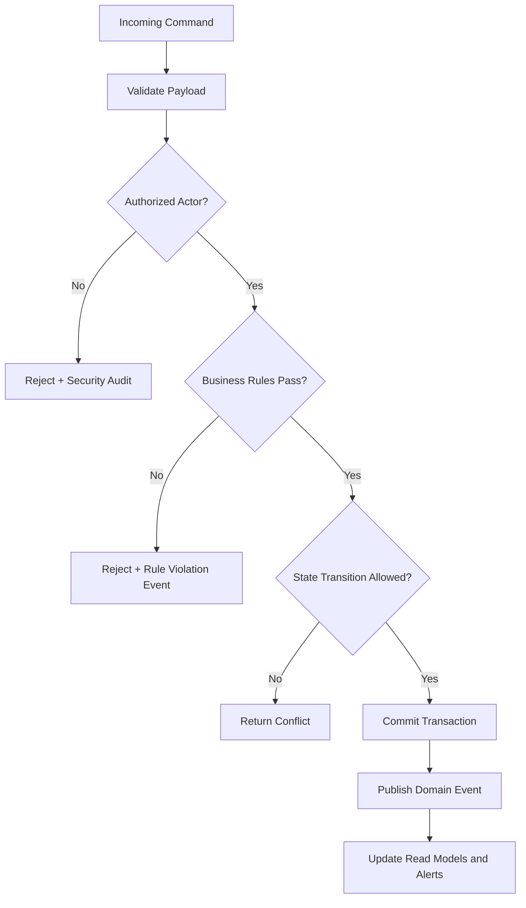
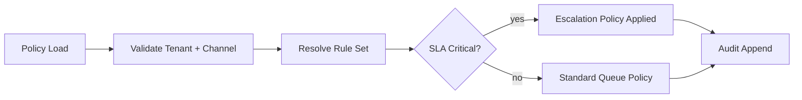

# Business Rules

This document defines enforceable policy rules for **Customer Support and Contact Center Platform** so command processing, asynchronous jobs, and operational actions behave consistently under normal and exceptional conditions.

## Context
- Domain focus: customer support and contact center workflows.
- Rule categories: lifecycle transitions, authorization, compliance, and resilience.
- Enforcement points: APIs, workflow/state engines, background processors, and administrative consoles.

## Enforceable Rules
1. Every state-changing command must pass authentication, authorization, and schema validation before processing.
2. Lifecycle transitions must follow the configured state graph; invalid transitions are rejected with explicit reason codes.
3. High-impact operations (financial, security, or regulated data actions) require additional approval evidence.
4. Manual overrides must include approver identity, rationale, and expiration timestamp.
5. Retries and compensations must be idempotent and must not create duplicate business effects.

## Rule Evaluation Pipeline

## Exception and Override Handling
- Overrides are restricted to approved exception classes and require dual logging (business + security audit).
- Override windows automatically expire and trigger follow-up verification tasks.
- Repeated override patterns are reviewed for policy redesign and automation improvements.

## Domain Rule Expansion for Contact Center Operations

1. **Queue/workflow rules:** queue assignment requires matching language, skill, and compliance flags; fallback queues require supervisor approval token.
2. **SLA/escalation rules:** P1 issues escalate at T-15m to incident commander; P2 at breach; P3 only after two missed response checkpoints.
3. **Omnichannel rules:** duplicate inbound events are discarded using `(connector_id, external_message_id)` uniqueness contract.
4. **Auditability rules:** policy overrides must include `override_reason`, `expiry_at`, and `approved_by`.
5. **Incident rules:** during connector outage, rule engine disables nonessential automations and forces human review for unresolved high-priority cases.
