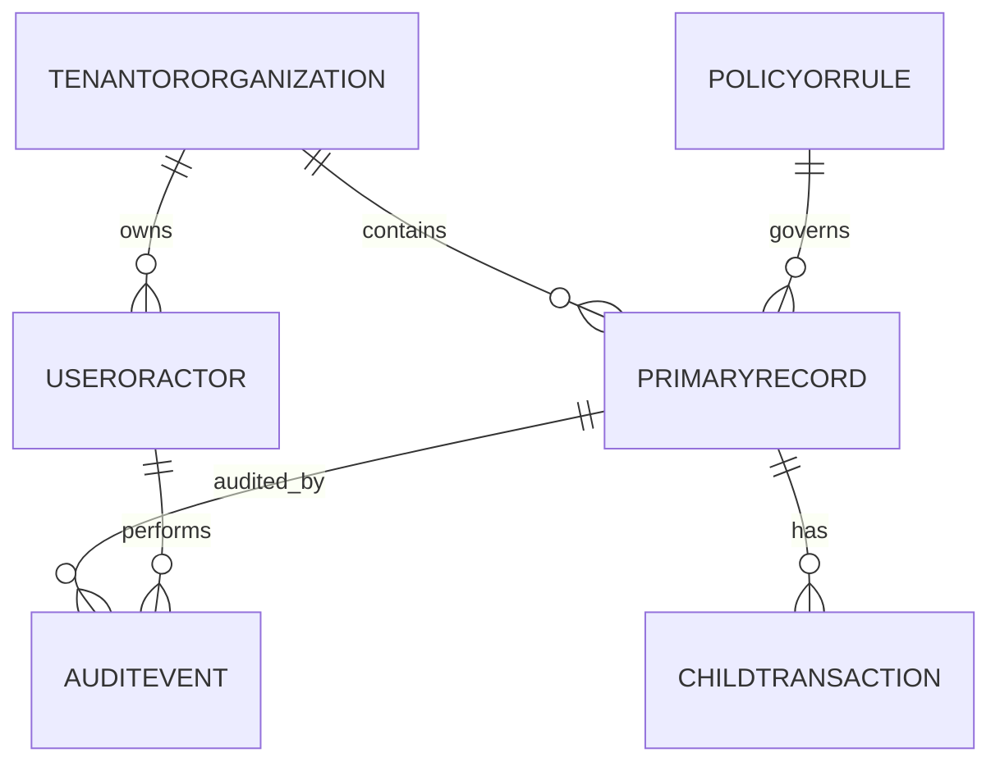
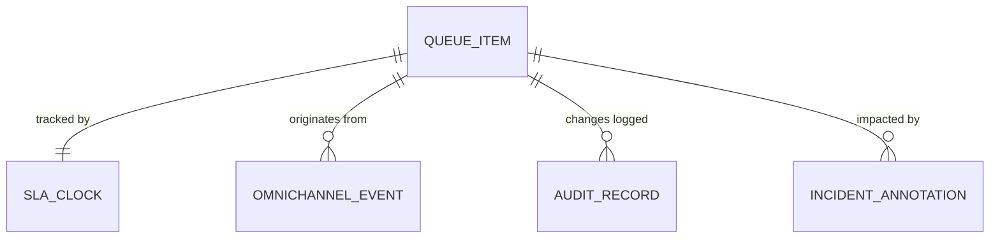

# Data Dictionary

This data dictionary is the canonical reference for **Customer Support and Contact Center Platform**. It defines shared terminology, entity semantics, and governance controls required to keep customer support and contact center workflows consistent across teams and services.

## Scope and Goals
- Establish a stable vocabulary for architecture, API, analytics, and operations teams.
- Define minimum required fields for core entities and expected relationship boundaries.
- Document data quality and retention controls needed for production readiness.

## Core Entities
| Entity | Description | Required Attributes |
|---|---|---|
| TenantOrOrganization | Top-level ownership boundary for data segregation | `org_id, name, status, region, created_at` |
| UserOrActor | Human/system principal that performs actions | `actor_id, org_id, role, status, last_active_at` |
| PrimaryRecord | Main lifecycle object handled by the platform | `record_id, org_id, state, owner_id, created_at, updated_at` |
| ChildTransaction | Operational transaction or sub-step linked to primary record | `txn_id, record_id, txn_type, amount_or_value, occurred_at` |
| PolicyOrRule | Versioned policy configuration that influences decisions | `policy_id, scope, version, effective_from, effective_to` |
| AuditEvent | Append-only evidence for state changes and controls | `audit_id, record_id, actor_id, action, reason_code, occurred_at` |

## Canonical Relationship Diagram

## Data Quality Controls
1. All write paths enforce required-field validation and referential integrity for mandatory foreign keys.
2. External imports must include provenance metadata (`source_system`, `source_ref`, `ingested_at`).
3. Status/state fields use controlled vocabularies and reject unknown values.
4. Duplicate detection runs on natural keys where business identity collisions are likely.
5. Sensitive fields carry classification tags to drive masking, encryption, and export behavior.

## Retention and Audit
- Operational records remain online for active workflow windows and support forensic queries.
- Historical records move to archive tiers by policy without breaking traceability.
- Audit events are immutable and linked through correlation ids for incident analysis.

## Data Dictionary Narrative: SLA, Queue, and Incident Entities
Key entities to keep this platform auditable and operable:
- `queue_item`: `queue_id`, `priority_score`, `entered_at`, `assignment_deadline_at`, `workflow_state`.
- `sla_clock`: `clock_type`, `started_at`, `paused_at`, `breach_at`, `policy_version`.
- `omnichannel_event`: canonical envelope with `channel`, `source_event_id`, `causation_id`, `payload_hash`.
- `audit_record`: immutable row with `actor`, `action`, `before_json`, `after_json`, `signature`.
- `incident_annotation`: `incident_id`, `service_component`, `impact_segment`, `mitigation_step`.

Operational requirement: dictionary fields used in routing/SLA decisions must be non-null and versioned to permit historical replay.
