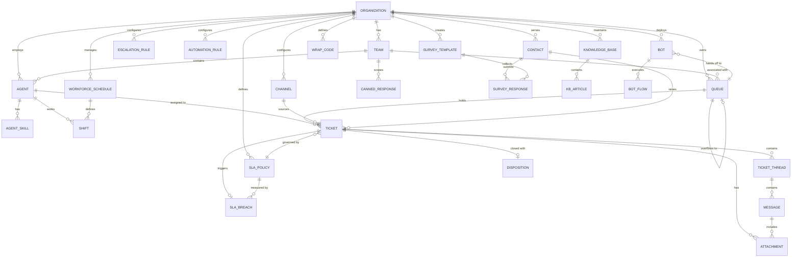

# Data Dictionary

This data dictionary is the **canonical reference** for the Customer Support and Contact Center Platform. It defines shared terminology, entity semantics, attribute constraints, relationship boundaries, data quality controls, and governance policies required for consistent behavior across all services, APIs, analytics pipelines, and operational tooling.

**Version:** 1.0  
**Status:** Authoritative  
**Scope:** All microservices, event streams, and data warehouse schemas owned by this platform.

---

## Table of Contents

1. [Core Entities](#core-entities)
2. [Canonical Relationship Diagram](#canonical-relationship-diagram)
3. [Entity Attribute Reference](#entity-attribute-reference)
4. [Data Quality Controls](#data-quality-controls)
5. [Data Retention Policy](#data-retention-policy)
6. [Security Classification](#security-classification)

---

## Core Entities

The following table enumerates every first-class entity in the platform. Each entity maps to exactly one primary database table and one canonical domain aggregate.

| # | Entity | Description | Table Name |
|---|--------|-------------|------------|
| 1 | **Organization** | Top-level multi-tenant boundary; all data is scoped to an org. | `organizations` |
| 2 | **Team** | A named group of agents within an org, associated with one or more queues. | `teams` |
| 3 | **Agent** | A human support representative belonging to one org and team. | `agents` |
| 4 | **AgentSkill** | A specific skill or competency held by an agent, with a proficiency rating. | `agent_skills` |
| 5 | **Queue** | A virtual holding area for tickets awaiting agent assignment. | `queues` |
| 6 | **Channel** | An inbound/outbound communication surface (email, chat, voice, SMS, etc.). | `channels` |
| 7 | **Ticket** | The primary lifecycle record representing a customer support interaction. | `tickets` |
| 8 | **TicketThread** | A logical conversation thread within a ticket (reply, internal note, system). | `ticket_threads` |
| 9 | **Message** | An individual message unit within a thread, with full content and delivery metadata. | `messages` |
| 10 | **Attachment** | A binary or document file associated with a message or ticket. | `attachments` |
| 11 | **Contact** | A customer or end-user who initiates or participates in a support interaction. | `contacts` |
| 12 | **SLAPolicy** | A named set of response and resolution time targets, scoped to priority levels. | `sla_policies` |
| 13 | **SLABreach** | An immutable record of an SLA target being missed on a specific ticket. | `sla_breaches` |
| 14 | **EscalationRule** | A conditional rule that triggers automated escalation actions on matching events. | `escalation_rules` |
| 15 | **KnowledgeBase** | A container for self-service documentation and internal knowledge articles. | `knowledge_bases` |
| 16 | **KBArticle** | An individual article within a knowledge base, with version and publish status. | `kb_articles` |
| 17 | **Bot** | An automated conversational agent that handles tickets before human handoff. | `bots` |
| 18 | **BotFlow** | A versioned definition of a bot conversation path triggered by a recognized intent. | `bot_flows` |
| 19 | **AutomationRule** | A trigger-condition-action rule that executes automated operations on tickets. | `automation_rules` |
| 20 | **CannedResponse** | A pre-written reply template available to agents for fast response composition. | `canned_responses` |
| 21 | **SurveyTemplate** | A configured customer satisfaction or NPS survey template. | `survey_templates` |
| 22 | **SurveyResponse** | A submitted survey response linked to a ticket and contact. | `survey_responses` |
| 23 | **WorkforceSchedule** | A time-based working schedule defining available hours for a team. | `workforce_schedules` |
| 24 | **Shift** | An individual agent's scheduled working period within a workforce schedule. | `shifts` |
| 25 | **WrapCode** | A categorization code applied at ticket close to classify the interaction type. | `wrap_codes` |
| 26 | **Disposition** | A record of the wrap code and closing notes applied to a resolved ticket. | `dispositions` |

---

## Canonical Relationship Diagram

The following ER diagram shows the structural relationships between all major entities. Cardinality follows standard Crow's Foot notation.

---

## Entity Attribute Reference

### Organization

A multi-tenant partition boundary. Every row in every other table carries `org_id` as a mandatory foreign key. Cross-org data access is prohibited at the database layer via row-level security.

**Table:** `organizations`

| Attribute | Type | Nullable | Description | Validation / Constraints |
|-----------|------|----------|-------------|--------------------------|
| `org_id` | `UUID` | No | Immutable primary key, globally unique. | PK; generated server-side (UUIDv7 recommended). |
| `name` | `VARCHAR(255)` | No | Human-readable organization name. | NOT NULL; length 1–255. |
| `slug` | `VARCHAR(100)` | No | URL-safe unique identifier for subdomain routing. | UNIQUE; regex `[a-z0-9-]{2,100}`. |
| `plan_tier` | `ENUM` | No | Subscription tier controlling feature access. | Values: `free`, `starter`, `growth`, `enterprise`. |
| `region` | `VARCHAR(20)` | No | Primary data residency region. | Values: `us-east`, `us-west`, `eu-west`, `ap-south`, `au-east`. |
| `timezone` | `VARCHAR(50)` | No | Default IANA timezone for scheduling and SLA calendars. | Must be valid IANA tz identifier. |
| `status` | `ENUM` | No | Lifecycle status of the organization account. | Values: `active`, `suspended`, `churned`, `trial`. |
| `settings_json` | `JSONB` | Yes | Flexible bag of org-level feature flags and configuration. | Valid JSON; schema-validated against org_settings schema. |
| `created_at` | `TIMESTAMPTZ` | No | Record creation timestamp. | Server-set; immutable after insert. |
| `updated_at` | `TIMESTAMPTZ` | No | Last modification timestamp. | Server-set on every UPDATE. |
| `deleted_at` | `TIMESTAMPTZ` | Yes | Soft-delete timestamp; NULL means active. | Set by DELETE command; row remains for audit. |

---

### Team

A logical grouping of agents, typically aligned to a product area, language, or support tier. Teams control skill-based routing and canned response scoping.

**Table:** `teams`

| Attribute | Type | Nullable | Description | Validation / Constraints |
|-----------|------|----------|-------------|--------------------------|
| `team_id` | `UUID` | No | Immutable primary key. | PK. |
| `org_id` | `UUID` | No | Owning organization. | FK → `organizations.org_id`; NOT NULL. |
| `name` | `VARCHAR(150)` | No | Display name of the team. | NOT NULL; unique within org. |
| `description` | `TEXT` | Yes | Free-text description of the team's purpose. | Max 2000 characters. |
| `type` | `ENUM` | No | Functional classification of the team. | Values: `support`, `sales`, `technical`, `billing`, `escalations`. |
| `lead_agent_id` | `UUID` | Yes | Agent designated as team lead for escalation routing. | FK → `agents.agent_id`; must belong to same org. |
| `queue_id` | `UUID` | Yes | Primary queue associated with this team. | FK → `queues.queue_id`. |
| `status` | `ENUM` | No | Operational status of the team. | Values: `active`, `inactive`. |
| `created_at` | `TIMESTAMPTZ` | No | Record creation timestamp. | Server-set; immutable. |

---

### Agent

A human support representative who receives and resolves tickets. Agent status drives real-time availability routing.

**Table:** `agents`

| Attribute | Type | Nullable | Description | Validation / Constraints |
|-----------|------|----------|-------------|--------------------------|
| `agent_id` | `UUID` | No | Immutable primary key. | PK. |
| `org_id` | `UUID` | No | Owning organization. | FK → `organizations.org_id`. |
| `team_id` | `UUID` | Yes | Current team assignment. | FK → `teams.team_id`. |
| `user_id` | `UUID` | No | Reference to the identity/auth user record. | FK → `users.user_id`; UNIQUE. |
| `display_name` | `VARCHAR(150)` | No | Name shown in the agent console and customer-facing messages. | **PII** — NOT NULL. |
| `email` | `VARCHAR(254)` | No | Work email address; used for notifications and login. | **PII** — UNIQUE; RFC 5321 format. |
| `status` | `ENUM` | No | Real-time availability status for routing decisions. | Values: `online`, `offline`, `busy`, `break`. |
| `concurrent_limit` | `SMALLINT` | No | Maximum number of simultaneously active tickets. | DEFAULT 5; range 1–50. |
| `seniority_level` | `ENUM` | No | Seniority tier used for escalation target selection. | Values: `junior`, `mid`, `senior`, `lead`. |
| `created_at` | `TIMESTAMPTZ` | No | Record creation timestamp. | Server-set; immutable. |
| `last_active_at` | `TIMESTAMPTZ` | Yes | Timestamp of the last observed activity (heartbeat or action). | Updated by presence service. |

---

### AgentSkill

Records a specific skill or language competency held by an agent, with a proficiency rating. Used by skill-based routing to match tickets to the most qualified available agent.

**Table:** `agent_skills`

| Attribute | Type | Nullable | Description | Validation / Constraints |
|-----------|------|----------|-------------|--------------------------|
| `skill_id` | `UUID` | No | Immutable primary key. | PK. |
| `agent_id` | `UUID` | No | Agent who holds this skill. | FK → `agents.agent_id`; NOT NULL. |
| `skill_name` | `VARCHAR(100)` | No | Canonical skill identifier (e.g., `spanish`, `billing`, `tier2`). | NOT NULL; matches org skill registry. |
| `proficiency_level` | `SMALLINT` | No | Self-reported or certified proficiency on a 1–5 scale. | Range 1–5; NOT NULL. |
| `certified_at` | `TIMESTAMPTZ` | Yes | Date the skill was formally certified or assessed. | NULL for self-reported skills. |
| `expires_at` | `TIMESTAMPTZ` | Yes | Certification expiry date; NULL means does not expire. | Must be > `certified_at` if set. |

---

### Queue

A named holding area for unassigned tickets. Queues implement routing strategies and carry overflow configurations. Tickets enter a queue and are dequeued to agents based on the routing strategy.

**Table:** `queues`

| Attribute | Type | Nullable | Description | Validation / Constraints |
|-----------|------|----------|-------------|--------------------------|
| `queue_id` | `UUID` | No | Immutable primary key. | PK. |
| `org_id` | `UUID` | No | Owning organization. | FK → `organizations.org_id`. |
| `team_id` | `UUID` | Yes | Team primarily responsible for this queue. | FK → `teams.team_id`. |
| `name` | `VARCHAR(150)` | No | Human-readable queue name. | UNIQUE within org. |
| `description` | `TEXT` | Yes | Purpose and escalation context for operators. | Max 2000 characters. |
| `priority` | `SMALLINT` | No | Queue priority weight relative to other queues (higher = more urgent). | Range 1–10; DEFAULT 5. |
| `routing_strategy` | `ENUM` | No | Algorithm used to select the next agent for dequeue. | Values: `round_robin`, `least_busy`, `skill_based`, `manual`. |
| `max_wait_seconds` | `INTEGER` | Yes | Maximum allowed wait time before overflow logic fires. | NULL = no overflow limit; > 0 if set. |
| `overflow_queue_id` | `UUID` | Yes | Destination queue when max_wait is exceeded. | FK → `queues.queue_id`; must not create cycle. |
| `status` | `ENUM` | No | Operational state of the queue. | Values: `active`, `paused`, `archived`. |
| `created_at` | `TIMESTAMPTZ` | No | Record creation timestamp. | Server-set; immutable. |

---

### Channel

An inbound or outbound communication surface configured by the organization. A single org may have multiple channels of the same type (e.g., two email addresses for different products).

**Table:** `channels`

| Attribute | Type | Nullable | Description | Validation / Constraints |
|-----------|------|----------|-------------|--------------------------|
| `channel_id` | `UUID` | No | Immutable primary key. | PK. |
| `org_id` | `UUID` | No | Owning organization. | FK → `organizations.org_id`. |
| `channel_type` | `ENUM` | No | Communication medium for this channel. | Values: `email`, `chat`, `voice`, `sms`, `whatsapp`, `social`, `api`. |
| `name` | `VARCHAR(150)` | No | Operator label for this channel (e.g., "Support Email US"). | NOT NULL. |
| `config_json` | `JSONB` | No | Channel-specific configuration (SMTP creds, API keys, webhook URLs). | **SENSITIVE** — encrypted at rest; schema per channel_type. |
| `inbound_address` | `VARCHAR(320)` | Yes | Email address, phone number, or API endpoint receiving inbound messages. | **PII-adjacent** — format validated per channel_type. |
| `status` | `ENUM` | No | Whether the channel actively accepts new messages. | Values: `active`, `paused`, `archived`. |
| `created_at` | `TIMESTAMPTZ` | No | Record creation timestamp. | Server-set; immutable. |

---

### Ticket

The central lifecycle entity of the platform. A ticket represents one complete customer interaction from initial contact through resolution and closure. All SLA measurement, routing, and reporting anchor on this entity.

**Table:** `tickets`

| Attribute | Type | Nullable | Description | Validation / Constraints |
|-----------|------|----------|-------------|--------------------------|
| `ticket_id` | `UUID` | No | Immutable primary key. | PK. |
| `org_id` | `UUID` | No | Owning organization. | FK → `organizations.org_id`; NOT NULL. |
| `channel_id` | `UUID` | No | Channel through which the ticket arrived. | FK → `channels.channel_id`. |
| `queue_id` | `UUID` | Yes | Current queue holding the ticket. | FK → `queues.queue_id`; NULL when assigned. |
| `contact_id` | `UUID` | No | Customer or contact who opened the ticket. | FK → `contacts.contact_id`. |
| `assignee_agent_id` | `UUID` | Yes | Agent currently assigned to the ticket. | FK → `agents.agent_id`; NULL when unassigned. |
| `team_id` | `UUID` | Yes | Team responsible for this ticket. | FK → `teams.team_id`. |
| `subject` | `VARCHAR(500)` | No | Short description summarizing the customer issue. | NOT NULL; 1–500 characters. |
| `status` | `ENUM` | No | Current lifecycle state of the ticket. | Values: `new`, `open`, `pending`, `on_hold`, `resolved`, `closed`. |
| `priority` | `ENUM` | No | Urgency level driving SLA targets and routing weight. | Values: `low`, `normal`, `high`, `urgent`. |
| `source_channel` | `ENUM` | No | Denormalized copy of channel_type for fast reporting queries. | Mirrors `channels.channel_type`. |
| `sla_policy_id` | `UUID` | Yes | SLA policy currently governing this ticket. | FK → `sla_policies.policy_id`. |
| `created_at` | `TIMESTAMPTZ` | No | When the ticket was first created. | Server-set; immutable. |
| `updated_at` | `TIMESTAMPTZ` | No | Last modification timestamp. | Server-set on every UPDATE. |
| `first_response_at` | `TIMESTAMPTZ` | Yes | Timestamp of the first outbound agent reply. | NULL until first reply sent. |
| `resolved_at` | `TIMESTAMPTZ` | Yes | Timestamp when status changed to `resolved`. | NULL until resolved. |
| `closed_at` | `TIMESTAMPTZ` | Yes | Timestamp when status changed to `closed`. | NULL until closed. |
| `due_at` | `TIMESTAMPTZ` | Yes | SLA-driven resolution deadline. | Calculated from SLA policy at ticket creation. |
| `custom_fields_json` | `JSONB` | Yes | Org-defined additional fields (product area, account tier, etc.). | Valid JSON; keys validated against org field registry. |
| `tags_array` | `TEXT[]` | Yes | Free-form tags applied by agents or automation. | Array of strings; max 50 tags; each tag ≤ 64 chars. |

---

### TicketThread

A logical grouping of messages within a ticket. Tickets may have multiple threads: the primary customer reply thread, internal agent note threads, and system-generated event threads.

**Table:** `ticket_threads`

| Attribute | Type | Nullable | Description | Validation / Constraints |
|-----------|------|----------|-------------|--------------------------|
| `thread_id` | `UUID` | No | Immutable primary key. | PK. |
| `ticket_id` | `UUID` | No | Parent ticket. | FK → `tickets.ticket_id`; NOT NULL. |
| `channel_id` | `UUID` | Yes | Channel through which this thread is delivered. | FK → `channels.channel_id`; NULL for internal notes. |
| `direction` | `ENUM` | No | Whether the thread is customer-originated or agent-originated. | Values: `inbound`, `outbound`. |
| `thread_type` | `ENUM` | No | Functional classification of the thread. | Values: `reply`, `note`, `system`. |
| `author_type` | `ENUM` | No | Category of the entity that created this thread. | Values: `agent`, `contact`, `bot`, `system`. |
| `author_id` | `UUID` | Yes | ID of the creating entity; type determined by `author_type`. | Polymorphic FK; NULL for system threads. |
| `created_at` | `TIMESTAMPTZ` | No | Thread creation timestamp. | Server-set; immutable. |

---

### Message

An individual message unit within a ticket thread. Carries the full content in both plain text and HTML, plus delivery tracking metadata from the originating channel.

**Table:** `messages`

| Attribute | Type | Nullable | Description | Validation / Constraints |
|-----------|------|----------|-------------|--------------------------|
| `message_id` | `UUID` | No | Immutable primary key. | PK. |
| `thread_id` | `UUID` | No | Parent thread. | FK → `ticket_threads.thread_id`. |
| `ticket_id` | `UUID` | No | Denormalized ticket reference for fast lookup. | FK → `tickets.ticket_id`. |
| `content_text` | `TEXT` | Yes | Plain-text body of the message. | Max 100 KB. |
| `content_html` | `TEXT` | Yes | HTML-rendered body (sanitized). | Max 500 KB; sanitized before storage. |
| `raw_payload_json` | `JSONB` | Yes | Original channel payload preserved for compliance and replay. | **SENSITIVE** — encrypted at rest. |
| `channel_ref` | `VARCHAR(255)` | Yes | Opaque reference to the upstream channel conversation/thread. | Used for reply-chain threading on email/WhatsApp. |
| `external_message_id` | `VARCHAR(512)` | Yes | Unique message ID assigned by the external channel provider. | UNIQUE per `channel_id`; used for deduplication. |
| `sent_at` | `TIMESTAMPTZ` | Yes | When the message was sent or received on the channel. | NULL until confirmed by provider. |
| `delivered_at` | `TIMESTAMPTZ` | Yes | When delivery was confirmed by the channel provider. | NULL until delivery receipt received. |
| `read_at` | `TIMESTAMPTZ` | Yes | When the recipient opened/read the message. | NULL until read receipt received; not all channels support this. |
| `status` | `ENUM` | No | Current delivery state. | Values: `queued`, `sent`, `delivered`, `read`, `failed`, `bounced`. |

---

### Attachment

A binary file or document linked to a message or directly to a ticket. All attachments pass through a security scanning pipeline before being made accessible.

**Table:** `attachments`

| Attribute | Type | Nullable | Description | Validation / Constraints |
|-----------|------|----------|-------------|--------------------------|
| `attachment_id` | `UUID` | No | Immutable primary key. | PK. |
| `message_id` | `UUID` | Yes | Parent message, if attachment was sent in a message. | FK → `messages.message_id`; NULL for ticket-level attachments. |
| `ticket_id` | `UUID` | No | Parent ticket (always set). | FK → `tickets.ticket_id`. |
| `filename` | `VARCHAR(255)` | No | Original filename as provided by the uploader. | NOT NULL; sanitized before storage. |
| `mime_type` | `VARCHAR(127)` | No | MIME type detected at upload time. | Server-detected; not trusted from client. |
| `size_bytes` | `BIGINT` | No | File size in bytes. | NOT NULL; max configurable per org plan. |
| `storage_key` | `VARCHAR(512)` | No | Object storage path / key (e.g., S3 key). | NOT NULL; **SENSITIVE** — not exposed in API responses. |
| `scan_status` | `ENUM` | No | Result of antivirus/malware scan pipeline. | Values: `pending`, `clean`, `infected`, `error`. |
| `uploaded_at` | `TIMESTAMPTZ` | No | When the attachment was uploaded. | Server-set. |

---

### Contact

A customer or end-user who interacts with the support platform. Contacts may be created automatically from inbound channel events or manually by agents. Each contact is scoped to one organization.

**Table:** `contacts`

| Attribute | Type | Nullable | Description | Validation / Constraints |
|-----------|------|----------|-------------|--------------------------|
| `contact_id` | `UUID` | No | Immutable primary key. | PK. |
| `org_id` | `UUID` | No | Owning organization. | FK → `organizations.org_id`. |
| `first_name` | `VARCHAR(100)` | Yes | Contact's first (given) name. | **PII**. |
| `last_name` | `VARCHAR(100)` | Yes | Contact's last (family) name. | **PII**. |
| `email` | `VARCHAR(254)` | Yes | Primary email address. | **PII** — RFC 5321 format; unique per org. |
| `phone` | `VARCHAR(30)` | Yes | Primary phone number in E.164 format. | **PII** — E.164 format validation. |
| `company` | `VARCHAR(255)` | Yes | Company or organization the contact represents. | Free text. |
| `locale` | `VARCHAR(10)` | Yes | Preferred language/locale (BCP 47). | e.g., `en-US`, `fr-FR`. |
| `timezone` | `VARCHAR(50)` | Yes | Contact's preferred IANA timezone for scheduling. | Valid IANA tz identifier. |
| `source` | `ENUM` | Yes | How the contact record was first created. | Values: `inbound_email`, `inbound_chat`, `manual`, `import`, `api`. |
| `external_id` | `VARCHAR(255)` | Yes | ID in an external CRM or identity system. | **PII** — unique per org if set. |
| `tags` | `TEXT[]` | Yes | Classification tags applied by agents or imports. | Max 20 tags; each ≤ 64 chars. |
| `created_at` | `TIMESTAMPTZ` | No | Record creation timestamp. | Server-set; immutable. |
| `updated_at` | `TIMESTAMPTZ` | No | Last modification timestamp. | Server-set on every UPDATE. |
| `last_interaction_at` | `TIMESTAMPTZ` | Yes | Timestamp of the most recent ticket or message involving this contact. | Updated by ticket service. |

---

### SLAPolicy

A named configuration of response and resolution time targets, keyed to priority level. Policies support business-hours-only calculation and pause-on-status semantics.

**Table:** `sla_policies`

| Attribute | Type | Nullable | Description | Validation / Constraints |
|-----------|------|----------|-------------|--------------------------|
| `policy_id` | `UUID` | No | Immutable primary key. | PK. |
| `org_id` | `UUID` | No | Owning organization. | FK → `organizations.org_id`. |
| `name` | `VARCHAR(150)` | No | Human-readable policy name (e.g., "Enterprise 24h SLA"). | NOT NULL. |
| `priority_level` | `ENUM` | No | Ticket priority this policy applies to. | Values: `low`, `normal`, `high`, `urgent`. |
| `first_response_seconds` | `INTEGER` | No | Maximum seconds allowed before the first agent response. | > 0; NOT NULL. |
| `next_response_seconds` | `INTEGER` | Yes | Maximum seconds allowed between subsequent responses. | > 0 if set. |
| `resolution_seconds` | `INTEGER` | No | Maximum seconds allowed before ticket resolution. | > `first_response_seconds`. |
| `business_hours_only` | `BOOLEAN` | No | If true, SLA clock only ticks during configured business hours. | DEFAULT false. |
| `business_hours_schedule_id` | `UUID` | Yes | Reference to the workforce schedule defining business hours. | FK → `workforce_schedules.schedule_id`; required if `business_hours_only = true`. |
| `pause_on_status` | `TEXT[]` | Yes | Ticket statuses that pause the SLA clock. | Valid values: `pending`, `on_hold`. |
| `created_at` | `TIMESTAMPTZ` | No | Record creation timestamp. | Server-set; immutable. |
| `updated_at` | `TIMESTAMPTZ` | No | Last modification timestamp. | Server-set on every UPDATE. |

---

### SLABreach

An immutable audit record generated when a ticket exceeds an SLA target. Breach records are never deleted and serve as the source of truth for SLA compliance reporting.

**Table:** `sla_breaches`

| Attribute | Type | Nullable | Description | Validation / Constraints |
|-----------|------|----------|-------------|--------------------------|
| `breach_id` | `UUID` | No | Immutable primary key. | PK. |
| `ticket_id` | `UUID` | No | Ticket that breached the SLA. | FK → `tickets.ticket_id`. |
| `policy_id` | `UUID` | No | SLA policy in effect at the time of breach. | FK → `sla_policies.policy_id`. |
| `breach_type` | `ENUM` | No | Which SLA target was breached. | Values: `first_response`, `next_response`, `resolution`. |
| `scheduled_at` | `TIMESTAMPTZ` | No | When the breach was expected to occur based on the policy. | Server-calculated at ticket creation. |
| `breached_at` | `TIMESTAMPTZ` | No | Actual timestamp when the breach was detected and recorded. | Server-set by SLA monitor job. |
| `acknowledged_by` | `UUID` | Yes | Agent or manager who acknowledged the breach. | FK → `agents.agent_id`. |
| `acknowledged_at` | `TIMESTAMPTZ` | Yes | When the breach was acknowledged. | NULL until acknowledged. |
| `resolution_note` | `TEXT` | Yes | Post-breach explanation or corrective action note. | Max 2000 characters. |

---

### EscalationRule

A conditional rule evaluated on matching trigger events. When triggered, executes one or more configured actions such as reassignment, priority change, or notification dispatch.

**Table:** `escalation_rules`

| Attribute | Type | Nullable | Description | Validation / Constraints |
|-----------|------|----------|-------------|--------------------------|
| `rule_id` | `UUID` | No | Immutable primary key. | PK. |
| `org_id` | `UUID` | No | Owning organization. | FK → `organizations.org_id`. |
| `name` | `VARCHAR(150)` | No | Descriptive rule name for operator reference. | NOT NULL. |
| `trigger_type` | `ENUM` | No | The event class that activates this rule. | Values: `sla_warning`, `sla_breach`, `tag`, `priority_change`, `no_response`. |
| `trigger_config_json` | `JSONB` | No | Parameters qualifying the trigger (e.g., threshold minutes, tag name). | NOT NULL; schema per trigger_type. |
| `action_type` | `ENUM` | No | The automated action to execute when triggered. | Values: `reassign`, `notify`, `escalate_priority`, `create_task`. |
| `action_config_json` | `JSONB` | No | Parameters for the action (e.g., target agent_id, notification template). | NOT NULL; schema per action_type. |
| `is_active` | `BOOLEAN` | No | Whether the rule is currently enabled. | DEFAULT true. |
| `created_at` | `TIMESTAMPTZ` | No | Record creation timestamp. | Server-set; immutable. |

---

### KnowledgeBase

A container for a collection of self-service or internal support articles. An organization may have multiple knowledge bases for different products, languages, or audiences.

**Table:** `knowledge_bases`

| Attribute | Type | Nullable | Description | Validation / Constraints |
|-----------|------|----------|-------------|--------------------------|
| `kb_id` | `UUID` | No | Immutable primary key. | PK. |
| `org_id` | `UUID` | No | Owning organization. | FK → `organizations.org_id`. |
| `name` | `VARCHAR(150)` | No | Display name of the knowledge base. | NOT NULL. |
| `language` | `VARCHAR(10)` | No | Primary language of articles (BCP 47). | NOT NULL; e.g., `en`, `de`, `ja`. |
| `visibility` | `ENUM` | No | Who can read articles in this knowledge base. | Values: `public`, `internal`. |
| `default_locale` | `VARCHAR(10)` | No | Fallback locale for untranslated articles. | BCP 47 identifier. |
| `status` | `ENUM` | No | Operational status. | Values: `active`, `archived`. |
| `created_at` | `TIMESTAMPTZ` | No | Record creation timestamp. | Server-set; immutable. |

---

### KBArticle

An individual support article within a knowledge base. Articles go through a draft → review → published lifecycle. Published articles are versioned to allow rollback.

**Table:** `kb_articles`

| Attribute | Type | Nullable | Description | Validation / Constraints |
|-----------|------|----------|-------------|--------------------------|
| `article_id` | `UUID` | No | Immutable primary key. | PK. |
| `kb_id` | `UUID` | No | Parent knowledge base. | FK → `knowledge_bases.kb_id`. |
| `author_agent_id` | `UUID` | No | Agent who authored the article. | FK → `agents.agent_id`. |
| `title` | `VARCHAR(300)` | No | Article title shown in search results. | NOT NULL; 1–300 characters. |
| `slug` | `VARCHAR(300)` | No | URL-safe article identifier. | UNIQUE per kb_id; regex `[a-z0-9-]+`. |
| `body_markdown` | `TEXT` | No | Article body in Markdown format (source of truth). | NOT NULL; max 500 KB. |
| `body_html` | `TEXT` | No | Server-rendered HTML from Markdown (for display). | NOT NULL; regenerated on every save. |
| `status` | `ENUM` | No | Publication lifecycle state. | Values: `draft`, `review`, `published`, `archived`. |
| `tags_array` | `TEXT[]` | Yes | Searchable topic tags. | Max 20 tags. |
| `view_count` | `INTEGER` | No | Cumulative page view counter. | DEFAULT 0; incremented by analytics service. |
| `helpful_count` | `INTEGER` | No | Count of "this was helpful" feedback responses. | DEFAULT 0. |
| `not_helpful_count` | `INTEGER` | No | Count of "not helpful" feedback responses. | DEFAULT 0. |
| `published_at` | `TIMESTAMPTZ` | Yes | When the article first reached `published` status. | NULL until first publish. |
| `updated_at` | `TIMESTAMPTZ` | No | Last content modification timestamp. | Server-set on every UPDATE. |
| `version` | `INTEGER` | No | Monotonically increasing version counter. | DEFAULT 1; incremented on every content save. |

---

### Bot

An automated conversational agent that handles tickets on behalf of human agents. Bots can be simple rule-based scripts or ML/NLP-powered dialog systems.

**Table:** `bots`

| Attribute | Type | Nullable | Description | Validation / Constraints |
|-----------|------|----------|-------------|--------------------------|
| `bot_id` | `UUID` | No | Immutable primary key. | PK. |
| `org_id` | `UUID` | No | Owning organization. | FK → `organizations.org_id`. |
| `name` | `VARCHAR(150)` | No | Display name shown to customers during bot interactions. | NOT NULL. |
| `bot_type` | `ENUM` | No | Architecture type of the bot. | Values: `rule_based`, `ml_nlp`. |
| `language` | `VARCHAR(10)` | No | Primary language the bot handles. | BCP 47 identifier. |
| `handoff_queue_id` | `UUID` | Yes | Queue to which the bot routes tickets upon handoff. | FK → `queues.queue_id`. |
| `fallback_agent_id` | `UUID` | Yes | Agent to assign when no queue agent is available. | FK → `agents.agent_id`. |
| `status` | `ENUM` | No | Deployment status. | Values: `active`, `paused`, `retired`. |
| `created_at` | `TIMESTAMPTZ` | No | Record creation timestamp. | Server-set; immutable. |

---

### BotFlow

A versioned conversation flow definition linked to a recognized intent. Each flow describes the sequence of messages, actions, and branching logic the bot follows.

**Table:** `bot_flows`

| Attribute | Type | Nullable | Description | Validation / Constraints |
|-----------|------|----------|-------------|--------------------------|
| `flow_id` | `UUID` | No | Immutable primary key. | PK. |
| `bot_id` | `UUID` | No | Parent bot. | FK → `bots.bot_id`. |
| `trigger_intent` | `VARCHAR(150)` | No | Intent name that activates this flow (e.g., `billing_inquiry`). | NOT NULL; unique per bot. |
| `flow_definition_json` | `JSONB` | No | Full flow definition graph with nodes, transitions, and actions. | NOT NULL; schema-validated. |
| `version` | `INTEGER` | No | Version counter for the flow definition. | DEFAULT 1; incremented on every update. |
| `is_active` | `BOOLEAN` | No | Whether this flow version is currently in production. | Only one active version per trigger_intent per bot. |
| `created_at` | `TIMESTAMPTZ` | No | Record creation timestamp. | Server-set; immutable. |

---

### AutomationRule

A trigger-condition-action rule evaluated by the automation engine on matching ticket events. Rules execute in a configured order and can be chained or stopped on first match.

**Table:** `automation_rules`

| Attribute | Type | Nullable | Description | Validation / Constraints |
|-----------|------|----------|-------------|--------------------------|
| `automation_id` | `UUID` | No | Immutable primary key. | PK. |
| `org_id` | `UUID` | No | Owning organization. | FK → `organizations.org_id`. |
| `name` | `VARCHAR(150)` | No | Descriptive name for operator reference. | NOT NULL. |
| `trigger_event` | `VARCHAR(100)` | No | Domain event name that activates this rule. | e.g., `ticket.created`, `ticket.status_changed`. |
| `conditions_json` | `JSONB` | No | List of field-operator-value conditions (AND/OR logic). | NOT NULL; validated against conditions schema. |
| `actions_json` | `JSONB` | No | Ordered list of actions to execute when conditions match. | NOT NULL; validated against actions schema. |
| `execution_order` | `INTEGER` | No | Relative execution priority among rules sharing the same trigger. | Lower = executes first; DEFAULT 100. |
| `is_active` | `BOOLEAN` | No | Whether the rule is currently enabled. | DEFAULT true. |
| `last_triggered_at` | `TIMESTAMPTZ` | Yes | Timestamp of the most recent successful rule execution. | Updated by automation engine. |
| `created_at` | `TIMESTAMPTZ` | No | Record creation timestamp. | Server-set; immutable. |

---

### CannedResponse

A pre-written reply template available to agents for rapid response composition. Canned responses can be scoped to a team or available org-wide.

**Table:** `canned_responses`

| Attribute | Type | Nullable | Description | Validation / Constraints |
|-----------|------|----------|-------------|--------------------------|
| `response_id` | `UUID` | No | Immutable primary key. | PK. |
| `org_id` | `UUID` | No | Owning organization. | FK → `organizations.org_id`. |
| `team_id` | `UUID` | Yes | Team scope; NULL means org-wide. | FK → `teams.team_id`. |
| `name` | `VARCHAR(150)` | No | Display name for the template in the agent picker. | NOT NULL. |
| `shortcode` | `VARCHAR(50)` | No | Short trigger code for quick search (e.g., `ty-close`). | UNIQUE per org. |
| `content_text` | `TEXT` | No | Plain text body of the canned reply, with variable placeholders. | NOT NULL; max 10 KB. |
| `tags_array` | `TEXT[]` | Yes | Searchable category tags. | Max 10 tags. |
| `usage_count` | `INTEGER` | No | Cumulative count of times this response has been used. | DEFAULT 0; incremented on insert. |
| `created_by` | `UUID` | No | Agent who created the template. | FK → `agents.agent_id`. |
| `created_at` | `TIMESTAMPTZ` | No | Record creation timestamp. | Server-set; immutable. |

---

### SurveyTemplate

A configured customer satisfaction (CSAT) or Net Promoter Score (NPS) survey. Templates are triggered automatically at ticket resolution or manually by agents.

**Table:** `survey_templates`

| Attribute | Type | Nullable | Description | Validation / Constraints |
|-----------|------|----------|-------------|--------------------------|
| `survey_id` | `UUID` | No | Immutable primary key. | PK. |
| `org_id` | `UUID` | No | Owning organization. | FK → `organizations.org_id`. |
| `name` | `VARCHAR(150)` | No | Internal name for the survey template. | NOT NULL. |
| `survey_type` | `ENUM` | No | Type of survey. | Values: `csat`, `nps`, `custom`. |
| `questions_json` | `JSONB` | No | Array of question definitions with type, label, and options. | NOT NULL; schema-validated. |
| `trigger_event` | `ENUM` | No | Event that automatically dispatches the survey. | Values: `ticket_resolved`, `ticket_closed`, `manual`. |
| `is_active` | `BOOLEAN` | No | Whether the survey is currently being dispatched. | DEFAULT true. |
| `created_at` | `TIMESTAMPTZ` | No | Record creation timestamp. | Server-set; immutable. |

---

### SurveyResponse

A completed survey submission from a contact. One response is created per survey dispatch event per ticket.

**Table:** `survey_responses`

| Attribute | Type | Nullable | Description | Validation / Constraints |
|-----------|------|----------|-------------|--------------------------|
| `response_id` | `UUID` | No | Immutable primary key. | PK. |
| `survey_id` | `UUID` | No | Survey template that was answered. | FK → `survey_templates.survey_id`. |
| `ticket_id` | `UUID` | No | Ticket associated with this survey. | FK → `tickets.ticket_id`. |
| `contact_id` | `UUID` | No | Contact who submitted the response. | FK → `contacts.contact_id`. |
| `score` | `SMALLINT` | Yes | Primary numeric score (CSAT 1–5, NPS 0–10). | Range validated per survey_type. |
| `responses_json` | `JSONB` | No | Full question-answer payload. | NOT NULL; schema-validated against template questions. |
| `submitted_at` | `TIMESTAMPTZ` | No | When the contact submitted the survey. | Server-set. |

---

### WorkforceSchedule

Defines the standard working hours and calendar for a team. Used by SLA policies for business-hours calculations and by the workforce management module to validate agent shift entries.

**Table:** `workforce_schedules`

| Attribute | Type | Nullable | Description | Validation / Constraints |
|-----------|------|----------|-------------|--------------------------|
| `schedule_id` | `UUID` | No | Immutable primary key. | PK. |
| `org_id` | `UUID` | No | Owning organization. | FK → `organizations.org_id`. |
| `team_id` | `UUID` | Yes | Team this schedule applies to; NULL = org default. | FK → `teams.team_id`. |
| `name` | `VARCHAR(150)` | No | Human-readable schedule name. | NOT NULL. |
| `timezone` | `VARCHAR(50)` | No | IANA timezone for interpreting working hours. | NOT NULL; valid IANA identifier. |
| `working_days` | `SMALLINT[]` | No | ISO 8601 weekday numbers (1=Mon … 7=Sun). | Array of integers 1–7; NOT NULL. |
| `working_hours_json` | `JSONB` | No | Start and end times per working day. | NOT NULL; e.g., `{"start":"09:00","end":"17:00"}`. |
| `holiday_calendar_id` | `UUID` | Yes | Reference to a holiday calendar for exclusions. | FK to holiday_calendars table. |
| `effective_from` | `DATE` | No | First date this schedule is in effect. | NOT NULL. |
| `effective_to` | `DATE` | Yes | Last date this schedule is in effect; NULL = indefinite. | Must be > `effective_from` if set. |

---

### Shift

An individual agent's scheduled working block within a workforce schedule. The shift lifecycle tracks scheduled versus actual presence for attendance reporting.

**Table:** `shifts`

| Attribute | Type | Nullable | Description | Validation / Constraints |
|-----------|------|----------|-------------|--------------------------|
| `shift_id` | `UUID` | No | Immutable primary key. | PK. |
| `schedule_id` | `UUID` | No | Parent workforce schedule. | FK → `workforce_schedules.schedule_id`. |
| `agent_id` | `UUID` | No | Agent who is assigned this shift. | FK → `agents.agent_id`. |
| `start_at` | `TIMESTAMPTZ` | No | Planned shift start time. | NOT NULL. |
| `end_at` | `TIMESTAMPTZ` | No | Planned shift end time. | NOT NULL; must be > `start_at`. |
| `break_minutes` | `SMALLINT` | No | Total planned break time in minutes. | DEFAULT 0; ≥ 0. |
| `status` | `ENUM` | No | Current status of the shift. | Values: `scheduled`, `active`, `completed`, `missed`. |
| `actual_start_at` | `TIMESTAMPTZ` | Yes | Actual login/clock-in time. | NULL until agent goes online. |
| `actual_end_at` | `TIMESTAMPTZ` | Yes | Actual logout/clock-out time. | NULL until shift ends. |

---

### WrapCode

A standardized categorization code applied to a ticket at resolution. Wrap codes provide structured data for post-interaction analytics and QA sampling.

**Table:** `wrap_codes`

| Attribute | Type | Nullable | Description | Validation / Constraints |
|-----------|------|----------|-------------|--------------------------|
| `code_id` | `UUID` | No | Immutable primary key. | PK. |
| `org_id` | `UUID` | No | Owning organization. | FK → `organizations.org_id`. |
| `code` | `VARCHAR(50)` | No | Short alphanumeric code used in reporting (e.g., `BILL-001`). | UNIQUE per org; uppercase, no spaces. |
| `description` | `VARCHAR(255)` | No | Human-readable description of the interaction type. | NOT NULL. |
| `category` | `VARCHAR(100)` | No | High-level category grouping for rollup reporting. | NOT NULL; e.g., `billing`, `technical`, `general`. |
| `requires_notes` | `BOOLEAN` | No | Whether agents must enter disposition notes when using this code. | DEFAULT false. |
| `is_active` | `BOOLEAN` | No | Whether this code is available for selection. | DEFAULT true. |
| `created_at` | `TIMESTAMPTZ` | No | Record creation timestamp. | Server-set; immutable. |

---

### Disposition

Records the closing metadata applied to a ticket at resolution: wrap code, free-text notes, and whether a survey was dispatched. Immutable after creation.

**Table:** `dispositions`

| Attribute | Type | Nullable | Description | Validation / Constraints |
|-----------|------|----------|-------------|--------------------------|
| `disposition_id` | `UUID` | No | Immutable primary key. | PK. |
| `ticket_id` | `UUID` | No | Ticket being closed. | FK → `tickets.ticket_id`; UNIQUE (one disposition per ticket). |
| `agent_id` | `UUID` | No | Agent who applied the disposition. | FK → `agents.agent_id`. |
| `wrap_code_id` | `UUID` | No | Wrap code selected at close. | FK → `wrap_codes.code_id`. |
| `notes` | `TEXT` | Yes | Free-text closing notes from the agent. | Required when `wrap_codes.requires_notes = true`; max 5000 characters. |
| `survey_sent` | `BOOLEAN` | No | Whether a CSAT survey was dispatched for this ticket. | DEFAULT false; set by survey dispatch service. |
| `created_at` | `TIMESTAMPTZ` | No | Record creation timestamp. | Server-set; immutable. |

---

## Data Quality Controls

The following controls are enforced across all write paths, ETL pipelines, and data exports.

| # | Control | Scope | Enforcement Point | Severity |
|---|---------|-------|-------------------|----------|
| DQ-01 | **Required-field completeness** — All non-nullable columns must be present on INSERT; API layer rejects requests with HTTP 422 before hitting the database. | All entities | API validation middleware + DB constraint | Critical |
| DQ-02 | **Referential integrity** — All foreign key relationships are enforced at the database level with `ON DELETE RESTRICT` unless explicitly noted. Orphaned records are prohibited. | All FK columns | Database constraint | Critical |
| DQ-03 | **Enum domain enforcement** — Status, type, and priority fields use database-level `CHECK` constraints or enum types. Unknown values are rejected at write time with a structured error. | All `ENUM` columns | Database CHECK / application layer | Critical |
| DQ-04 | **Org-scoped uniqueness** — Natural keys (slug, shortcode, email) are unique within the owning `org_id` scope. Cross-org collisions are permitted and expected. | `organizations.slug`, `contacts.email`, `canned_responses.shortcode` | Database UNIQUE (org_id, field) | High |
| DQ-05 | **Message deduplication** — The composite key `(channel_id, external_message_id)` must be unique in `messages`. Duplicate inbound events are silently discarded with idempotency logging. | `messages` | Application deduplication layer | High |
| DQ-06 | **SLA deadline consistency** — `ticket.due_at` must be recalculated and updated whenever `sla_policy_id`, `priority`, or `status` changes. Stale due_at values trigger a nightly reconciliation job. | `tickets` | SLA service + nightly job | High |
| DQ-07 | **Attachment scan gate** — Attachments with `scan_status = pending` or `infected` must not be returned in API responses. The attachment URL endpoint checks scan_status before generating pre-signed URLs. | `attachments` | Attachment API handler | High |
| DQ-08 | **JSON schema validation** — All `_json` / `_jsonb` columns with documented schemas (e.g., `config_json`, `conditions_json`, `flow_definition_json`) are validated against their registered JSON Schema at write time. Invalid payloads are rejected with a 422 error enumerating schema violations. | All JSONB columns | API validation layer | High |
| DQ-09 | **Soft-delete isolation** — Rows with `deleted_at IS NOT NULL` are excluded from all application queries via a mandatory `WHERE deleted_at IS NULL` clause. Row-level security policies enforce this at the database layer. | `organizations`, soft-deleted entities | PostgreSQL RLS policies | High |
| DQ-10 | **Timestamp monotonicity** — `updated_at` must always be ≥ `created_at`. `resolved_at` must be ≥ `created_at`. `closed_at` must be ≥ `resolved_at` if both are set. The application layer enforces these ordering invariants. | All timestamp columns | Application service layer | Medium |
| DQ-11 | **Concurrent ticket limit** — On ticket assignment, the system verifies the target agent's active ticket count does not exceed `agent.concurrent_limit`. Violations are rejected with a routing conflict error. | `tickets.assignee_agent_id` | Routing service assignment handler | Medium |
| DQ-12 | **PII field encryption** — Fields classified as PII (see Security Classification) are encrypted at rest using AES-256 with per-org keys managed by the platform's KMS integration. Encryption is validated by a startup assertion check. | PII columns | Database encryption layer + KMS | Critical |
| DQ-13 | **Survey uniqueness** — At most one survey response may exist per `(survey_id, ticket_id)`. Duplicate dispatch attempts are idempotent; the survey service returns the existing response_id. | `survey_responses` | Survey dispatch service + DB UNIQUE | Medium |
| DQ-14 | **Bot flow active-version integrity** — At most one `bot_flows` row may have `is_active = true` per `(bot_id, trigger_intent)`. The activation operation deactivates any previously active version atomically. | `bot_flows` | Bot management service + DB constraint | Medium |
| DQ-15 | **Shift time validity** — `shifts.end_at` must be strictly greater than `shifts.start_at`. Actual times, when set, must fall within ± 2 hours of planned times for automated validation. Out-of-bounds actuals require a supervisor override token. | `shifts` | Workforce management service | Low |

---

## Data Retention Policy

| Entity Group | Online Retention | Archive Retention | Deletion Rule |
|---|---|---|---|
| Active tickets and threads | Indefinite while `status != closed` | — | — |
| Closed tickets and messages | 7 years from `closed_at` | Cold storage (S3 Glacier) after 2 years | Hard delete after 7-year window |
| Attachments | 7 years from `uploaded_at` | Cold storage after 1 year | Hard delete after 7-year window; `infected` files deleted within 24 hours |
| Contact PII fields | Active while contact has open tickets | Anonymized after 3 years of inactivity | GDPR erasure within 30 days of validated subject access request |
| SLA breach records | Indefinite (compliance) | Archive tier after 3 years | Never hard deleted; PII fields redacted on contact erasure |
| Survey responses | 3 years | Archive tier after 1 year | Hard delete after 3-year window |
| Agent and team records | Indefinite while `status != deleted` | Archived on deletion | Soft delete; PII anonymized after 1 year |
| Audit / event logs | 2 years online | 5 years cold archive | Immutable; never deleted within retention window |
| Raw channel payloads (`raw_payload_json`) | 90 days online | Purged after 90 days | Deleted at 90 days regardless of ticket status |

---

## Security Classification

Fields are classified according to sensitivity level. All engineering, data, and operations teams must observe the handling rules for each classification.

| Classification | Definition | Handling Requirements |
|---|---|---|
| **PII – Direct** | Data that directly identifies a natural person. | AES-256 encryption at rest; TLS in transit; excluded from logs; subject to GDPR/CCPA erasure. |
| **PII – Indirect** | Data that can identify a person in combination with other fields. | Encrypted at rest; masked in non-production environments; pseudonymized in analytics exports. |
| **Sensitive – Credentials** | API keys, OAuth tokens, SMTP passwords. | Encrypted at rest with KMS; never logged; rotated on personnel change. |
| **Internal** | Business data not suitable for public exposure. | Role-based access control; not exported to third parties without DPA. |
| **Public** | Data safe for external-facing surfaces (article titles, ticket IDs). | No special handling required. |

**PII Field Registry:**

| Entity | Field | Classification |
|--------|-------|----------------|
| `contacts` | `first_name`, `last_name` | PII – Direct |
| `contacts` | `email` | PII – Direct |
| `contacts` | `phone` | PII – Direct |
| `contacts` | `external_id` | PII – Indirect |
| `agents` | `display_name` | PII – Direct |
| `agents` | `email` | PII – Direct |
| `messages` | `content_text`, `content_html` | PII – Indirect (may contain PII in body) |
| `messages` | `raw_payload_json` | Sensitive – may contain PII |
| `channels` | `config_json` | Sensitive – Credentials |
| `sla_breaches` | `resolution_note` | Internal |
| `dispositions` | `notes` | Internal |
