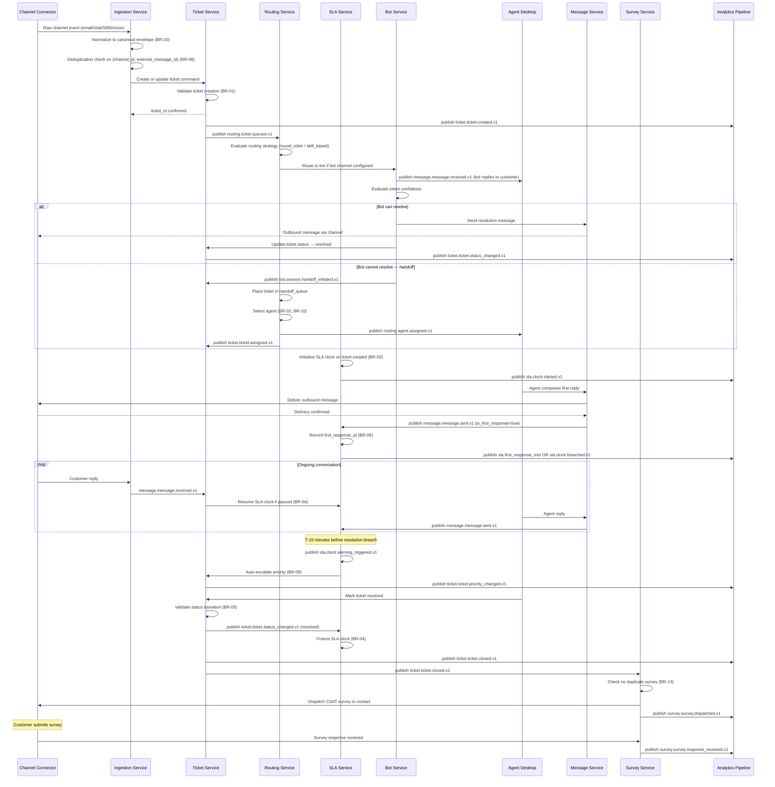

# Event Catalog

This catalog defines all stable event contracts for the Customer Support and Contact Center Platform. It is the authoritative reference for event-driven integrations, audit pipelines, analytics consumers, and inter-service communication. All services producing or consuming events must conform to the contracts defined here.

**Version:** 1.0  
**Status:** Authoritative  
**Broker:** Apache Kafka (primary) / Amazon EventBridge (external integrations)  

---

## Table of Contents

1. [Contract Conventions](#contract-conventions)
2. [Domain Events](#domain-events)
3. [Publish and Consumption Sequence](#publish-and-consumption-sequence)
4. [Operational SLOs](#operational-slos)

---

## Contract Conventions

### Naming Schema

All events follow the naming pattern: `<domain>.<aggregate>.<action>.v<major>`, where:

- **domain** — the bounded context owning the aggregate (e.g., `ticket`, `sla`, `bot`, `agent`)
- **aggregate** — the primary entity the event describes (e.g., `ticket`, `message`, `clock`, `session`)
- **action** — the past-tense verb describing what occurred (e.g., `created`, `status_changed`, `breached`)
- **v\<major\>** — integer major version; increment on breaking schema changes, never on additive changes

**Examples:** `ticket.ticket.created.v1`, `sla.clock.breached.v1`, `bot.session.handoff_initiated.v1`

### Required Metadata Fields (Event Envelope)

Every event, regardless of domain, must include the following top-level envelope fields:

| Field | Type | Description |
|-------|------|-------------|
| `event_id` | `UUID` | Globally unique event identifier (UUIDv7 recommended for sortability). |
| `event_name` | `string` | Full event name including version (e.g., `ticket.ticket.created.v1`). |
| `schema_version` | `string` | Semantic version of the payload schema (e.g., `1.2.0`). |
| `occurred_at` | `ISO 8601` | Timestamp when the event occurred in the source system. |
| `published_at` | `ISO 8601` | Timestamp when the event was written to the broker. |
| `producer` | `string` | Service name that published the event (e.g., `ticket-service`). |
| `correlation_id` | `UUID` | Traces a chain of events back to an originating command or request. |
| `causation_id` | `UUID` | ID of the direct parent event or command that caused this event. |
| `org_id` | `UUID` | Tenant identifier for multi-tenant data isolation. |
| `idempotency_key` | `string` | Consumer-side deduplication key; format: `<producer>:<event_id>`. |

### Versioning Strategy

- **Additive (backward-compatible) changes** — add new optional fields to the payload. Do not increment major version. Update `schema_version` minor version (e.g., `1.1.0` → `1.2.0`).
- **Breaking changes** — rename fields, remove fields, change field types, or change semantics. Increment the major version in the event name (e.g., `v1` → `v2`). Both versions are published in parallel during a migration window (minimum 30 days). Consumers migrate and deregister the old version.
- **Deprecation** — deprecated events carry a `deprecated: true` field in the envelope and a `sunset_at` timestamp. Producers must maintain deprecated events for a minimum of 60 days after `sunset_at` announcement.

### Delivery Guarantees

| Guarantee Level | Description | Usage |
|---|---|---|
| **At-least-once** | Default for all events. Consumers must be idempotent. | All domain events |
| **Exactly-once** | Achieved via outbox pattern + consumer idempotency check on `event_id`. | Financial/SLA-sensitive events |
| **Best-effort** | Used for high-volume, low-criticality telemetry where occasional loss is acceptable. | Metrics and heartbeat events |

### Ordering Guarantee

Events are ordered **per partition key** only. The partition key for all ticket-domain events is `ticket_id`. The partition key for agent-domain events is `agent_id`. Cross-aggregate ordering is not guaranteed.

---

## Domain Events

### Summary Table

| # | Event Name | Domain | Producer | Key Consumers |
|---|------------|--------|----------|---------------|
| 1 | `ticket.ticket.created.v1` | Ticket | ticket-service | sla-service, routing-service, analytics |
| 2 | `ticket.ticket.assigned.v1` | Ticket | routing-service | ticket-service, notification-service |
| 3 | `ticket.ticket.status_changed.v1` | Ticket | ticket-service | sla-service, survey-service, analytics |
| 4 | `ticket.ticket.priority_changed.v1` | Ticket | ticket-service, sla-service | routing-service, sla-service, notification-service |
| 5 | `ticket.ticket.merged.v1` | Ticket | ticket-service | analytics, search-indexer |
| 6 | `ticket.ticket.closed.v1` | Ticket | ticket-service | survey-service, billing-service, analytics |
| 7 | `ticket.ticket.reopened.v1` | Ticket | ticket-service | sla-service, routing-service |
| 8 | `message.message.received.v1` | Message | ingestion-service | ticket-service, sla-service, search-indexer |
| 9 | `message.message.sent.v1` | Message | message-service | sla-service, analytics |
| 10 | `message.message.failed.v1` | Message | message-service | notification-service, ops-alerting |
| 11 | `message.thread.created.v1` | Message | ticket-service | analytics, search-indexer |
| 12 | `sla.clock.started.v1` | SLA | sla-service | sla-monitor, analytics |
| 13 | `sla.clock.paused.v1` | SLA | sla-service | sla-monitor, analytics |
| 14 | `sla.clock.warning_triggered.v1` | SLA | sla-service | escalation-engine, notification-service |
| 15 | `sla.clock.breached.v1` | SLA | sla-service | escalation-engine, notification-service, analytics |
| 16 | `sla.clock.reset.v1` | SLA | sla-service | sla-monitor |
| 17 | `routing.ticket.queued.v1` | Routing | routing-service | sla-monitor, analytics |
| 18 | `routing.ticket.routed.v1` | Routing | routing-service | ticket-service, analytics |
| 19 | `routing.agent.assigned.v1` | Routing | routing-service | notification-service, analytics |
| 20 | `routing.queue.overflow_triggered.v1` | Routing | routing-service | notification-service, ops-alerting |
| 21 | `bot.session.started.v1` | Bot | bot-service | analytics |
| 22 | `bot.session.intent_recognized.v1` | Bot | bot-service | analytics, kb-service |
| 23 | `bot.session.handoff_initiated.v1` | Bot | bot-service | routing-service, ticket-service |
| 24 | `bot.session.ended.v1` | Bot | bot-service | analytics |
| 25 | `agent.agent.status_changed.v1` | Agent | presence-service | routing-service, analytics |
| 26 | `agent.shift.started.v1` | Agent | shift-service | routing-service, analytics |
| 27 | `agent.shift.ended.v1` | Agent | shift-service | routing-service, analytics |
| 28 | `survey.survey.dispatched.v1` | Survey | survey-service | analytics |
| 29 | `survey.survey.response_received.v1` | Survey | survey-service | analytics, reporting-service |
| 30 | `kb.article.published.v1` | KB | kb-service | search-indexer, analytics |
| 31 | `kb.article.suggested.v1` | KB | kb-service | analytics |

---

### Ticket Domain Events

---

#### `ticket.ticket.created.v1`

**Description:** Published when a new ticket is persisted for the first time. This is the origin event of the ticket lifecycle and triggers SLA clock initialization, queue routing, and analytics recording.

**Producer:** `ticket-service`  
**Consumers:** `sla-service`, `routing-service`, `search-indexer`, `analytics-pipeline`, `notification-service`  
**Delivery Guarantee:** At-least-once (outbox pattern)  
**Ordering Guarantee:** Per `ticket_id` partition  
**Kafka Topic:** `platform.ticket.events`

**Payload Schema:**
```json
{
  "ticket_id": "UUID",
  "org_id": "UUID",
  "channel_id": "UUID",
  "channel_type": "string (enum)",
  "contact_id": "UUID",
  "queue_id": "UUID | null",
  "subject": "string",
  "status": "new",
  "priority": "string (enum)",
  "sla_policy_id": "UUID | null",
  "tags": ["string"],
  "created_at": "ISO 8601"
}
```

---

#### `ticket.ticket.assigned.v1`

**Description:** Published when an agent is assigned to a ticket, either by the automated routing engine or manually by a supervisor. Triggers agent desktop notification and analytics recording.

**Producer:** `routing-service`  
**Consumers:** `ticket-service`, `notification-service`, `analytics-pipeline`  
**Delivery Guarantee:** At-least-once  
**Ordering Guarantee:** Per `ticket_id` partition

**Payload Schema:**
```json
{
  "ticket_id": "UUID",
  "org_id": "UUID",
  "agent_id": "UUID",
  "team_id": "UUID",
  "assignment_type": "string (auto|manual|transfer)",
  "assigned_by": "UUID | null",
  "assigned_at": "ISO 8601",
  "queue_id": "UUID | null"
}
```

---

#### `ticket.ticket.status_changed.v1`

**Description:** Published on every status transition of a ticket. The SLA service, survey service, and reporting systems subscribe to this event to react to lifecycle changes such as resolution, closure, and reopening.

**Producer:** `ticket-service`  
**Consumers:** `sla-service`, `survey-service`, `analytics-pipeline`, `search-indexer`, `notification-service`  
**Delivery Guarantee:** Exactly-once (idempotency check on `(ticket_id, new_status, occurred_at)`)  
**Ordering Guarantee:** Per `ticket_id` partition

**Payload Schema:**
```json
{
  "ticket_id": "UUID",
  "org_id": "UUID",
  "old_status": "string (enum)",
  "new_status": "string (enum)",
  "actor_type": "string (agent|system|automation)",
  "actor_id": "UUID | null",
  "reason_code": "string | null",
  "occurred_at": "ISO 8601"
}
```

---

#### `ticket.ticket.priority_changed.v1`

**Description:** Published when ticket priority is changed, either manually by an agent or automatically by the SLA warning escalation logic. Triggers SLA policy re-evaluation and routing re-prioritization.

**Producer:** `ticket-service`, `sla-service`  
**Consumers:** `sla-service`, `routing-service`, `notification-service`, `analytics-pipeline`  
**Delivery Guarantee:** At-least-once  
**Ordering Guarantee:** Per `ticket_id` partition

**Payload Schema:**
```json
{
  "ticket_id": "UUID",
  "org_id": "UUID",
  "old_priority": "string (enum)",
  "new_priority": "string (enum)",
  "reason": "string (manual|sla_warning|escalation_rule)",
  "changed_by": "UUID | null",
  "occurred_at": "ISO 8601"
}
```

---

#### `ticket.ticket.merged.v1`

**Description:** Published when one or more source tickets are merged into a master ticket. Downstream systems (search indexer, analytics) must re-index or re-aggregate merged ticket data.

**Producer:** `ticket-service`  
**Consumers:** `search-indexer`, `analytics-pipeline`  
**Delivery Guarantee:** At-least-once  
**Ordering Guarantee:** Per `master_ticket_id` partition

**Payload Schema:**
```json
{
  "master_ticket_id": "UUID",
  "source_ticket_ids": ["UUID"],
  "org_id": "UUID",
  "merged_by": "UUID",
  "thread_count_transferred": "integer",
  "merged_at": "ISO 8601"
}
```

---

#### `ticket.ticket.closed.v1`

**Description:** Published when a ticket transitions to `closed` status. Triggers CSAT survey dispatch, billing event finalization, and archive scheduling.

**Producer:** `ticket-service`  
**Consumers:** `survey-service`, `billing-service`, `archive-service`, `analytics-pipeline`  
**Delivery Guarantee:** Exactly-once  
**Ordering Guarantee:** Per `ticket_id` partition

**Payload Schema:**
```json
{
  "ticket_id": "UUID",
  "org_id": "UUID",
  "contact_id": "UUID",
  "agent_id": "UUID | null",
  "resolution_seconds": "integer",
  "first_response_seconds": "integer | null",
  "sla_met": "boolean",
  "wrap_code_id": "UUID | null",
  "closed_at": "ISO 8601"
}
```

---

#### `ticket.ticket.reopened.v1`

**Description:** Published when a closed or resolved ticket is reopened. The SLA service re-initializes the resolution clock, and the routing service places the ticket back in queue or re-assigns to the previous agent.

**Producer:** `ticket-service`  
**Consumers:** `sla-service`, `routing-service`, `analytics-pipeline`  
**Delivery Guarantee:** At-least-once  
**Ordering Guarantee:** Per `ticket_id` partition

**Payload Schema:**
```json
{
  "ticket_id": "UUID",
  "org_id": "UUID",
  "previous_status": "string (closed|resolved)",
  "reopen_reason": "string (customer_reply|agent_manual|automation)",
  "reopened_by": "UUID | null",
  "reopened_at": "ISO 8601"
}
```

---

### Message / Thread Domain Events

---

#### `message.message.received.v1`

**Description:** Published when an inbound message is successfully normalized and persisted. This is the trigger for routing decisions on new tickets and for SLA clock management on existing tickets.

**Producer:** `ingestion-service`  
**Consumers:** `ticket-service`, `sla-service`, `search-indexer`, `analytics-pipeline`, `bot-service`  
**Delivery Guarantee:** At-least-once (idempotency key: `channel_id + external_message_id`)  
**Ordering Guarantee:** Per `ticket_id` partition

**Payload Schema:**
```json
{
  "message_id": "UUID",
  "thread_id": "UUID",
  "ticket_id": "UUID",
  "org_id": "UUID",
  "channel_id": "UUID",
  "external_message_id": "string",
  "direction": "inbound",
  "author_type": "contact|bot",
  "author_id": "UUID",
  "has_attachments": "boolean",
  "received_at": "ISO 8601"
}
```

---

#### `message.message.sent.v1`

**Description:** Published when an outbound message is confirmed as sent by the channel provider. Used by the SLA service to record first-response timestamps and by analytics to measure agent response times.

**Producer:** `message-service`  
**Consumers:** `sla-service`, `analytics-pipeline`  
**Delivery Guarantee:** At-least-once  
**Ordering Guarantee:** Per `ticket_id` partition

**Payload Schema:**
```json
{
  "message_id": "UUID",
  "thread_id": "UUID",
  "ticket_id": "UUID",
  "org_id": "UUID",
  "agent_id": "UUID | null",
  "channel_id": "UUID",
  "is_first_response": "boolean",
  "sent_at": "ISO 8601"
}
```

---

#### `message.message.failed.v1`

**Description:** Published when message delivery fails after all retries are exhausted. Triggers agent notification and ops alerting for channel-level failure patterns.

**Producer:** `message-service`  
**Consumers:** `notification-service`, `ops-alerting`, `analytics-pipeline`  
**Delivery Guarantee:** At-least-once  
**Ordering Guarantee:** Per `ticket_id` partition

**Payload Schema:**
```json
{
  "message_id": "UUID",
  "ticket_id": "UUID",
  "org_id": "UUID",
  "channel_id": "UUID",
  "failure_reason": "string",
  "retry_count": "integer",
  "failed_at": "ISO 8601"
}
```

---

### SLA Domain Events

---

#### `sla.clock.started.v1`

**Description:** Published when the SLA clock is initialized for a ticket after SLA policy assignment. Consumed by the SLA monitor to schedule warning and breach evaluation jobs.

**Producer:** `sla-service`  
**Consumers:** `sla-monitor`, `analytics-pipeline`  
**Delivery Guarantee:** Exactly-once  
**Ordering Guarantee:** Per `ticket_id` partition

**Payload Schema:**
```json
{
  "ticket_id": "UUID",
  "org_id": "UUID",
  "policy_id": "UUID",
  "first_response_due_at": "ISO 8601",
  "resolution_due_at": "ISO 8601",
  "business_hours_only": "boolean",
  "started_at": "ISO 8601"
}
```

---

#### `sla.clock.warning_triggered.v1`

**Description:** Published when the SLA resolution clock has fewer than 15 minutes remaining. Triggers priority escalation logic and manager notification. Published at most once per clock cycle per ticket.

**Producer:** `sla-service`  
**Consumers:** `escalation-engine`, `notification-service`, `analytics-pipeline`  
**Delivery Guarantee:** At-least-once  
**Ordering Guarantee:** Per `ticket_id` partition

**Payload Schema:**
```json
{
  "ticket_id": "UUID",
  "org_id": "UUID",
  "policy_id": "UUID",
  "breach_type": "string (first_response|resolution)",
  "remaining_seconds": "integer",
  "breach_due_at": "ISO 8601",
  "triggered_at": "ISO 8601"
}
```

---

#### `sla.clock.breached.v1`

**Description:** Published when a ticket exceeds an SLA target without meeting it. This event is the highest-criticality SLA event; its absence for a breached ticket is treated as a Sev-2 telemetry defect.

**Producer:** `sla-service`  
**Consumers:** `escalation-engine`, `notification-service`, `analytics-pipeline`, `reporting-service`  
**Delivery Guarantee:** Exactly-once  
**Ordering Guarantee:** Per `ticket_id` partition

**Payload Schema:**
```json
{
  "breach_id": "UUID",
  "ticket_id": "UUID",
  "org_id": "UUID",
  "policy_id": "UUID",
  "breach_type": "string (first_response|next_response|resolution)",
  "scheduled_at": "ISO 8601",
  "breached_at": "ISO 8601",
  "elapsed_seconds": "integer",
  "target_seconds": "integer",
  "assignee_agent_id": "UUID | null"
}
```

---

#### `sla.clock.reset.v1`

**Description:** Published when the SLA clock is reset, typically on ticket reopen. The SLA monitor cancels previously scheduled breach jobs and reschedules based on the new clock state.

**Producer:** `sla-service`  
**Consumers:** `sla-monitor`  
**Delivery Guarantee:** At-least-once  
**Ordering Guarantee:** Per `ticket_id` partition

**Payload Schema:**
```json
{
  "ticket_id": "UUID",
  "org_id": "UUID",
  "policy_id": "UUID",
  "reset_reason": "string (reopened|policy_changed)",
  "new_resolution_due_at": "ISO 8601",
  "reset_at": "ISO 8601"
}
```

---

### Routing Domain Events

---

#### `routing.ticket.queued.v1`

**Description:** Published when a ticket enters a queue for agent assignment. The SLA monitor records queue entry time for wait-time reporting.

**Producer:** `routing-service`  
**Consumers:** `sla-monitor`, `analytics-pipeline`  
**Delivery Guarantee:** At-least-once  
**Ordering Guarantee:** Per `ticket_id` partition

**Payload Schema:**
```json
{
  "ticket_id": "UUID",
  "org_id": "UUID",
  "queue_id": "UUID",
  "priority": "string (enum)",
  "routing_strategy": "string (enum)",
  "queued_at": "ISO 8601"
}
```

---

#### `routing.queue.overflow_triggered.v1`

**Description:** Published when a ticket exceeds the queue's max_wait_seconds threshold and is transferred to an overflow queue or has its priority bumped. Consumed by ops alerting for capacity monitoring.

**Producer:** `routing-service`  
**Consumers:** `notification-service`, `ops-alerting`, `analytics-pipeline`  
**Delivery Guarantee:** At-least-once  
**Ordering Guarantee:** Per `queue_id` partition

**Payload Schema:**
```json
{
  "ticket_id": "UUID",
  "org_id": "UUID",
  "from_queue_id": "UUID",
  "to_queue_id": "UUID | null",
  "action": "string (transferred|priority_bump)",
  "wait_seconds": "integer",
  "triggered_at": "ISO 8601"
}
```

---

### Bot Domain Events

---

#### `bot.session.started.v1`

**Description:** Published when a bot begins handling a ticket. Bot session start is separate from ticket creation; the ticket may already exist when the bot session begins.

**Producer:** `bot-service`  
**Consumers:** `analytics-pipeline`  
**Delivery Guarantee:** At-least-once  
**Ordering Guarantee:** Per `ticket_id` partition

**Payload Schema:**
```json
{
  "session_id": "UUID",
  "bot_id": "UUID",
  "ticket_id": "UUID",
  "org_id": "UUID",
  "channel_type": "string (enum)",
  "started_at": "ISO 8601"
}
```

---

#### `bot.session.handoff_initiated.v1`

**Description:** Published when a bot initiates handoff to a human agent. This event triggers the routing service to place the ticket in the handoff queue and is critical for measuring bot containment rates.

**Producer:** `bot-service`  
**Consumers:** `routing-service`, `ticket-service`, `analytics-pipeline`  
**Delivery Guarantee:** Exactly-once  
**Ordering Guarantee:** Per `ticket_id` partition

**Payload Schema:**
```json
{
  "session_id": "UUID",
  "bot_id": "UUID",
  "ticket_id": "UUID",
  "org_id": "UUID",
  "handoff_reason": "string (low_confidence|customer_request|max_turns|error)",
  "intents_recognized": ["string"],
  "turns_count": "integer",
  "context_summary": "string",
  "handoff_queue_id": "UUID",
  "initiated_at": "ISO 8601"
}
```

---

### Agent Domain Events

---

#### `agent.agent.status_changed.v1`

**Description:** Published when an agent's availability status changes (online, offline, busy, break). The routing service subscribes to this event to immediately update its agent availability pool and reassign queued tickets if needed.

**Producer:** `presence-service`  
**Consumers:** `routing-service`, `analytics-pipeline`, `shift-service`  
**Delivery Guarantee:** At-least-once  
**Ordering Guarantee:** Per `agent_id` partition

**Payload Schema:**
```json
{
  "agent_id": "UUID",
  "org_id": "UUID",
  "team_id": "UUID",
  "old_status": "string (enum)",
  "new_status": "string (enum)",
  "changed_at": "ISO 8601"
}
```

---

#### `agent.shift.started.v1`

**Description:** Published when an agent's shift begins (actual clock-in recorded). The routing service includes the agent in its available pool upon receiving this event.

**Producer:** `shift-service`  
**Consumers:** `routing-service`, `analytics-pipeline`  
**Delivery Guarantee:** At-least-once  
**Ordering Guarantee:** Per `agent_id` partition

**Payload Schema:**
```json
{
  "shift_id": "UUID",
  "agent_id": "UUID",
  "org_id": "UUID",
  "team_id": "UUID",
  "scheduled_start_at": "ISO 8601",
  "actual_start_at": "ISO 8601"
}
```

---

### Survey Domain Events

---

#### `survey.survey.dispatched.v1`

**Description:** Published when a CSAT or NPS survey is successfully sent to a contact. The analytics pipeline subscribes to track dispatch rates and pending response windows.

**Producer:** `survey-service`  
**Consumers:** `analytics-pipeline`  
**Delivery Guarantee:** At-least-once  
**Ordering Guarantee:** Per `ticket_id` partition

**Payload Schema:**
```json
{
  "dispatch_id": "UUID",
  "survey_id": "UUID",
  "ticket_id": "UUID",
  "contact_id": "UUID",
  "org_id": "UUID",
  "delivery_channel": "string (email|chat|sms)",
  "dispatched_at": "ISO 8601"
}
```

---

#### `survey.survey.response_received.v1`

**Description:** Published when a contact submits a survey response. Consumed by the analytics and reporting services to update CSAT and NPS dashboards in near real-time.

**Producer:** `survey-service`  
**Consumers:** `analytics-pipeline`, `reporting-service`  
**Delivery Guarantee:** Exactly-once (idempotency on `(survey_id, ticket_id)`)  
**Ordering Guarantee:** Per `ticket_id` partition

**Payload Schema:**
```json
{
  "response_id": "UUID",
  "survey_id": "UUID",
  "ticket_id": "UUID",
  "contact_id": "UUID",
  "org_id": "UUID",
  "score": "integer | null",
  "survey_type": "string (csat|nps|custom)",
  "submitted_at": "ISO 8601"
}
```

---

### Knowledge Base Domain Events

---

#### `kb.article.published.v1`

**Description:** Published when a KB article transitions to `published` status. Triggers search indexer re-indexing so the article becomes searchable by agents and customers.

**Producer:** `kb-service`  
**Consumers:** `search-indexer`, `analytics-pipeline`  
**Delivery Guarantee:** At-least-once  
**Ordering Guarantee:** Per `article_id` partition

**Payload Schema:**
```json
{
  "article_id": "UUID",
  "kb_id": "UUID",
  "org_id": "UUID",
  "title": "string",
  "slug": "string",
  "visibility": "string (public|internal)",
  "language": "string",
  "tags": ["string"],
  "published_at": "ISO 8601"
}
```

---

#### `kb.article.suggested.v1`

**Description:** Published when the KB suggestion engine recommends an article to an agent while they are composing a reply. Used by analytics to measure suggestion acceptance rates and improve the recommendation model.

**Producer:** `kb-service`  
**Consumers:** `analytics-pipeline`  
**Delivery Guarantee:** Best-effort  
**Ordering Guarantee:** None

**Payload Schema:**
```json
{
  "suggestion_id": "UUID",
  "article_id": "UUID",
  "ticket_id": "UUID",
  "agent_id": "UUID",
  "org_id": "UUID",
  "confidence_score": "float (0-1)",
  "accepted": "boolean | null",
  "suggested_at": "ISO 8601"
}
```

---

## Publish and Consumption Sequence

The following sequence diagram traces the complete lifecycle of a ticket from initial channel ingestion through normalization, routing, SLA management, agent message exchange, resolution, and survey dispatch. This is the canonical reference flow for all integration points.



### Event Flow Topology

| Flow Stage | Events Published | Latency Target |
|---|---|---|
| Channel → Ingestion | `message.message.received.v1` | < 2 s from channel receipt |
| Ingestion → Ticket | `ticket.ticket.created.v1` | < 1 s from message persistence |
| Ticket → SLA | `sla.clock.started.v1` | < 3 s from ticket creation |
| Ticket → Routing | `routing.ticket.queued.v1` | < 1 s from ticket creation |
| Routing → Agent | `routing.agent.assigned.v1` | < 5 s from queue entry |
| Agent reply → SLA | `message.message.sent.v1` | < 1 s from send confirmation |
| Ticket close → Survey | `survey.survey.dispatched.v1` | < 30 s from ticket closed |

---

## Operational SLOs

### P95 Publish Latency Targets

| Event Tier | Definition | P95 Latency Target | P99 Target |
|---|---|---|---|
| **Tier 1 — Critical** | Events gating SLA measurement: `ticket.created`, `message.received`, `message.sent`, `sla.breached` | < 2 seconds commit-to-publish | < 5 seconds |
| **Tier 2 — High** | Routing and assignment events: `ticket.queued`, `agent.assigned`, `bot.handoff_initiated` | < 5 seconds | < 10 seconds |
| **Tier 3 — Standard** | Status change, survey, KB events | < 30 seconds | < 60 seconds |
| **Tier 4 — Telemetry** | Analytics-only, best-effort: `bot.intent_recognized`, `kb.article.suggested` | < 5 minutes | Best-effort |

### Dead Letter Queue (DLQ) SLOs

| Metric | Target |
|---|---|
| DLQ triage acknowledgement (production) | ≤ 15 minutes from DLQ entry |
| DLQ triage acknowledgement (non-production) | ≤ 4 hours |
| DLQ replay success rate after triage | ≥ 95% within 1 hour of acknowledgement |
| Max DLQ depth before PagerDuty alert fires | 50 messages per topic partition |
| Consumer max retry attempts before DLQ | 5 retries with exponential backoff (1s, 2s, 4s, 8s, 16s) |

### Schema Compatibility Guarantees

| Guarantee | Requirement |
|---|---|
| **Backward compatibility** | All schema changes within a major version must be backward-compatible. Consumers on schema version N must process events on schema version N+1 without failure. |
| **Forward compatibility** | Producers must not send fields with semantics that break consumers on older schema versions. |
| **Schema registry enforcement** | All schemas are registered in the platform's schema registry (Confluent Schema Registry or equivalent). Producers are blocked from publishing events that fail schema validation. |
| **Migration window** | When a breaking change requires a new major version (e.g., `v2`), both versions must be published in parallel for a minimum of 30 calendar days. |

### Consumer Idempotency Requirements

Every event consumer must implement idempotency checks before processing any event. The recommended pattern:

1. On receipt, check if `event_id` exists in the consumer's processed-events store (Redis SET or database table with TTL of 7 days).
2. If found, discard and acknowledge (do not reprocess).
3. If not found, process the event, then write `event_id` to the store atomically within the same transaction or using compare-and-set.

Consumers that do not implement idempotency checks are treated as non-compliant and blocked from production deployment.

### Monitoring and Alerting Requirements

| Monitor | Alert Condition | Severity |
|---|---|---|
| Event publish lag (Tier 1) | P95 > 5 seconds | Sev-2 |
| Missing `sla.clock.breached.v1` for known-breached tickets | Any gap > 5 minutes | Sev-2 |
| DLQ depth per partition | > 50 messages | Sev-2 |
| Schema validation rejection rate | > 0.1% of events in any 5-minute window | Sev-3 |
| Consumer processing lag (Tier 1 consumers) | > 30 seconds behind tip | Sev-2 |
| Survey dispatch failure rate | > 1% of resolved tickets in 1 hour window | Sev-3 |
| Bot handoff event delivery failure | Any failure | Sev-2 |

### Event Schema Evolution Guidelines

**DO:**
- Add new optional fields to existing event schemas (backward-compatible).
- Use `null` as the default for new optional fields when the value is unavailable.
- Deprecate fields with a `deprecated_fields` list in the schema metadata before removal.
- Use semantic versioning on `schema_version` for patch and minor changes.
- Increment the event name major version (`v1` → `v2`) for breaking changes.

**DO NOT:**
- Remove or rename existing fields without a major version bump and migration window.
- Change field types (e.g., `string` → `integer`) without a major version bump.
- Add required fields to an existing schema version (existing producers would break).
- Use polymorphic field types (a field that is sometimes a `string`, sometimes an `object`).

### Dead Letter Queue Handling Procedures

When an event lands in the DLQ, the on-call engineer follows this runbook:

1. **Identify** — inspect the DLQ message header for `failure_reason`, `retry_count`, and `consumer_service`. Check the consumer's error log for the corresponding `correlation_id`.
2. **Classify** — categorize the failure:
   - *Transient* (network timeout, dependency unavailable): replay the message after the dependency recovers.
   - *Schema error* (invalid payload, unknown field): fix the producer schema bug; replay only after the fix is deployed.
   - *Consumer bug* (null pointer, incorrect business logic): fix the consumer; replay after fix deployment.
   - *Data inconsistency* (referenced entity not found): determine if this is a race condition or orphaned data. Apply data repair if needed before replay.
3. **Replay** — use the platform's `dlq-replay-tool` to re-publish the corrected message to the original topic with the original `idempotency_key` preserved.
4. **Post-mortem** — for any DLQ incident affecting Tier 1 events, complete a lightweight post-mortem within 48 hours documenting root cause and prevention measures.
