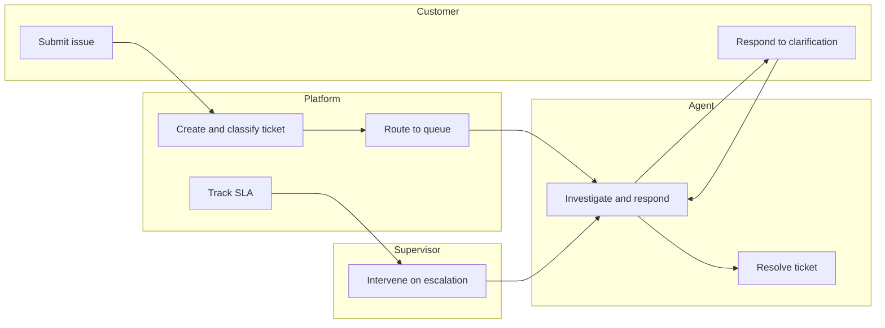
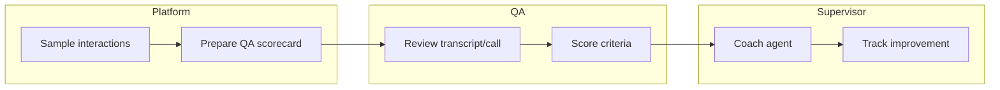

# Swimlane Diagrams

## Ticket Resolution Swimlane

```mermaid
flowchart LR
    subgraph Customer
      A[Submit issue]
      B[Respond to clarification]
    end

    subgraph Platform
      C[Create and classify ticket]
      D[Route to queue]
      E[Track SLA]
    end

    subgraph Agent
      F[Investigate and respond]
      G[Resolve ticket]
    end

    subgraph Supervisor
      H[Intervene on escalation]
    end

    A --> C --> D --> F --> B --> F --> G
    E --> H --> F
```

## QA Evaluation Swimlane

```mermaid
flowchart LR
    subgraph Platform
      A[Sample interactions]
      B[Prepare QA scorecard]
    end

    subgraph QA
      C[Review transcript/call]
      D[Score criteria]
    end

    subgraph Supervisor
      E[Coach agent]
      F[Track improvement]
    end

    A --> B --> C --> D --> E --> F
```
