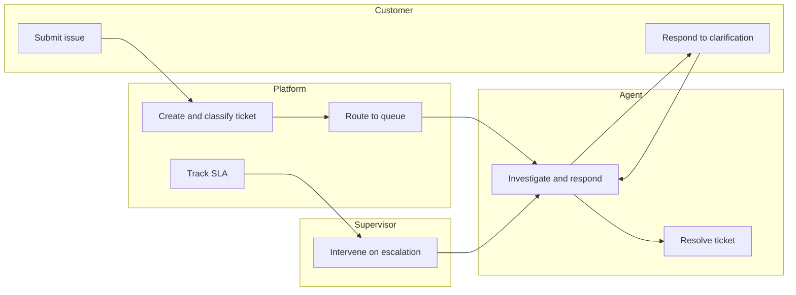
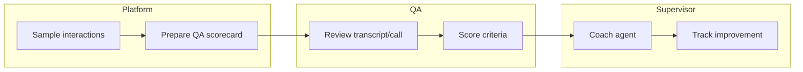
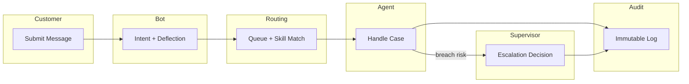

# Swimlane Diagrams

## Ticket Resolution Swimlane

## QA Evaluation Swimlane

## Swimlane Operational Narrative
Swimlanes should model **Customer**, **Bot**, **Routing Service**, **Agent**, **Supervisor**, and **Compliance/Audit** tracks with explicit handoff points.

SLA checkpoints should be shown on lane boundaries, and incident responsibilities should be explicit (who acknowledges degraded routing, who authorizes queue bypass).

Operational coverage note: this artifact also specifies omnichannel controls for this design view.
