# System Context Diagram — Customer Support and Contact Center Platform

**Version:** 1.1  
**Last Updated:** 2025-07  
**Status:** Approved

---

## Overview

This document presents the C4 Context-level view of the Customer Support and Contact Center Platform. It defines the system boundary, identifies all external actors and systems that interact with the platform, and describes the nature, direction, and data exchanged in each integration. The context diagram serves as the entry point for architectural discussion, integration planning, security boundary reviews, and compliance zone mapping.

---

## C4 Context Diagram

```mermaid
flowchart TD
    %% ── Human Actors ────────────────────────────────────────────────────
    WCUST(["`**Web Customer**
    Browser / PWA`"])
    MCUST(["`**Mobile Customer**
    iOS / Android App`"])
    ECUST(["`**Email Customer**
    SMTP Client`"])
    SCUST(["`**Social Customer**
    Twitter / Facebook / Instagram`"])
    AGT(["`**Support Agent**
    Internal Staff`"])
    SUP(["`**Supervisor**
    Internal Staff`"])
    WFM_ACT(["`**Workforce Manager**
    Internal Staff`"])
    ADM_ACT(["`**Administrator**
    Internal Staff`"])

    %% ── Core System ─────────────────────────────────────────────────────
    PLATFORM[["**Customer Support &
    Contact Center Platform**

    Multi-tenant SaaS
    Omni-channel ticketing,
    routing, SLA, WFM,
    knowledge base, bots"]]

    %% ── External Systems ────────────────────────────────────────────────
    EMAIL_PROV(["**Email Provider**
    SendGrid / Gmail / Outlook
    SMTP · IMAP · Webhooks"])

    TELEPHONY(["**Telephony / Voice Platform**
    Twilio Voice · Amazon Connect
    WebRTC · SIP · PSTN"])

    SMS_WA(["**SMS / WhatsApp Gateway**
    Twilio · MessageBird
    WhatsApp Business API"])

    SOCIAL(["**Social Media APIs**
    Twitter API v2
    Facebook Graph API
    Instagram Messaging API"])

    CRM(["**CRM System**
    Salesforce · HubSpot
    REST API · Webhooks"])

    IDP(["**Identity Provider**
    Okta · Azure AD · Auth0
    SAML 2.0 · OAuth 2.0 · OIDC"])

    AI_NLP(["**AI / NLP Services**
    OpenAI API · Google Dialogflow
    Custom NLP Model Endpoints"])

    OBJ_STORE(["**Object Storage**
    AWS S3 · Google Cloud Storage
    Attachments · Call Recordings"])

    DW(["**Data Warehouse**
    Snowflake · BigQuery · Redshift
    Analytics Export · ETL"])

    MON(["**Monitoring & Alerting**
    Datadog · PagerDuty · OpsGenie
    APM · Log Aggregation"])

    NOTIF(["**Notification Services**
    SendGrid · Twilio SMS
    Firebase FCM · APNs"])

    %% ── Actor → Platform ────────────────────────────────────────────────
    WCUST -- "HTTPS / WebSocket
    Submit ticket, chat, KB search" --> PLATFORM
    MCUST -- "HTTPS / WebSocket / Push
    Mobile app interactions" --> PLATFORM
    ECUST -- "Email (SMTP → Adapter)
    Support requests" --> PLATFORM
    SCUST -- "Social API Webhooks
    DMs and mentions" --> PLATFORM
    AGT -- "HTTPS / WebSocket
    Agent workspace UI" --> PLATFORM
    SUP -- "HTTPS
    Supervisor dashboard" --> PLATFORM
    WFM_ACT -- "HTTPS
    WFM scheduling console" --> PLATFORM
    ADM_ACT -- "HTTPS
    Admin configuration portal" --> PLATFORM

    %% ── Platform → External Systems ─────────────────────────────────────
    PLATFORM -- "SMTP send / IMAP poll
    Inbound & outbound email" --> EMAIL_PROV
    PLATFORM -- "REST API / WebRTC
    Call control, IVR, recordings" --> TELEPHONY
    PLATFORM -- "REST API
    Send / receive SMS & WhatsApp" --> SMS_WA
    PLATFORM -- "REST Webhooks
    Read DMs, post replies" --> SOCIAL
    PLATFORM -- "REST / Webhooks
    Sync contacts, accounts, cases" --> CRM
    PLATFORM -- "SAML / OIDC
    SSO authentication, token validation" --> IDP
    PLATFORM -- "REST API
    Intent classification, NLP inference" --> AI_NLP
    PLATFORM -- "AWS SDK / GCS client
    Upload / retrieve attachments & recordings" --> OBJ_STORE
    PLATFORM -- "Batch export / streaming
    Ticket events, metrics, CSAT data" --> DW
    PLATFORM -- "REST API / SDK
    Metrics, traces, logs, on-call alerts" --> MON
    PLATFORM -- "REST API
    Email, SMS, and push notifications" --> NOTIF
```

---

## System Description and Boundary

### What Is Inside the Boundary

The **Customer Support and Contact Center Platform** is a multi-tenant SaaS application that provides:

| Capability | Description |
|---|---|
| **Omni-channel Ingestion** | Normalizes inbound messages from email, chat, voice, SMS, WhatsApp, and social media into a unified ticket model. |
| **Ticket Lifecycle Management** | Full CRUD and state machine for tickets from creation through resolution and archival. |
| **Intelligent Routing** | Skill-based, priority-based, and load-balanced ticket assignment to agents and queues. |
| **SLA Engine** | Policy-driven SLA timers, warning thresholds, breach detection, and automated escalation. |
| **Bot Orchestration** | Integration layer for NLP bots that deflect queries and perform human handoffs with context transfer. |
| **Knowledge Base** | Authoring, review, publication, and full-text search of support articles. |
| **Workforce Management** | Agent scheduling, forecasting, availability tracking, and adherence reporting. |
| **Real-Time & Historical Reporting** | Live dashboards and historical analytics for SLA, CSAT, AHT, and agent performance. |
| **Administration** | User management, role-based access control, SLA policy configuration, and audit logging. |
| **Compliance** | GDPR data subject request handling, retention policy enforcement, and immutable audit trails. |

### What Is Outside the Boundary

The following are external systems; the platform integrates with them but does not own them:
- Customer-facing web/mobile application shells (front-ends owned by the product team)
- The underlying telephony infrastructure (PSTN, SIP trunks)
- The CRM and ERP systems of record
- Cloud infrastructure (compute, networking, databases are platform dependencies, not capabilities)

---

## External System Integration Descriptions

### 1. Email Provider (SendGrid / Gmail / Outlook)

| Attribute | Detail |
|---|---|
| **Protocol** | SMTP (outbound), IMAP / POP3 / Microsoft Graph API (inbound polling), Inbound Parse Webhook (push) |
| **Direction** | Bidirectional |
| **Data Exchanged** | Raw MIME email messages, attachment MIME parts, delivery receipts, bounce events |
| **Purpose** | Receive inbound customer emails as support tickets; send outbound agent replies, auto-acknowledgements, CSAT surveys, and notification emails. |
| **Authentication** | API key (SendGrid), OAuth 2.0 (Gmail, Outlook), DKIM/SPF for outbound signing |
| **SLA Impact** | Polling interval or webhook latency directly affects first-response SLA timer accuracy. |
| **Failure Mode** | Inbound: emails queued in durable backlog. Outbound: retry with exponential back-off (3 attempts, then dead-letter). |

### 2. Telephony / Voice Platform (Twilio Voice / Amazon Connect)

| Attribute | Detail |
|---|---|
| **Protocol** | REST API (call control), WebRTC (browser-based agent softphone), SIP (PSTN interconnect), Webhooks (call events) |
| **Direction** | Bidirectional |
| **Data Exchanged** | Call session metadata, DTMF input (IVR), agent status, call recordings (S3 URL references), real-time transcription streams |
| **Purpose** | Handle inbound voice calls via IVR, authenticate callers, route to agents, record calls, and link call records to tickets. |
| **Authentication** | Twilio Auth Token / HMAC webhook signature; AWS IAM roles (Amazon Connect) |
| **Compliance** | Call recordings stored in Object Storage; retention governed by tenant policy; subject to GDPR deletion scope. |

### 3. SMS / WhatsApp Gateway (Twilio / MessageBird)

| Attribute | Detail |
|---|---|
| **Protocol** | REST API, Webhooks (inbound message delivery) |
| **Direction** | Bidirectional |
| **Data Exchanged** | Text message bodies, media attachments (MMS/WhatsApp media), delivery status callbacks |
| **Purpose** | Receive customer SMS and WhatsApp messages as ticket events; send outbound agent replies and proactive notifications. |
| **Authentication** | API key + webhook signature validation |
| **Throughput** | Rate-limited per sending number; platform implements outbound message queue with rate throttling. |

### 4. Social Media APIs (Twitter / Facebook / Instagram)

| Attribute | Detail |
|---|---|
| **Protocol** | REST API (read/write), Webhooks / Account Activity API (event push) |
| **Direction** | Bidirectional |
| **Data Exchanged** | Direct messages, public mentions (@handle), reply messages, media attachments |
| **Purpose** | Ingest customer DMs and public brand mentions as tickets; post agent replies back through the originating social channel. |
| **Authentication** | OAuth 2.0 (user token for each connected brand account); webhook challenge-response validation |
| **Limitations** | Twitter API rate limits (read: 500k tweets/month on Basic); Facebook 24-hour messaging policy for standard messages. |

### 5. CRM System (Salesforce / HubSpot)

| Attribute | Detail |
|---|---|
| **Protocol** | REST API, Platform Events / Webhooks |
| **Direction** | Bidirectional |
| **Data Exchanged** | Contact/Account records, deal/opportunity context, case history, custom field sync |
| **Purpose** | Enrich ticket contact records with CRM data; write resolved tickets back as CRM cases; sync customer tier for SLA policy selection. |
| **Authentication** | OAuth 2.0 (Salesforce Connected App), HubSpot API private app token |
| **Sync Strategy** | Near-real-time webhook-driven sync for contact updates; nightly batch reconciliation for historical data. |

### 6. Identity Provider (Okta / Azure AD / Auth0)

| Attribute | Detail |
|---|---|
| **Protocol** | SAML 2.0 (enterprise SSO), OIDC / OAuth 2.0 (social/developer login), SCIM 2.0 (user provisioning) |
| **Direction** | Bidirectional |
| **Data Exchanged** | Authentication assertions, JWT access tokens, user provisioning events (create/deactivate/role change) |
| **Purpose** | Authenticate and authorize agents, supervisors, and administrators; auto-provision user accounts via SCIM; enforce MFA policies. |
| **Security** | All JWTs validated locally (public key cached); SCIM writes are idempotent and audited. |

### 7. AI / NLP Services (OpenAI / Dialogflow / Custom Endpoints)

| Attribute | Detail |
|---|---|
| **Protocol** | HTTPS REST API |
| **Direction** | Outbound (platform calls NLP service) |
| **Data Exchanged** | Anonymized customer message text, intent classification results, confidence scores, entity extractions, suggested KB article IDs |
| **Purpose** | Power the bot engine for intent recognition; provide agent-assist suggestions; auto-classify incoming tickets by category and priority. |
| **Data Privacy** | PII is stripped before sending to third-party NLP APIs; on-premise/VPC NLP endpoints used for tenants with strict data residency requirements. |
| **Fallback** | On NLP timeout, system falls back to keyword-based intent matching; on sustained outage, bot routes all queries to human agents. |

### 8. Object Storage (AWS S3 / Google Cloud Storage)

| Attribute | Detail |
|---|---|
| **Protocol** | AWS SDK / GCS client library (server-side), pre-signed URLs (client-side upload) |
| **Direction** | Bidirectional |
| **Data Exchanged** | Ticket attachments, call recordings, chat transcript exports, knowledge article media |
| **Purpose** | Durable, scalable storage for all binary assets; metadata stored in the platform database with storage references. |
| **Security** | Bucket-level encryption at rest (AES-256); pre-signed URLs with short TTL (15 minutes) for browser access; no public bucket policies. |
| **GDPR** | Deletion requests trigger object deletion from storage bucket within the 30-day compliance window. |

### 9. Data Warehouse (Snowflake / BigQuery / Redshift)

| Attribute | Detail |
|---|---|
| **Protocol** | Streaming (Kafka → Connector) or scheduled batch export (CSV/Parquet via S3 staging) |
| **Direction** | Outbound |
| **Data Exchanged** | Ticket events, agent activity events, CSAT responses, SLA metrics, queue depth snapshots |
| **Purpose** | Provide historical reporting, business intelligence, and ML training datasets outside of the OLTP platform. |
| **Latency** | Streaming: ≤ 5-minute lag. Batch: nightly full snapshot + intraday incremental. |
| **PII Handling** | PII fields are pseudonymized before export; re-identification keys are access-controlled within the DW. |

### 10. Monitoring & Alerting (Datadog / PagerDuty / OpsGenie)

| Attribute | Detail |
|---|---|
| **Protocol** | Datadog Agent (metrics/traces/logs), PagerDuty Events API v2 (alerting) |
| **Direction** | Outbound |
| **Data Exchanged** | Application metrics (p95 latency, error rate, queue depth), distributed traces, structured logs, incident alerts |
| **Purpose** | Observe platform health, detect anomalies, and page on-call engineers for severity-1/2 incidents. |
| **SLA Impact** | Routing engine and SLA monitor health checks trigger PagerDuty if uptime SLO drops below 99.9%. |

### 11. Notification Services (SendGrid / Twilio SMS / Firebase FCM / APNs)

| Attribute | Detail |
|---|---|
| **Protocol** | REST API |
| **Direction** | Outbound |
| **Data Exchanged** | Templated email HTML, SMS text, push notification payloads |
| **Purpose** | Deliver transactional notifications (ticket acknowledgements, CSAT surveys, SLA warnings, schedule confirmations) and proactive alerts. |
| **Deduplication** | Idempotency key sent with each notification API call to prevent duplicate delivery. |

---

## Data Flow Descriptions

### Inbound Customer Message Flow
1. Customer sends a message via any channel (email, chat, SMS, social, voice).
2. The relevant channel adapter receives the event and normalizes it into a `ChannelEvent`.
3. The Ingestion Service deduplicates and routes the event to the Ticket Service.
4. Ticket is created or updated; Contact record is resolved.
5. SLA Engine applies policy; Routing Engine places ticket in queue.
6. Notification Service sends acknowledgement to customer and notification to agent.

### Outbound Agent Reply Flow
1. Agent composes and submits a reply in the agent workspace.
2. The Message Service stores the reply and determines the originating channel.
3. The channel-specific adapter sends the reply via the appropriate external API (email SMTP, SMS API, chat WebSocket, social API).
4. Delivery status is tracked; on failure, the reply is retried and the agent is notified.

### SLA & Escalation Event Flow
1. SLA Monitor continuously evaluates tickets against their deadlines.
2. Warning and breach events are published to the internal event bus.
3. Escalation Engine subscribes to breach events and executes configured escalation actions.
4. Supervisor is notified via Notification Service; Monitoring platform receives a metric spike event.

### Data Export Flow
1. Platform publishes domain events to an internal event stream (Kafka).
2. A CDC connector or stream processor reads events and writes them to the Data Warehouse.
3. BI tools query the Data Warehouse for reports and dashboards not served by the OLTP API.

---

## Security Boundary Descriptions

### External Zone
All channels from untrusted external parties (customers, social platforms, email senders). Traffic enters through:
- API Gateway with WAF, rate limiting, and DDoS protection.
- Signature validation on all inbound webhooks (HMAC/timestamp-based).
- Input sanitization before any data reaches internal services.

### DMZ / Edge Zone
- API Gateway, Load Balancer, Chat Gateway (WebSocket termination), Email Inbound Adapter.
- TLS 1.2+ enforced on all external-facing endpoints.
- No internal database access from this zone.

### Internal Application Zone
- Core services: Ticket Service, Routing Engine, SLA Monitor, Bot Orchestration, WFM.
- Service-to-service communication via internal mTLS.
- All services run with least-privilege IAM roles/service accounts.

### Data Zone
- Relational database (PostgreSQL), search index (Elasticsearch/OpenSearch), cache (Redis), object storage.
- Network-level isolation (VPC private subnets, no public access).
- Encryption at rest (AES-256) and in transit (TLS).

### Compliance Zone
- Audit log store (write-once, append-only).
- GDPR request processor and deletion executor.
- Data retention policy enforcer.
- Immutable deletion receipts (hash-signed records).

---

## Compliance Zones

| Zone | Scope | Requirements |
|---|---|---|
| **PII Processing Zone** | Any service that reads or writes customer PII (name, email, phone, content of communications). | GDPR Article 25 (Privacy by Design), data minimization, pseudonymization where feasible. |
| **Call Recording Zone** | Services that store or retrieve audio recordings and transcriptions. | Informed consent collection before recording; retention limits per jurisdiction (typically 6–12 months); accessible only to authorized roles. |
| **Audit & Legal Hold Zone** | Audit log service; legal hold manager; GDPR request processor. | Immutable, tamper-evident logs; legal hold overrides deletion requests; access restricted to compliance officers. |
| **Data Residency Zone** | Tenant data segmentation for customers with geographic data residency requirements. | Tenant-specific database clusters or schema isolation in designated regions; no cross-region data replication for restricted tenants. |
| **Third-Party AI Data Zone** | NLP inference pipeline that may send message content to external AI APIs. | PII stripped before external API call; contractual DPA with AI vendors; on-premise option for restricted tenants. |
