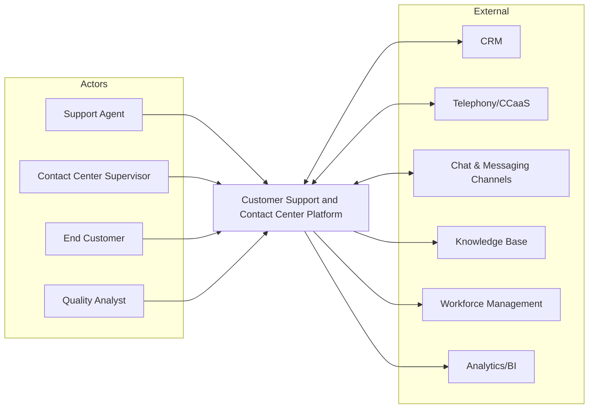

# System Context Diagram

```mermaid
flowchart LR
    subgraph Actors
      Agent[Support Agent]
      Supervisor[Contact Center Supervisor]
      Customer[End Customer]
      QA[Quality Analyst]
    end

    CCS[Customer Support and Contact Center Platform]

    subgraph External
      CRM[CRM]
      Telephony[Telephony/CCaaS]
      Chat[Chat & Messaging Channels]
      KB[Knowledge Base]
      WFM[Workforce Management]
      BI[Analytics/BI]
    end

    Agent --> CCS
    Supervisor --> CCS
    Customer --> CCS
    QA --> CCS

    CCS <--> CRM
    CCS <--> Telephony
    CCS <--> Chat
    CCS --> KB
    CCS --> WFM
    CCS --> BI
```
