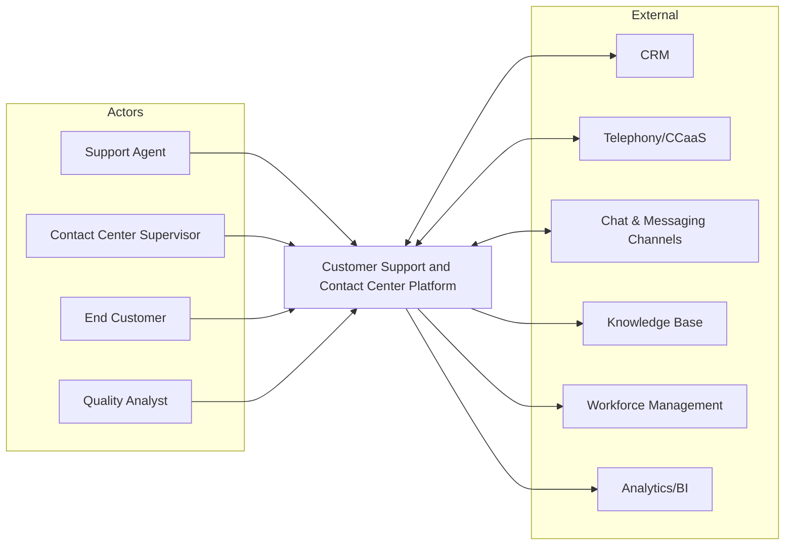
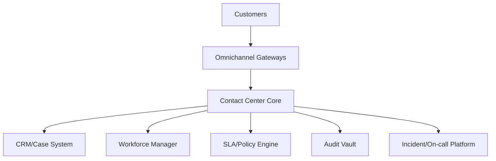

# System Context Diagram

## System Context Narrative (Operational Concerns)
The context diagram must represent external channels (telephony, email, messaging apps), identity providers, CRM, workforce tools, and compliance archive.

- Queue routing is centralized in Contact Center Core; SLA policy engine is authoritative for escalation clocks.
- Omnichannel normalization occurs before core ingestion to avoid channel-specific branching.
- Audit vault is write-once and independently retained for compliance.
- Incident platform receives health and breach-risk signals for automated paging.
