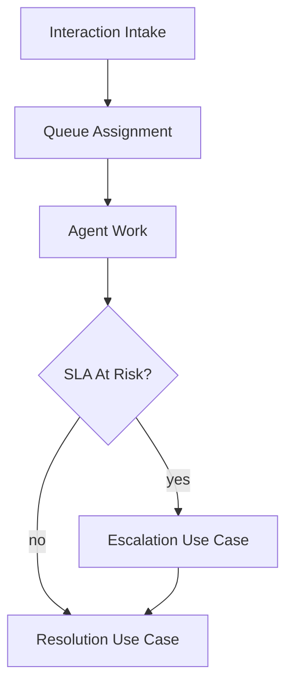

# Use Case Descriptions

## Purpose
Define the use case descriptions artifacts for the **Customer Support and Contact Center Platform** with implementation-ready detail.

## Domain Context
- Domain: Support Center
- Core entities: Conversation, Ticket, Queue, SLA Policy, Agent Skill, Bot Session, Escalation
- Primary workflows: intake across channels, skill-based routing and assignment, SLA monitoring and escalation, bot-to-human transfer, QA and workforce planning

## Key Design Decisions
- Enforce idempotency and correlation IDs for all mutating operations.
- Persist immutable audit events for critical lifecycle transitions.
- Separate online transaction paths from async reconciliation/repair paths.

## Reliability and Compliance
- Define SLOs and error budgets for user-facing operations.
- Include RBAC, least-privilege service identities, and full audit trails.
- Provide runbooks for degraded mode, replay, and backfill operations.

## Analysis Notes
- Capture alternate/error flows for: intake across channels, skill-based routing and assignment, SLA monitoring and escalation.
- Distinguish synchronous decision points vs asynchronous compensation.
- Track external dependencies through channels: chat, email, voice, social.

## Detailed Use-Case Operational Extensions
1. **Create Contact Interaction**: includes deduplication, tenant policy lookup, and queue placement.
2. **Handle Agent Assignment**: validates skill + occupancy + shift adherence before assignment commit.
3. **Escalate At-Risk Case**: invoked when SLA checkpoint misses; supervisor lane and acknowledgment timer required.
4. **Execute Retention/Redaction**: ensures legal hold exceptions and immutable audit receipts.
5. **Operate During Incident**: fall back to static routing table and prioritize regulatory queues.

Operational coverage note: this artifact also specifies omnichannel controls for this design view.
