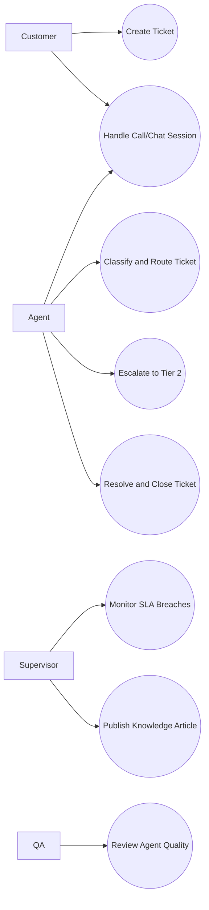
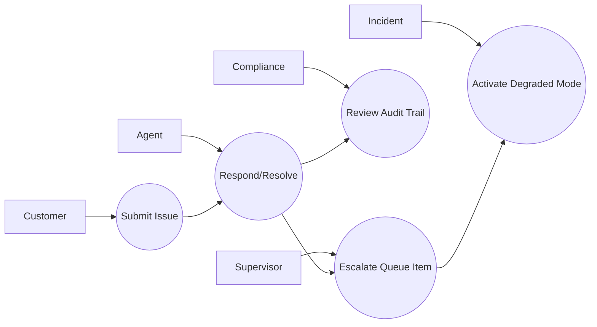

# Use Case Diagram

## Use-Case Diagram Narrative Addendum
Actors should include **Customer**, **Agent**, **Supervisor**, **Compliance Officer**, and **Incident Commander**.

The diagram must explicitly show escalation and audit review as first-class use cases, not optional annotations.

Operational coverage note: this artifact also specifies omnichannel controls for this design view.
