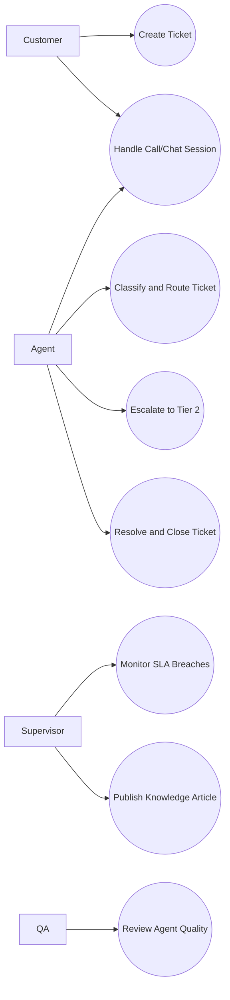
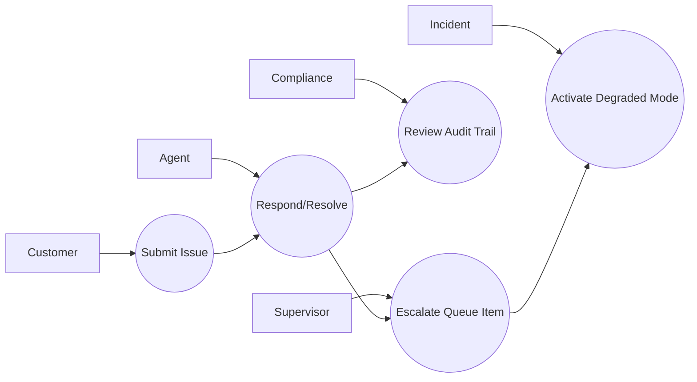

# Use Case Diagram — Customer Support and Contact Center Platform

**Version:** 1.1  
**Last Updated:** 2025-07  
**Status:** Approved

---

## Overview

This document captures the complete use-case model for the Customer Support and Contact Center Platform. The platform serves multiple distinct actor groups—from customers submitting support requests to workforce managers orchestrating agent schedules—across every digital and voice channel. The diagram and inventory below establish the full scope of system behavior, actor responsibilities, and inter-use-case relationships that guide feature development, acceptance testing, and capacity planning.

---

## Use Case Diagram

```mermaid
flowchart LR
    %% ── Actors ──────────────────────────────────────────────────────────
    CUST([Customer])
    AGT([Support Agent])
    SUP([Team Lead / Supervisor])
    WFM([Workforce Manager])
    KM([Knowledge Manager])
    BOT([Bot / IVR System])
    ADM([Administrator])

    %% ── Ticket Management ───────────────────────────────────────────────
    subgraph TM["🎫 Ticket Management"]
        UC01(Submit Support Request)
        UC02(View Ticket Status)
        UC03(Reopen Closed Ticket)
        UC04(Merge Duplicate Tickets)
        UC05(Split Multi-Issue Ticket)
        UC06(Link Related Tickets)
        UC07(Add Internal Note)
        UC08(Assign / Reassign Ticket)
        UC09(Resolve Ticket)
        UC10(Close Ticket)
    end

    %% ── Channel Communication ───────────────────────────────────────────
    subgraph CC["📡 Channel Communication"]
        UC11(Handle Live Chat Session)
        UC12(Handle Email Thread)
        UC13(Handle Voice Call)
        UC14(Handle SMS Conversation)
        UC15(Handle Social Media Message)
        UC16(Send CSAT Survey)
        UC17(Receive CSAT Response)
    end

    %% ── Routing & Assignment ────────────────────────────────────────────
    subgraph RA["🔀 Routing & Assignment"]
        UC18(Route Ticket by Skill)
        UC19(Route Ticket by Queue Priority)
        UC20(Overflow to Another Queue)
        UC21(Transfer Ticket to Another Agent)
    end

    %% ── SLA Management ──────────────────────────────────────────────────
    subgraph SLA["⏱ SLA Management"]
        UC22(Apply SLA Policy)
        UC23(Monitor SLA Timers)
        UC24(Trigger SLA Warning)
        UC25(Escalate on SLA Breach)
        UC26(Pause SLA Clock)
        UC27(Resume SLA Clock)
    end

    %% ── Knowledge Base ──────────────────────────────────────────────────
    subgraph KB["📚 Knowledge Base"]
        UC28(Search Knowledge Base)
        UC29(Suggest Articles to Agent)
        UC30(Publish Knowledge Article)
        UC31(Review and Approve Article)
        UC32(Archive Obsolete Article)
        UC33(Rate Article Helpfulness)
    end

    %% ── Bot & Automation ────────────────────────────────────────────────
    subgraph BA["🤖 Bot & Automation"]
        UC34(Handle Query with NLP Bot)
        UC35(Transfer to Human Agent)
        UC36(Trigger Automation Rule)
        UC37(Send Proactive Notification)
        UC38(Authenticate via IVR)
    end

    %% ── Workforce Management ────────────────────────────────────────────
    subgraph WM["👥 Workforce Management"]
        UC39(Create Agent Schedule)
        UC40(Forecast Call Volume)
        UC41(Manage Agent Availability)
        UC42(Record Wrap-Up Codes)
        UC43(Generate Adherence Report)
    end

    %% ── Reporting & Analytics ───────────────────────────────────────────
    subgraph RPT["📊 Reporting & Analytics"]
        UC44(View Real-Time Dashboard)
        UC45(Generate CSAT Report)
        UC46(Generate SLA Compliance Report)
        UC47(Export Raw Data)
        UC48(Configure Report Schedule)
    end

    %% ── Administration ──────────────────────────────────────────────────
    subgraph ADMgrp["⚙️ Administration"]
        UC49(Manage Users and Roles)
        UC50(Configure SLA Policies)
        UC51(Configure Routing Rules)
        UC52(Manage GDPR / Compliance)
        UC53(Audit System Logs)
    end

    %% ── Actor → Use Case Associations ───────────────────────────────────
    CUST --> UC01
    CUST --> UC02
    CUST --> UC03
    CUST --> UC11
    CUST --> UC12
    CUST --> UC14
    CUST --> UC15
    CUST --> UC17
    CUST --> UC28
    CUST --> UC33

    AGT --> UC04
    AGT --> UC05
    AGT --> UC06
    AGT --> UC07
    AGT --> UC08
    AGT --> UC09
    AGT --> UC10
    AGT --> UC11
    AGT --> UC12
    AGT --> UC13
    AGT --> UC21
    AGT --> UC26
    AGT --> UC27
    AGT --> UC28
    AGT --> UC29
    AGT --> UC35
    AGT --> UC42

    SUP --> UC08
    SUP --> UC20
    SUP --> UC25
    SUP --> UC44
    SUP --> UC45
    SUP --> UC46

    WFM --> UC39
    WFM --> UC40
    WFM --> UC41
    WFM --> UC43
    WFM --> UC48

    KM --> UC30
    KM --> UC31
    KM --> UC32

    BOT --> UC34
    BOT --> UC35
    BOT --> UC36
    BOT --> UC37
    BOT --> UC38

    ADM --> UC49
    ADM --> UC50
    ADM --> UC51
    ADM --> UC52
    ADM --> UC53

    %% ── Include / Extend Relationships ───────────────────────────────────
    UC01 -.->|<<include>>| UC22
    UC09 -.->|<<include>>| UC16
    UC34 -.->|<<extend>>| UC35
    UC23 -.->|<<include>>| UC24
    UC24 -.->|<<extend>>| UC25
    UC18 -.->|<<include>>| UC22
    UC29 -.->|<<include>>| UC28
```

> Mermaid's `flowchart LR` notation is used to approximate a UML use case diagram. Actors are on the left/right; subject-area groupings replace UML subject boxes; `-->` denotes association; dashed lines with labels capture `<<include>>` and `<<extend>>` relationships.

---

## Actor Descriptions

| Actor | Type | Role & Responsibilities |
|---|---|---|
| **Customer** | Primary External | End-user who initiates support interactions across web, mobile, email, chat, phone, and social channels. Submits tickets, tracks status, responds to surveys, and searches the self-service knowledge base. |
| **Support Agent** | Primary Internal | Frontline support staff who receive, work, and resolve tickets. Manages conversations across channels, adds notes, merges duplicates, applies CSAT surveys, and updates ticket state. |
| **Team Lead / Supervisor** | Primary Internal | Oversees agent queues in real time. Monitors SLA health, reassigns tickets, reviews performance metrics, handles escalations, and coaches agents via dashboards and reports. |
| **Workforce Manager** | Primary Internal | Plans staffing levels by forecasting contact volumes, building agent schedules, publishing shifts, and generating adherence reports to ensure adequate coverage across queues. |
| **Knowledge Manager** | Primary Internal | Owns the knowledge-base content lifecycle: commissioning articles, reviewing drafts submitted by agents, approving and publishing, flagging outdated content, and archiving articles. |
| **Bot / IVR System** | Primary System | Automated system that handles the first leg of interactions via natural language processing or interactive voice response. Deflects routine queries, authenticates callers, and executes handoffs to human agents. |
| **Administrator** | Primary Internal | Configures the platform itself: user accounts, role permissions, SLA policies, routing rules, compliance/GDPR settings, and audits system activity logs. |

---

## Use Case Inventory

| ID | Use Case Name | Primary Actor | Secondary Actor(s) | Subject Area | Brief Description |
|---|---|---|---|---|---|
| UC-001 | Submit Support Request | Customer | Bot, Ingestion Service | Ticket Management | Customer submits a request via any channel; system normalizes and creates a ticket. |
| UC-002 | View Ticket Status | Customer | — | Ticket Management | Customer checks ticket progress via self-service portal or email status update. |
| UC-003 | Reopen Closed Ticket | Customer | Agent | Ticket Management | Customer replies to a closed ticket; system automatically reopens it. |
| UC-004 | Merge Duplicate Tickets | Agent | Supervisor | Ticket Management | Agent identifies and merges two tickets from the same contact about the same issue. |
| UC-005 | Split Multi-Issue Ticket | Agent | — | Ticket Management | Agent splits a ticket covering distinct issues into separate child tickets. |
| UC-006 | Link Related Tickets | Agent | — | Ticket Management | Agent creates soft link between tickets for cross-reference without merging. |
| UC-007 | Add Internal Note | Agent | Supervisor | Ticket Management | Agent or supervisor adds a private note visible only to internal staff. |
| UC-008 | Assign / Reassign Ticket | Agent / Supervisor | Routing Engine | Ticket Management | Manual or automatic assignment of ticket to an agent or queue. |
| UC-009 | Resolve Ticket | Agent | SLA Monitor | Ticket Management | Agent marks ticket resolved; triggers CSAT survey dispatch. |
| UC-010 | Close Ticket | Agent / Supervisor | — | Ticket Management | Ticket permanently closed after resolution confirmation or auto-close timer. |
| UC-011 | Handle Live Chat Session | Customer / Agent | Bot | Channel Communication | Bidirectional real-time chat via web or mobile widget. |
| UC-012 | Handle Email Thread | Customer / Agent | — | Channel Communication | Full email thread captured and threaded under a single ticket. |
| UC-013 | Handle Voice Call | Agent | IVR, Telephony | Channel Communication | Inbound/outbound call recorded, transcribed, and linked to ticket. |
| UC-014 | Handle SMS Conversation | Customer / Agent | SMS Gateway | Channel Communication | Two-way SMS conversation mapped to a ticket. |
| UC-015 | Handle Social Media Message | Customer / Agent | Social API | Channel Communication | Twitter DM / Facebook Messenger / Instagram message ingested as ticket. |
| UC-016 | Send CSAT Survey | System | Notification Service | Channel Communication | Survey dispatched to customer after ticket resolution. |
| UC-017 | Receive CSAT Response | Customer | Analytics Service | Channel Communication | Customer submits star rating and optional comment. |
| UC-018 | Route Ticket by Skill | Routing Engine | Agent | Routing & Assignment | System matches ticket required skills to available agent skill tags. |
| UC-019 | Route Ticket by Queue Priority | Routing Engine | Supervisor | Routing & Assignment | Tickets placed into priority-weighted queues for FIFO or priority dispatch. |
| UC-020 | Overflow to Another Queue | Supervisor / Routing Engine | — | Routing & Assignment | Ticket redirected to overflow queue when primary queue capacity is exhausted. |
| UC-021 | Transfer Ticket to Another Agent | Agent | Supervisor | Routing & Assignment | Warm or blind transfer of an active ticket to a different agent. |
| UC-022 | Apply SLA Policy | System | Administrator | SLA Management | SLA policy selected and applied to ticket based on tier, channel, and issue type. |
| UC-023 | Monitor SLA Timers | SLA Monitor | — | SLA Management | Continuous background evaluation of first-response and resolution deadlines. |
| UC-024 | Trigger SLA Warning | SLA Monitor | Notification Service | SLA Management | Warning notification sent when ticket approaches SLA breach threshold. |
| UC-025 | Escalate on SLA Breach | SLA Monitor | Supervisor, Escalation Engine | SLA Management | Automatic escalation actions triggered when SLA is breached. |
| UC-026 | Pause SLA Clock | Agent | — | SLA Management | Agent pauses SLA timer when awaiting customer-provided information. |
| UC-027 | Resume SLA Clock | Agent / System | — | SLA Management | SLA timer resumes when customer responds or agent manually restarts. |
| UC-028 | Search Knowledge Base | Customer / Agent | Search Engine | Knowledge Base | Full-text and semantic search across published knowledge articles. |
| UC-029 | Suggest Articles to Agent | AI Service | Agent | Knowledge Base | Contextual article recommendations surfaced in agent workspace. |
| UC-030 | Publish Knowledge Article | Knowledge Manager | Author Agent | Knowledge Base | Approved article made publicly or internally visible. |
| UC-031 | Review and Approve Article | Knowledge Manager | Review Team | Knowledge Base | Draft article reviewed for accuracy and compliance before publication. |
| UC-032 | Archive Obsolete Article | Knowledge Manager | — | Knowledge Base | Outdated article removed from active search index. |
| UC-033 | Rate Article Helpfulness | Customer / Agent | — | Knowledge Base | 👍/👎 feedback collected to drive article quality scoring. |
| UC-034 | Handle Query with NLP Bot | Bot | NLP Service, KB | Bot & Automation | Bot interprets intent, fetches KB answer, and responds to customer. |
| UC-035 | Transfer to Human Agent | Bot | Routing Engine, Agent | Bot & Automation | Bot packages context and hands off conversation to a live agent. |
| UC-036 | Trigger Automation Rule | Automation Engine | — | Bot & Automation | Event-driven rule fires action such as tag assignment or auto-reply. |
| UC-037 | Send Proactive Notification | System | Notification Service | Bot & Automation | System-initiated outbound message (e.g., order shipped, incident alert). |
| UC-038 | Authenticate via IVR | IVR System | Customer | Bot & Automation | Caller identity verified through DTMF PIN or voice biometric. |
| UC-039 | Create Agent Schedule | Workforce Manager | Agents | Workforce Management | WFM creates weekly/monthly shift plan and publishes to agents. |
| UC-040 | Forecast Call Volume | Workforce Manager | Analytics Service | Workforce Management | Historical data used to predict future contact volumes per queue. |
| UC-041 | Manage Agent Availability | Agent / WFM | — | Workforce Management | Agent sets availability status; WFM overrides or adjusts as needed. |
| UC-042 | Record Wrap-Up Codes | Agent | — | Workforce Management | Agent applies disposition codes at end of interaction. |
| UC-043 | Generate Adherence Report | Workforce Manager | — | Workforce Management | Report comparing actual agent activity against scheduled shifts. |
| UC-044 | View Real-Time Dashboard | Supervisor | — | Reporting & Analytics | Live queue metrics: active tickets, AHT, agent availability, SLA health. |
| UC-045 | Generate CSAT Report | Supervisor / Admin | — | Reporting & Analytics | Aggregated customer satisfaction scores by agent, queue, and period. |
| UC-046 | Generate SLA Compliance Report | Supervisor / Admin | — | Reporting & Analytics | SLA breach rate, first-response time, and resolution time trends. |
| UC-047 | Export Raw Data | Administrator | Data Warehouse | Reporting & Analytics | Bulk export of tickets, interactions, and events to downstream systems. |
| UC-048 | Configure Report Schedule | Workforce Manager / Admin | — | Reporting & Analytics | Scheduled delivery of reports via email or dashboard widget. |
| UC-049 | Manage Users and Roles | Administrator | Identity Provider | Administration | Create, deactivate, and role-assign agent and supervisor accounts. |
| UC-050 | Configure SLA Policies | Administrator | — | Administration | Define response/resolution targets per tier, channel, and issue category. |
| UC-051 | Configure Routing Rules | Administrator | — | Administration | Set up skill-based, priority-based, and round-robin routing rules. |
| UC-052 | Manage GDPR / Compliance | Administrator | Legal Team | Administration | Handle data deletion requests, export personal data, and manage retention. |
| UC-053 | Audit System Logs | Administrator | — | Administration | Review security and operational audit trail for access and changes. |

---

## System Boundary

The **Customer Support and Contact Center Platform** system boundary encompasses:

- All ticket lifecycle state transitions and metadata management
- Multi-channel ingestion adapters (email, chat, voice, SMS, social)
- Routing and assignment engine and queue management
- SLA policy engine and breach detection/escalation subsystem
- Knowledge base content management and search
- Bot/IVR orchestration and NLP intent pipeline
- Workforce management scheduling and adherence tracking
- Reporting, analytics, and data export
- User, role, and permissions administration

**Outside the boundary** (external systems interacted with via API/webhook):
- Customer-facing website and mobile applications
- Email service providers (SendGrid, Gmail)
- Telephony infrastructure (Twilio, Amazon Connect)
- CRM systems (Salesforce, HubSpot)
- SSO / Identity Providers
- AI/NLP vendor APIs (OpenAI, Dialogflow)
- Object storage (AWS S3, GCS)

---

## Key Relationships

### `<<include>>` Relationships

| Base Use Case | Included Use Case | Rationale |
|---|---|---|
| UC-001 Submit Support Request | UC-022 Apply SLA Policy | Every new ticket must receive an SLA policy on creation. |
| UC-009 Resolve Ticket | UC-016 Send CSAT Survey | Survey is automatically dispatched upon every resolution. |
| UC-018 Route Ticket by Skill | UC-022 Apply SLA Policy | Routing outcome confirms or adjusts the SLA policy. |
| UC-023 Monitor SLA Timers | UC-024 Trigger SLA Warning | Timer evaluation always checks warning threshold before breach. |
| UC-029 Suggest Articles to Agent | UC-028 Search Knowledge Base | Suggestion engine internally invokes KB search with ticket context. |

### `<<extend>>` Relationships

| Extension Use Case | Base Use Case | Extension Condition |
|---|---|---|
| UC-035 Transfer to Human Agent | UC-034 Handle Query with NLP Bot | Extends when bot confidence < threshold or customer explicitly requests agent. |
| UC-025 Escalate on SLA Breach | UC-024 Trigger SLA Warning | Extends when breach threshold is crossed after the warning was fired. |
| UC-003 Reopen Closed Ticket | UC-010 Close Ticket | Extends when customer sends a follow-up reply within the reopen window. |
| UC-020 Overflow to Another Queue | UC-019 Route by Queue Priority | Extends when queue depth exceeds max-capacity configuration. |

## Use-Case Diagram Narrative Addendum
Actors should include **Customer**, **Agent**, **Supervisor**, **Compliance Officer**, and **Incident Commander**.

The diagram must explicitly show escalation and audit review as first-class use cases, not optional annotations.

Operational coverage note: this artifact also specifies omnichannel controls for this design view.
