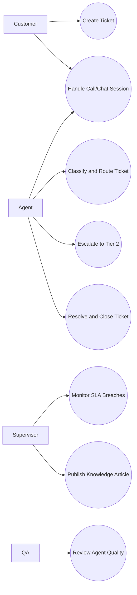

# Use Case Diagram

```mermaid
flowchart LR
    Customer
    Agent
    Supervisor
    QA

    UC1((Create Ticket))
    UC2((Classify and Route Ticket))
    UC3((Handle Call/Chat Session))
    UC4((Escalate to Tier 2))
    UC5((Resolve and Close Ticket))
    UC6((Monitor SLA Breaches))
    UC7((Review Agent Quality))
    UC8((Publish Knowledge Article))

    Customer --> UC1
    Customer --> UC3
    Agent --> UC2
    Agent --> UC3
    Agent --> UC4
    Agent --> UC5
    Supervisor --> UC6
    QA --> UC7
    Supervisor --> UC8
```
