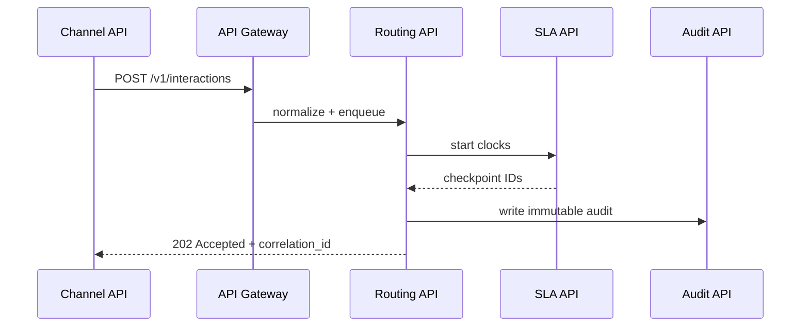

# Api Design

## Purpose
Define the api design artifacts for the **Customer Support and Contact Center Platform** with implementation-ready detail.

## Domain Context
- Domain: Support Center
- Core entities: Conversation, Ticket, Queue, SLA Policy, Agent Skill, Bot Session, Escalation
- Primary workflows: intake across channels, skill-based routing and assignment, SLA monitoring and escalation, bot-to-human transfer, QA and workforce planning

## Key Design Decisions
- Enforce idempotency and correlation IDs for all mutating operations.
- Persist immutable audit events for critical lifecycle transitions.
- Separate online transaction paths from async reconciliation/repair paths.

## Reliability and Compliance
- Define SLOs and error budgets for user-facing operations.
- Include RBAC, least-privilege service identities, and full audit trails.
- Provide runbooks for degraded mode, replay, and backfill operations.

## Detailed Design Emphasis
- Table/entity constraints and invariants are explicit.
- Failure semantics for retries/timeouts are defined per integration.
- Versioning strategy documented for APIs, events, and data migrations.

## API Deep Technical Narrative

- `POST /v1/interactions`: idempotent by `Idempotency-Key`; returns queue reference.
- `POST /v1/cases/{id}/escalations`: requires `reason_code`, `severity`, and `escalation_target`.
- `POST /v1/cases/{id}/state-transitions`: rejects illegal workflow moves with machine-readable error.
- `GET /v1/audit/events?conversation_id=`: paginated tamper-evident history for compliance.
- Incident mode endpoint `POST /v1/ops/degraded-mode` guarded by break-glass RBAC and dual-approval audit entries.

Operational coverage note: this artifact also specifies omnichannel controls for this design view.
