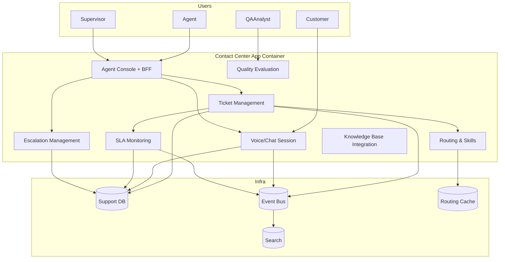
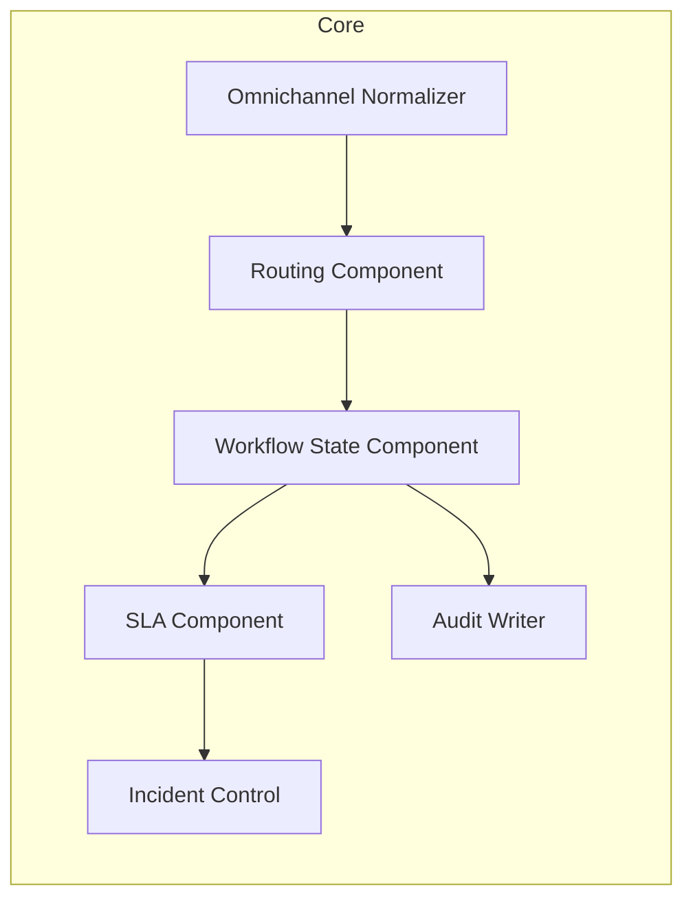

# C4 Component Diagram

## C4 Component Deep Narrative

Component boundaries:
- Routing decides queue and assignee.
- Workflow owns state machine invariants.
- SLA computes timers and escalation triggers.
- Audit Writer is append-only and asynchronous with guaranteed delivery.
- Incident Control toggles safe-mode features with change records.
