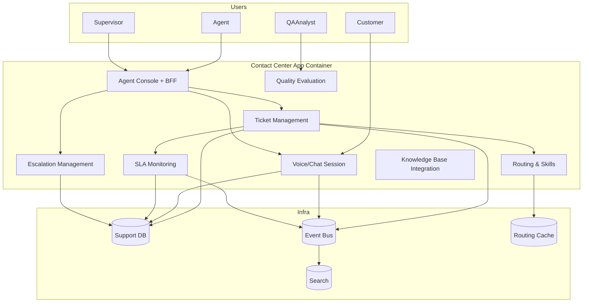

# C4 Component Diagram

```mermaid
flowchart TB
    subgraph Users
      Customer
      Agent
      Supervisor
      QAAnalyst
    end

    subgraph ContactCenter[Contact Center App Container]
      UIBFF[Agent Console + BFF]
      TicketCmp[Ticket Management]
      RoutingCmp[Routing & Skills]
      SessionCmp[Voice/Chat Session]
      SlaCmp[SLA Monitoring]
      EscCmp[Escalation Management]
      QACmp[Quality Evaluation]
      KBCmp[Knowledge Base Integration]
    end

    subgraph Infra
      OLTP[(Support DB)]
      Bus[(Event Bus)]
      Cache[(Routing Cache)]
      Search[(Search)]
    end

    Customer --> SessionCmp
    Agent --> UIBFF
    Supervisor --> UIBFF
    QAAnalyst --> QACmp

    UIBFF --> TicketCmp
    UIBFF --> SessionCmp
    UIBFF --> EscCmp

    TicketCmp --> RoutingCmp
    TicketCmp --> SlaCmp
    TicketCmp --> OLTP
    SessionCmp --> OLTP
    SlaCmp --> OLTP
    EscCmp --> OLTP

    TicketCmp --> Bus
    SessionCmp --> Bus
    SlaCmp --> Bus
    Bus --> Search
    RoutingCmp --> Cache
```
