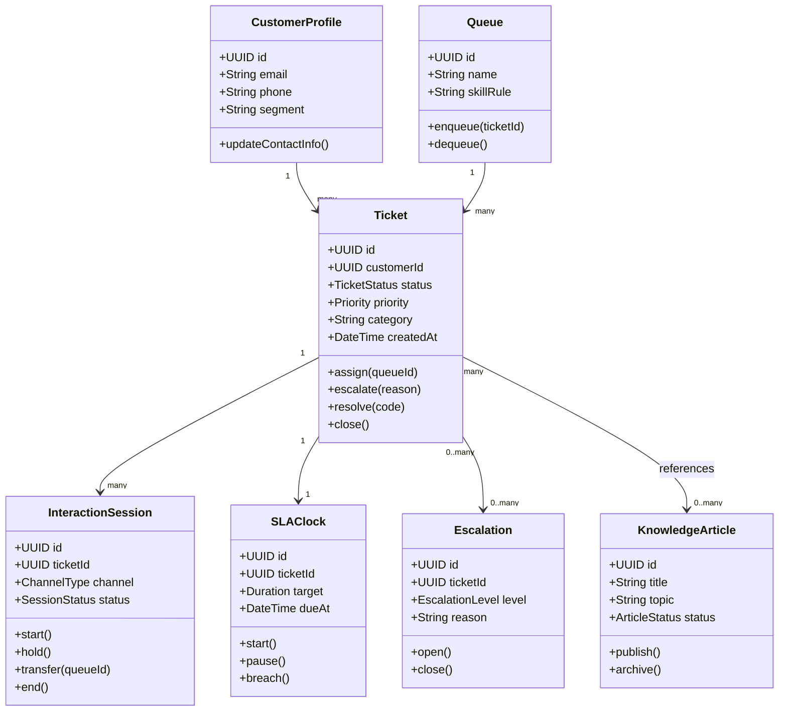

# Class Diagrams

```mermaid
classDiagram
    class CustomerProfile {
      +UUID id
      +String email
      +String phone
      +String segment
      +updateContactInfo()
    }

    class Ticket {
      +UUID id
      +UUID customerId
      +TicketStatus status
      +Priority priority
      +String category
      +DateTime createdAt
      +assign(queueId)
      +escalate(reason)
      +resolve(code)
      +close()
    }

    class InteractionSession {
      +UUID id
      +UUID ticketId
      +ChannelType channel
      +SessionStatus status
      +start()
      +hold()
      +transfer(queueId)
      +end()
    }

    class SLAClock {
      +UUID id
      +UUID ticketId
      +Duration target
      +DateTime dueAt
      +start()
      +pause()
      +breach()
    }

    class Queue {
      +UUID id
      +String name
      +String skillRule
      +enqueue(ticketId)
      +dequeue()
    }

    class Escalation {
      +UUID id
      +UUID ticketId
      +EscalationLevel level
      +String reason
      +open()
      +close()
    }

    class KnowledgeArticle {
      +UUID id
      +String title
      +String topic
      +ArticleStatus status
      +publish()
      +archive()
    }

    CustomerProfile "1" --> "many" Ticket
    Ticket "1" --> "many" InteractionSession
    Ticket "1" --> "1" SLAClock
    Queue "1" --> "many" Ticket
    Ticket "0..many" --> "0..many" Escalation
    Ticket "0..many" --> "0..many" KnowledgeArticle : references
```
